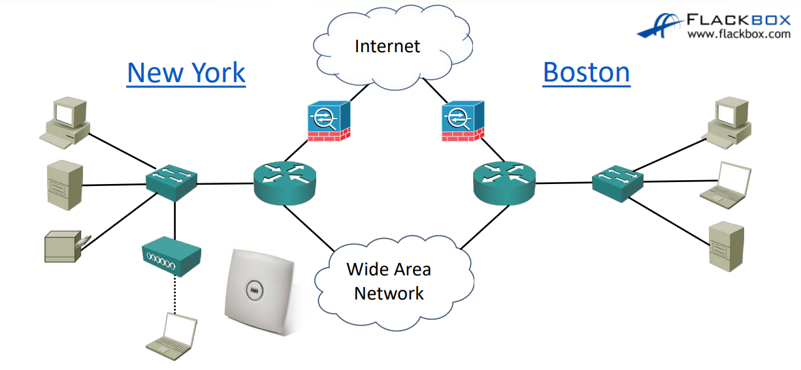

### 네트워크 구성요소
- 접속 기기들
- 무선 액세스 포인트  
-> 무선 연결 시 필요
- 스위치  (접속 기기들, 무선 액세스 포인트들을 연결해줌)
-> 여기 까지가 LAN (Local Area Network)
- 라우터  
-> 스위치가 다른 네트워크와 연결할 수 있도록 해줌 (Internet에 가거나 라우터 끼리 연결할 수 있음)  
->> 여기 까지 오면 WAN (Wide Area Network)
- 방화벽  
-> 라우터에 나쁜 해커들이 들어 올 수 없도록 막아주는 역할

### 네트워크 특성
1. Topology (토폴로지)  
-> 위에 있는 사진이 네트워크 토폴로지다 (어떤 식으로 연결되어 있는 지 보여주는 것)
2. Speed (속도)  
-> 빠를 수록 비용이 많이듦.
3. Cost (비용)  
-> 장치 유형, 크기, 기술 등을에 관여함(당연함 돈이 있어야 기술도 좋은 걸 씀)
4. Security (보안)  
-> 방화벽 같은 것을 사용하기도 하지만 스위치나 라우터에도 보안은 존재함.
5. Availability (가용성)  
-> 항상 작동 가능한 상태여야함. 네트워크는 한 치의 실패도 없어야한다. (중요!!) 그래서 작동하지 않더라도 **대체할 수 있는 구성요소**가 있어야 한다.
6. Scalability (확장성)  
-> 재설계 없어도 쉽게 확장할 수 있도록해야함.
7. Reliability (신뢰성)  
-> 네트워크를 신뢰할 수 있어야하는 뜻은 당연하고 **항상 가동 되어 있어야는 것**도 나타냄.