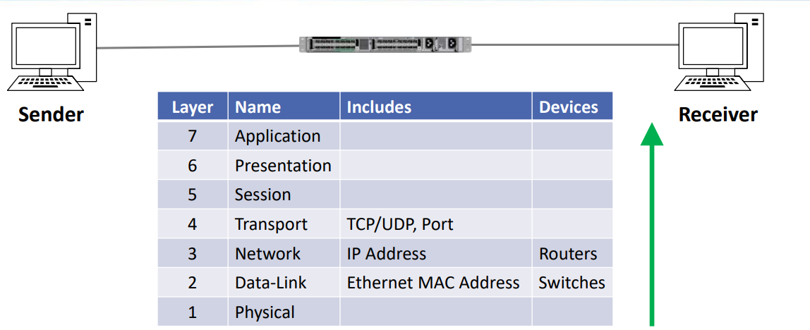

### OSI

7개의 레이어 존재  
- 7 layer Application **-응용-**
- 6 layer Presentation **-표현-**
- 5 layer Session **-세션-**
- 4 layer Transport **-전송-**  (TCP인지 UDP인지 구분, Port번호 포함)
- 3 layer Network **-네트워크-**  (Ip Address 포함, 라우터가 이 계층)
- 2 layer Data-link **-데이터 링크-** (Mac Address 포함, 스위치가 이 계층)
- 1 layer Physical  **-물리-**

상위부터 하위로 내려감.

### 수신 시뮬레이션
- 송신자가 7->1 계층을 타고타고 직렬화한 패킷을 수신자는
레이어를 반대로 타고 올라가며 분해한다.

1. 송신자가 보낸 데이터를 피지컬 계층으로  받음.
2. 2계층(Data Link) 헤더에 있는 Mac Address를 보고 자신의 Address인지 판단 (아니면 버림)
3. 3계층(Network)에서 Ip Address를 보고 자신의 Address인 지 판단(마찬가지로 아니면 버림)
4. 4계층(Transport)에 있는 Port번호를 통해 쓰임새를 확인함.
5. 5,6,7계층을 타고 올라가며 수신을 완료함.

### 이점
엔지니어가 모델의 위에서 아래로 진행되는 종단 간 기술을 설게하지 않아도된다는 것!  
-> **이게 무슨 말 이냐?**  
->> 나 같은 어플리케이션 개발자는  상위 3개의 계층만 신경쓰면 된다. 그저 아래 계층의 규칙을 지키고 있는 지만 신경 쓰면 된다.

### 이게 얼마나 중요하냐면...
네트워크 문제를 해결하거나, 새로운 기술을 배울 때 이 OSI 7 Layer를 중심으로 사고하게 될 것이다.  
->Ex. 단순 케이블 문제였다거나 (물리계층), 8계층 문제였을 수 있다. (유저의 문제)

