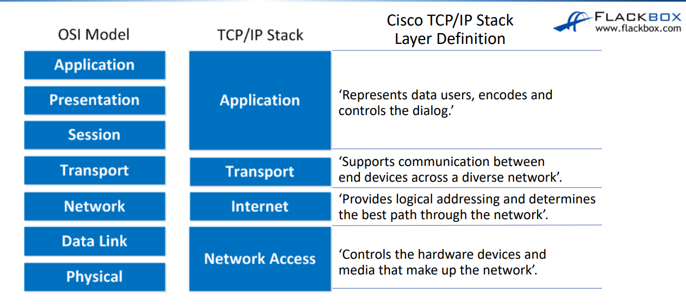
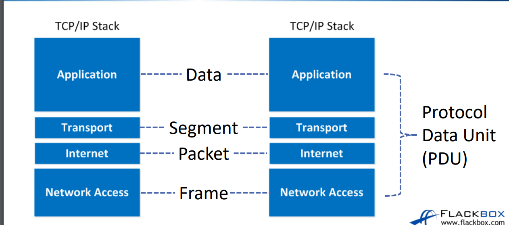

### TCP/IP 스택

- TCP/IP 스택은 4까지 계층이있다.  
1. Application (응용)
2. Transport (전송)
3. Internet (인터넷)
4. Network Access (네트워크 액세스)  

> **OSI 7계층과는 위 사진과 같게 대입된다.**

각 단계의 데이터 통신 단위
- 전체 단위 -> PDU(Protocol Data Unit)
- 전송 계층 단위 -> Segment
- 인터넷 계층 단위 -> Packet
- 네트워크 액세스 계층 단위 -> Frame

TCP/IP 스택으로 보면 Internet 부분에서 통신을 Packet이라고하지만, 두 호스트 간의 통신을 흔히 Packet이라고한다.