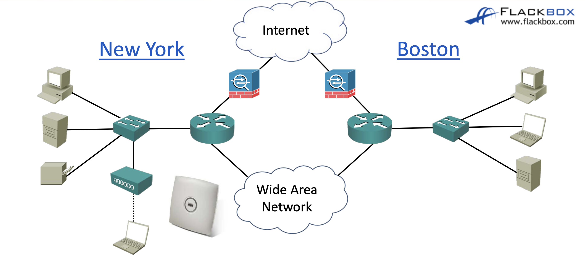
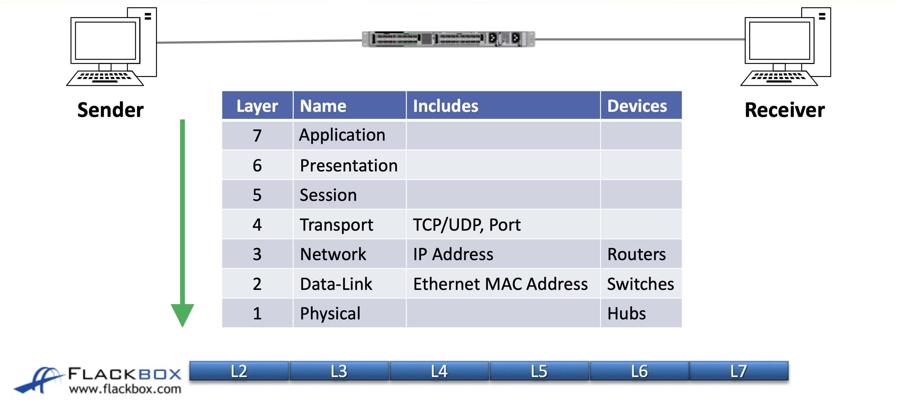
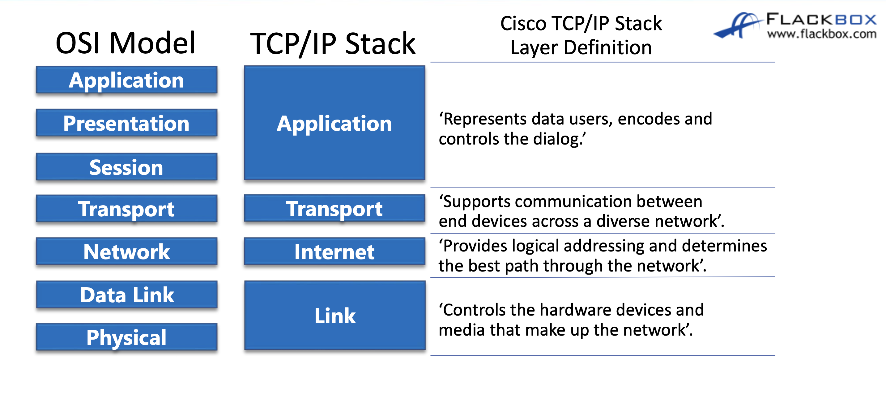
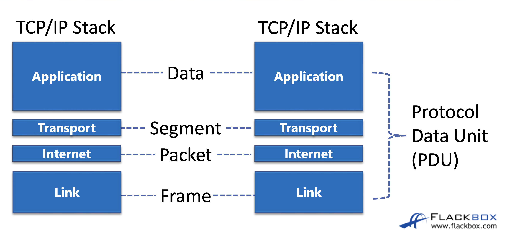

## characteristic of network
네트워크에는 다음과 같이 7가지 특징이 있다.
- topology
- speed
- cost
- security
- availability
- scalability
- reliability

위 사진처럼 엔드포인트(PC, 서버, 프린터)를 어떻게 연결하고 멀리있는 엔드포인트끼리는 어떻게 연결하는지 설계도?를 **topology**라고 한다.  
**speed**는 말그대로 속도이고 보통 속도가 빠를수록 **cost**가 높다.  
**security**는 인터넷에는 빌런들이 많기때문에 위 토폴로지 사진에 나와있듯이 방화벽을 설계해주어야한다. 보안 기능은 방화벽에만 있는 것은 아니고 라우터, 스위치에도 포함돼있다.    
네트워크에서 빠질 수 없는 특성은 실패하지 않는 것인데 **availability**는 이를 의미한다. 만약 장치가 down되도 기존에 장치들을 2배로 설치해둬 다른 대체 장치가 작동할 수 있게끔 해야한다.  
**scalability**는 호스트는 계속해서 생산되는 만큼 재설계없이도 네트워크를 확장할 수 있게 설계해야한다.  
**reliability**는 네트워크가 계속 작동하면서도 실패나 결함없이 작동해야함을 의미한다.

## OSI 7 layer
이제는 대부분 알겠지만 OSI 7 layer는 실제로 쓰이지는 않는 개념적인 모델이다.  
하지만 그럼에도 교육, 현업자 간의 소통에서 자주, 편리하게 쓰이기 때문에 알아두어야한다.  

OSI 7 layer에서 데이터를 전송할때 송신자 측에서는 상위계층의 데이터를 하위계층이 header로 감싼다.  
7계층에서 이메일 주소와 내용을 보내면 6계층에서 7계층의 데이터는 body에 담고 6계층의 정보인 확장자를 header에 담는다.  
수신자측에선 반대로 1계층부터 시작해 패킷의 헤더를 하나씩 까본다.  
만약 2계층에서 헤더를 깠는데 MAC주소 본인과 일치하지 않다면 3계층으로 올리지 않고 해당 패킷을 버린다.  
3계층에서도 만약 IP주소가 일치하지 않는다면 패킷을 버린다.  

상위계층은 5,6,7은 애플리케이션 개발자의 담당이라 네트워크 엔지니어에겐 비교적 덜 중요하다.  
후에 전용 섹션에서 더 자세히 알아보겠지만 네트워크 엔지니어의 계층인 3,4 계층에대해 좀더 알아보면,  
4계층에선 포트번호와 TCP인지 UDP인지를 담당한다.  
TCP/UDP는 신뢰성이 속도보다 중요할때 TCP 영상, 음성과 같이 신뢰성보다 속도가 중요할때 UDP를 사용한다.  
또한 4계층에선 전송문제가 덜 일어나도록 데이터를 여러 조각으로 나눠서 보내고 수신측에선 이를 다시 재조립한다.  
3계층에선 중요한 것이 IP주소이다.  
3계층의 operator인 라우터와 이 IP주소를 통해 지리적으로 서로다른 곳에 있는 두 호스트의 연결을 관리한다.  

그리고 이제는 대부분 알듯 실제 현업에선 위 사진의 TCP/IP stack이 쓰인다.  
물론 TCP/IP stack도 어떤 프로토콜이 아니라 개념적인 모델이기에 OSI 7 layer와 크게 다르지는 않다.

TCP/IP stack의 용어를 좀 알아보면, 정확히는 두 호스트 간 통신에 쓰이는 개체를 PDU라고 부른다.  
또한 각 계층마다 OSI 기준으로 7계층이면 data 4계층이면 segement 3계층이면 packet이라고 불리지만, 실제로는 그냥 packet으로 퉁쳐서 부르는 경우가 많다.  

