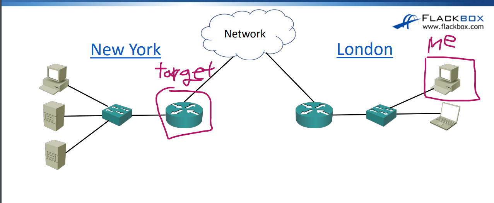
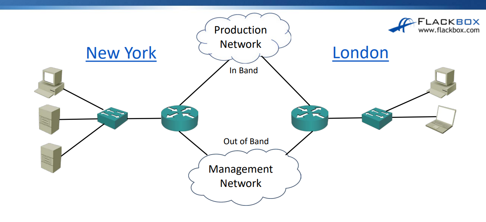

### 내가 네트워크 관리사가 되고, 뉴욕에 있는 라우터에 접속해서 작업을 해야한다면??

우리는 PuTty와 같은 어플리케이션을 통해 라우터 커맨드라인에 접속하게 된다.

대표적으론 ssh 와 telnet이 있는데 telnet은 보안이 좋지 않으니 ssh 사용을 권장한다.

현재 우리는 일반적인 유저들이 접속하는 경로를 통해 router에 접속했다. 
My Computer -> London switch -> London Router -> Network -> target router

(In Band)
### 다른 방식의 접근 방법

하지만 대기업의 경우 관리를 위한 별도 네트워크를 구성하기도 한다. 이것을 Out of Band라고 한다.

