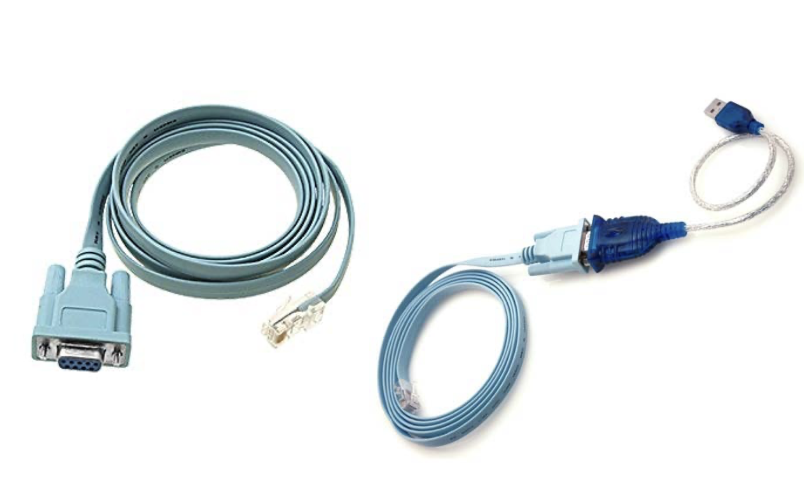
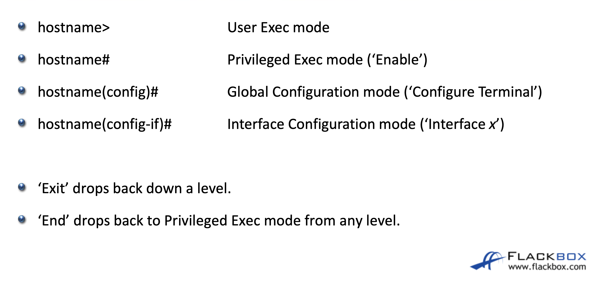
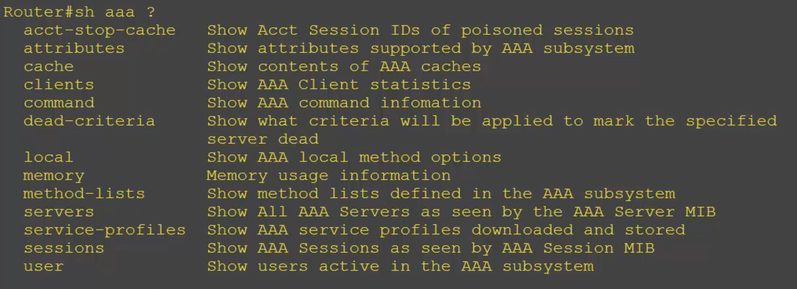
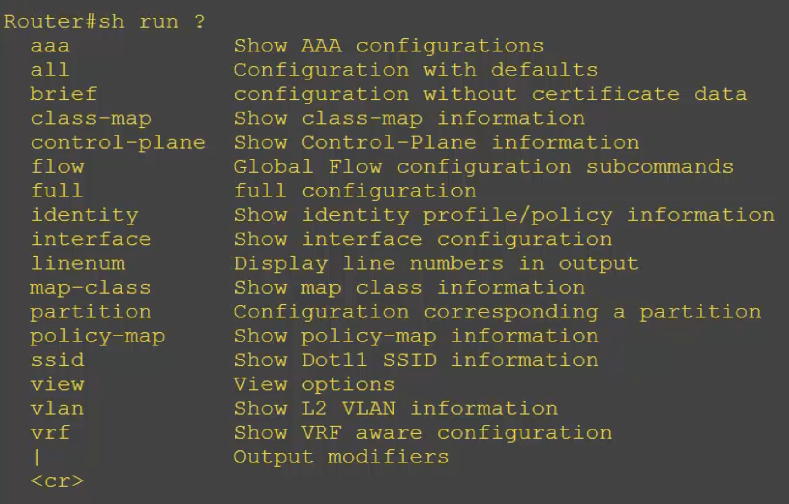

## how to pronounce gui
강의에서 강사님이 GUI를 Gooey라고 발음하시길래 놀라서 찾아봄
https://www.reddit.com/r/programming/comments/grckjf/what_is_the_proper_way_to_pronounce_gui_geeyueye/

맞다 틀리다는 없긴한데 모음이 들어가있어 실제 소리 낼 수 있는 두문자어(e.g NASA, NATO)는 소리 낼 수 있는대로 읽는 듯  

## console cable

CISCO장치가 이미 세팅된 후라면 네트워크를 통해 접속이 가능하지만, 맨 처음 CISCO 장치에는 IP주소가 설정돼있지 않다.  
때문에 초기세팅은 로컬에서 직접 접속해 해주어야하는데 그때 콘솔 케이블을 통해 연결이 가능하다.  

이렇게 직접 접속하는 방식은 초기 세팅만이 아닌 트러블슈팅에서도 유용한데, 어떠한 이유로 CISCO장치에 접속이 안될때 직접 접속해 트러블 슈팅이 가능하다.  
또한 장치에 전원은 켜져있는데 네트워크 접속이 안될 때, 직접 접속해 장치 부팅이 안되고 있는지 확인이 가능하다.  
IP주소는 부팅이 완전히 된 이후에야 할당이 되기 때문이다.  

## CISCO IOS command line

CISCO 장치는 장치를 설정할 수 있게 운영체제가 깔려있다.  
장치마다 운영체제가 조금씩 다른 경우가 있지만, 명령어는 거의 같다고 한다.  
위 사진처럼 CISCO 운영체제에는 여러 계층이있고, 각 계층마다 사용할 수 있는 명령어가 다르다.  
현재 계층 레벨은 명령어 입력칸 왼쪽을 통해 확인할 수 있다.  

명령어는 단축어가 있고 tab을 통해 자동완성도 가능하다.  
단축어를 사용할때에는 해당 단축어와 매핑되는 명령어가 1:1로만 존재해야하는데, 예를 들어 `disconnect`, `disable`이라는 명령어가 같은 계층에 존재할때, `dis`를 입력하면 "모호한 명령어입니다." 라는 에러메세지가 뜬다.  
때문에 `disc`나 `disa`를 사용해야할 것이다.  
단축어로 가능한 명령어 집합을 확인하고 싶다면 ?를 사용하면 된다.  
예를 들어 `dis?`를 입력하면 `dis`로 가능한 명령어 집합인 `disconnect`, `disable`이 뜰 것이다.  
또한 명령어는 인자를 받을 수 있는데, 그 경우 명령어에 한칸 띄우고 ?를 하면된다.

뒤에 인자를 받을 수 있는 명령어의 경우 인자를 입력하지 않을 경우 "불완전한 명령어입니다."라는 에러가 뜰텐데, 위에서 설명한 ?를 통해 명령어 인자를 출력했을때 아래 사진과 같이 <cr>이 존재한다면 인자없이도 어떠한 명령을 수행하는 명령어라는 뜻이다.  

## shortcut
- ctrl + a: 현재 명령어의 맨 앞으로 간다.
- ctrl + c: 명령어가 비어있을 경우 `exit`와 동일, 명령어 이후 출력량이 많아 --more--가 있을 경우 거기서 끊고 명령어 입력으로 돌아온다. 
## arrow key
- <, >: 명령어에서 한칸씩 이동
- ^, v: 같은 계층에서 이전에 입력한 명령어를 불러온다
## do
보통 초보가 가장 많이 실수하는 것이 해당 계층에는 없지만 다른 계층에 있는 명령어를 실행해 에러가 나는 것인데, 이경우 명령어 맨앞에 do를 추가하면 계층을 무시하고 실행한다고 한다.    
## pipe
unix와 비슷하지만 pipe뒤에 오는 명령어가 한정돼있다.  
출력을 필터링해주는 기능이다.  
CISCO 운영체제에선 명령어에 소문자 대문자를 가리지 않지만 pipe뒤에 오는 명령어에서만 구별한다.  
예를 들어 `show runing-config | begin a`라 입력하면 출력에서 a로 시작하는 줄만 보여준다. A로 시작하는 줄은 보여주지 않는다.  

## start configuration, running configuration
장치를 설정할때 세팅값은 바로바로 장치에 적용된다.  
하지만 이는 휘발성 메모리에만 저장되기에 만약 장치가 재부팅되면 기존 세팅값이 전부 날아간다.  
때문에 `copy run start`를 통해 재부팅시 세팅 값에 저장해둘 수 있다.  
또한 장치가 고장날 것을 대비해 백업을 해두는 것이 좋을텐데, `copy run flash`를 통해 해당 장치에 백업해둘 수 있지만, 백업을 로컬에 해두면 별 의미가 없을 것이다.  
때문에 `copy run tftp`이후에 tftp서버 IP주소를 입력해 외부 서버에 백업해둘 수 있다.