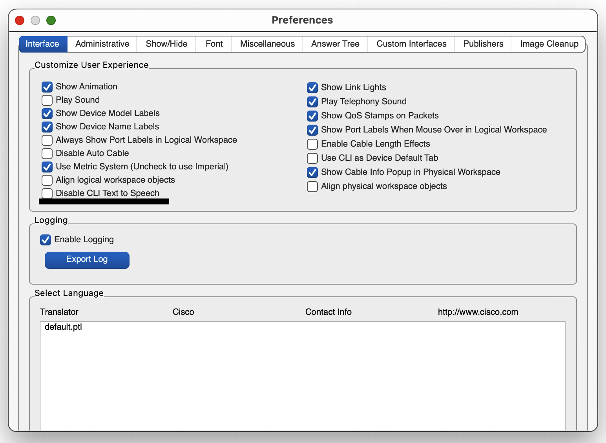

## Section 04 정리

#### Cisco OS (IOS)
Cisco의 여러 기기에 사용되는 OS는 IOS OS이다.

- Cisco OS 역사
    - 라우터만 파는 회사로 시작
    - 라우터에 IOS OS를 사용함.
    - 스위치 파는 회사 인수.
    - 기존 스위치에 있는 CatOS 대신 IOS 사용
    - 방화벽도 마찬가지로 IOS로 대체
    - Cisco는 거의 모든 기기에서 IOS를 사용함.
        - 일부 최신 라우터, 스위치를 제외한
        - 그러나 IOS와 비슷한 명령어를 제공함.

- IOS 특징 
    - 모놀리식 커널임.
    - 따라서 프로세스 하나가 충돌하면 전체 라우터가 충돌함.
    - 앞서 말한 다른 OS는 마이크로 커널을 사용해서 프로세스 충돌이 다른 시스템에 영향을 주지 않음.
    - 그럼에도 IOS는 여러 Cisco 기기에 쓰이는 만큼, 신뢰 가능하고 견고한 OS임.

#### 네트워크로 Cisco 장치 연결

강의에서 사용하는 Cisco Packet Tracer 소프트웨어는 네트워크 환경을 시뮬레이션하는 도구로, 실제 라우터나 스위치 조작이 아님.

주로 업무를 하면, 네트워크를 통해 원격으로 접근하여 관리함.

SSH를 사용함. (암호화되어 Telnet보다 안전함.)    
SSH 외에 추가로 중앙 집중식 AAA 서버가 있을 수 있음.    
AAA: 인증(Authentification), 인가(Authorization), 계정(Accounting)

(실제로 어떻게 PuTTY 소프트웨어를 사용해서 접속하는지 강의에서 보여줌.)

Production Network: 일반 직원 트래픽에서 사용되는 네트워크

Management Netowrk: 관리 전용 네트워크 - 백업, 관리 면에서 사용

#### Cisco 장치로 초기 연결

초기 연결은 물리적으로 이루어져야 함.
- IP 주소를 포함한 기본 설정이 전혀 되어있지 않기 때문.
- 그 외 유선 연결 사용 이유: 네트워크 연결이 불가능한 상태인 경우, 콘솔 연결을 통해서 어디가 문제인지 알 수 있음.

물리적 장치에 초기 연결을 하는 방법
- IP 아래의 하위 레벨(이더넷?)으로 연결해서 명령 수행
- 커넥터
    - DB9 to RJ45(LAN 커넥터랑 비슷하게 생김)을 사용해서 연결 가능
    - DB9를 노트북에 꼽는데, 요즘에는 지원 안함. 그래서 확장 어댑처를 사용해야 함.
    - 최근에는 Mini USB to USB 케이블을 지원하기도 함.
- PuTTY에서 Serial 연결 유형을 사용해서 연결 가능
- 연결이 완료된 이후에는 CLI 창에서 초기 설정을 하면 됨.

#### Cisco IOS 운영 체제 탐색 파트 1,2

(Cisco IOS에서 사용하는 여러 명령어에 대한 설명. 따로 Perplexity 사용해서 요약본으로 적고, 강의 내용은 생략함.)

#### Cisco IOS 구성 관리

구성은 기기가 사용하는 설정을 이야기 함.

IOS가 시작되면 시작 구성으로부터 관리자 구성을 불러옴.

- 실행중인(running) 구성
    - 변경사항이 바뀌면 그 바뀐 정보가 실행중인 구성으로 즉시 전송이 됨.
    - 실행중인 구성은 RAM에 저장됨. 휘발성.
    
- 시작 구성
    - 다시 시작되야만 적용되는 구성.
    - 실행중인 구성과 별개로 따로 설정해줘야 함.
    - 재시작 시, 시작 구성을 기준으로 설정됨.
    - 시작 구성은 NVRAM에 저장되므로 비휘발성

만약 라우터의 이름을 바꾼다면, 실행중인 구성만 바뀌고, 시작 구성은 바뀌지 않아서, 재시작하면 다시 돌아옴. runinng 구성을 시작 구성에 copy 명령어를 사용해 적용해줘야 함.

구성을 백업(따로 저장)해서 나중에 덮어씌우거나 할 수 있음.

파일을 기기 내부 대신 외부에 저장하는게 안전함. TFTP 서버가 가장 간단한 방법.

## 후기

- [GPT 한테 물어본 모놀리식, 마이르로 커널](https://chatgpt.com/share/6703e562-0bcc-8009-aa29-17ddff8c058b)

## 실습

실습 자료는 보고, 강의에서 이야기한 거 정리한거 직접 다뤄보는게 끝.

이 옵션 눌러서 Text 읽어주는 기능 꺼야함.