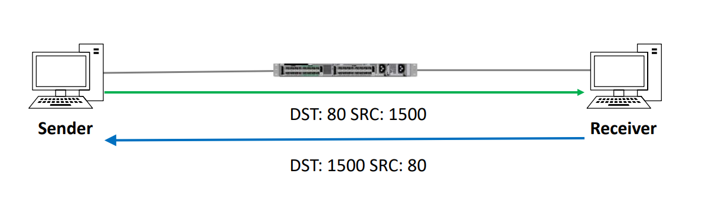

### 전송 계층
- 호스트 간 데이터 전송 역할
-  오류 복구와 흐름 제어를 담당하기도 함.
- 발신자의 데이터 흐름을 조정하는 것.  
-> ex. 인터넷 속도가 너무 빨라 수신자가 처리하기 벅차다면 흐름 제어가 발동해 늦추도록 함.

- 멀티플 세션 지원 -> 다양한 세션과 통신 가능

- 이메일용 데이터, HTTP용 데이터 이런걸 어떻게 구분할까?  
-> 4계층의 Port 번호 사용.
- TMI -> 이메일 port: 25, HTTP port: 80

- 발신자는 제4계층 헤더에 출발지 포트 번호를 추가함. 출발지,목적지 포트를 보고 세션을 추척할 수 있다. 
  
  (헤더의 정보를 보고 출발지 port로 response하는 모습)

# 프로토콜 종류
TCP,UDP 존재

## TCP
TCP: 연결 기반 양방향으로 데이터를 전송함, 순서 제어 수행(순서 보장), 신뢰성 보장(누락 됐을 경우, 전체 트래픽이 들어오지 않았다면 누락.)

### Three_Way_Handshake

1. 송신자가 Sync 메세지 전송
2. 수신자는 동기화 완료 통보 전송
3. 송신자가 연결 통보

### 헤더 구성

구성요소
1. 출발지 port
2. 도착지 port
3. 순서 번호
4. 응답 번호
5. 헤더 길이
6. 예약 필드
7. 코드 비트
8. 윈도우 ( 흐름제어를 위함 )
9. checksum ( 트래픽 오류 여부 확인 )
10. Urgent(긴급위치?)
11. 다른 옵션

## UDP
1. 송신자가 패킷을 구성해 전송 -> 성공적이길 빔 ( 기도메타 )
2. 연결 기반이 아님.
3. 아무런 제어가 없음. ( 신뢰 불가 )

오류 발견하고 복구하기 위해선 상위계층에서 발견되어야한다. UDP는 제공되지 않음.

### UDP Header

구성요소
1. 출발지 포트
2. 목적지 포트
3. 헤더 길이
4. UDP checkSum

# 사용하면 좋은 환경들
TCP
1. 신뢰성이 필요한 경우 사용
UDP
1.  실시간 컨텐츠의 경우 ( 음성, 영상 ) TCP의 간접 비용(흐름제어 등을 위한 비용) 감당할 수 없어 UDP를 사용함. (속도를 위해서도 있음 )

### 자주 쓰는 포트들
TCP
- FTP (21)
- SSH (22)
- Telnet (23)
- HTTP (80)
- HTTPS (443)

UDP
- TFTP (69)
- SNMP (161)

TCP and UDP both
- DNS (53)