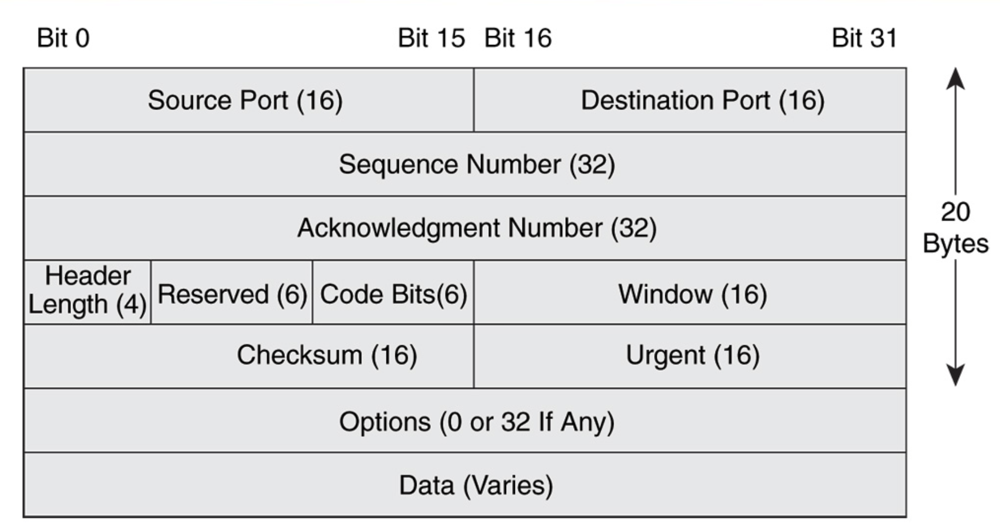
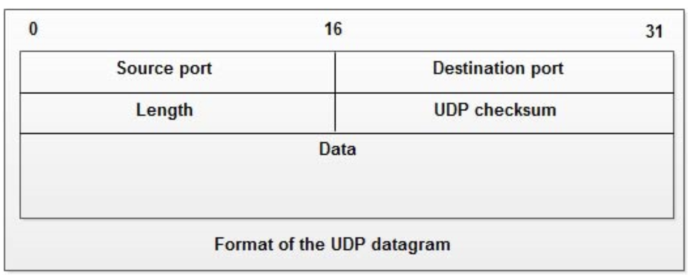

4계층은 이전에도 말했듯 세가지의 요소가 있다.  
- Port
- TCP
- UDP

물론 이외에도 세션다중화, 흐름제어를 맡기도한다.  
세션다중화는 한 장치에서 여러 종류의 패킷이 들어올때, 각 호스트에 맞게 보내주는 것을 의미하고,  
흐름제어는 송신자가 수신자애서 처리하기에 너무 빠른 속도로 패킷을 보낼때 송신속도를 제어하는 작업 등을 의미한다.   

## Port
한 호스트에서는 여러 애플리케이션이 돌아간다.  
하지만 호스트로 패킷이 들어오는 길은 하나이다.  
이때 호스트로 들어온 어떤 애플리케이션으로 가야하는지를 알려주는 것이 포트이다.  

포트는 애플리케이션 레벨에서 보기엔 하나밖에 없다.  
무슨 말이냐면 내가 어떤 서버로 요청을 보낼때 해당 서버의 포트만 알면된다.  
하지만 실제로는 포트 번호가 두개가 들어간다.  
송신자 포트, 수신자 포트.  
그리고 이를 활용해 stateful 방화벽이 작동한다.  
송신자와 수신자 사이에 방화벽이 있고 송신자 측에서만 수신자에게 패킷을 보낼 수 있게끔 설정해놨을때, 송신자가 보낸 요청에 대한 응답은 수신자측에서 송신자로 보낼 수 있어야 할 것이다.  
이때 수신자에서 보낸 패킷의 포트 번호를 확인해 송신자가 보낸 패킷의 포트 번호와 수신자가 보낸 패킷의 포투 번호가 같다면 해당 요청은 송신자에게 보내질 수 있게끔 하는 것이다.

## TCP / UDP

TCP는 3-way-handshake를 통해 수신자와 송신자를 연결한 후에 헤더에 여러 검증용 정보를 담아 reliability있는 통신을 진행한다.  
만약 수신자측에서 패킷이 전부 오지 않은거 같다면 송신자에 다시 요청을 보내기도한다. 

이에 반해 UDP는 best effort(난 최선을 다했어)방식을 사용해 한번 패킷을 보내고나면 패킷이 제대로 갔는지는 확인하지 않는다.  

때문에 당연히 속도가 중요할땐 UDP를 데이터의 신뢰성이 중요할땐 TCP를 사용한다.  

## DNS
DNS는 특이하게 TCP, UDP를 전부 사용한다하여 조금 더 알아보았다.  
DNS는 널리 쓰이기에 보통 높은 요청 처리량을 가지고있다.  
때문에 속도를 위해 보통 UDP를 사용하지만 몇몇 신뢰성이 필요하거나(zone transfer) 요청의 패킷 크기가 클때(512바이트 이상) TCP를 사용한다고 한다.  
