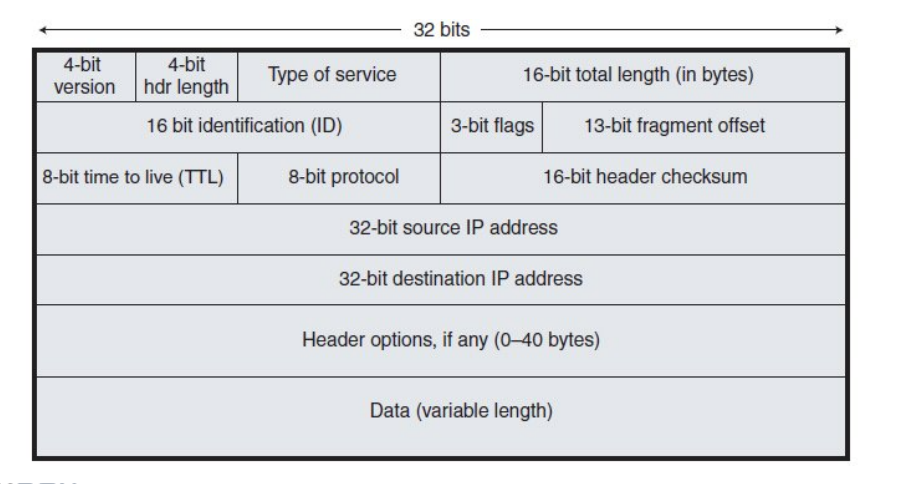
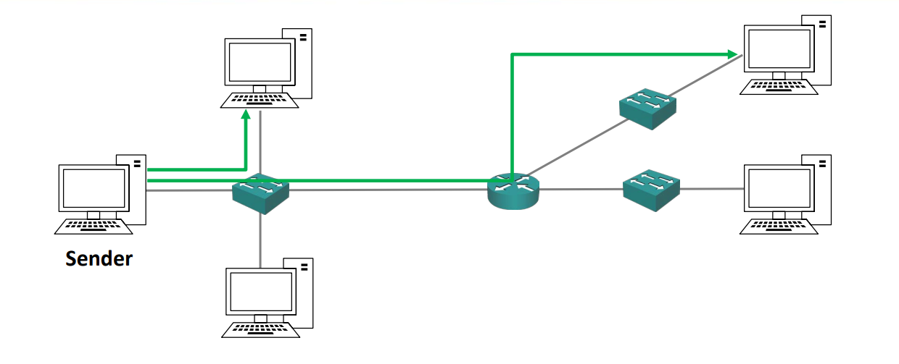
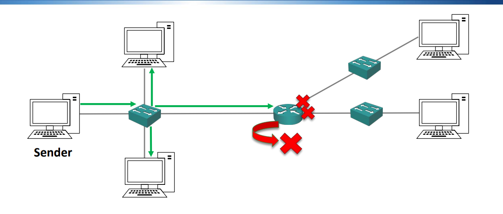
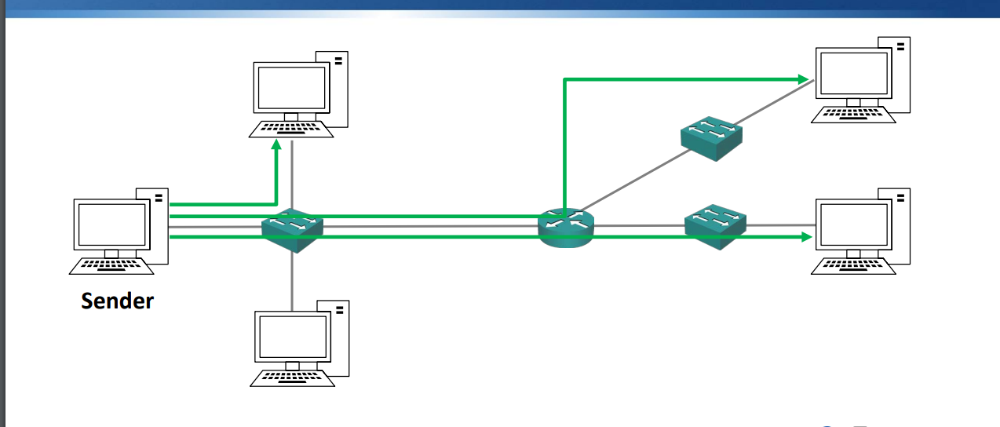

# 네트워크 계층
-> 네트워크상의 목적지로 라우팅 하는 역할    
->> 라우터가 네트워크층에서 작동

IP -> 가장 유명한 3계층 프로토콜  
ICMP -> 핑에 사용되는 인터넷 컨트롤 메세지 프로토콜
IPSec -> 보안 암호화 통신용

### IP 헤더

 
 구성요소
 1. 4비트 버전: IPv4, IPv6 구분
 2. header 길이: 부가적인 헤더옵션으로 인해 길이가 바뀔 수 있음.
 3. 서비스 유형: 서비스 품질정보로 사용됨. 어떤 트래픽인지 지정하여 품질 유지에 사용함.
 4. 패킷의 총 길이
 5. 3 bit flag?, fragment offset?
 6. Time to live(TTL) -> 라우터를 통과할 때마다 TTL을 감소 시키고, 0이되면 패킷을 삭제함. 라우팅 루프를 방지하기 위함(목적지에 도달하지못하고 무한 루프에 빠지는 현상)
 7. 8bit protocol: 4계층 정보를 지정함. (TCP, UDP)
 8. checksum: 패킷이 손상되지 않는지 검사용
 9. source IP Address: 패킷의 출처
 10. destination IP address: 목적지 ip
 11. header options: 부가 옵션
 12. data: 데이터

# 유니캐스트, 브로드 캐스트, 멀티캐스트

### 유니캐스트
-> 단일 목적지 호스트로 이동

말 그대로 단일 호스트에게 전달한다.

### 브로드캐스트
-> 서브넷의 모든 호스트로 이동

한 서브넷의 모든 호스트에게 전달한다. -> 라우터에게도 전달
하지만 라우터는 그 데이터를 삭제해버린다. Why? 그렇지 않으면 모든 인터넷 구성원에게 데이터가 보내질 것이고, 이것은 속도에 악영향을 미칠 뿐더러 보안상에도 문제가 된다.

### 멀티캐스트
-> 관심있는 다수의 호스트(특정 호스트)로 이동

- 멀티캐스트를 사용하지 않으면 3개의 복사본을 따로따로 각각의 호스트에게 전송하여야하지만, 멀티캐스트를 사용하면 1개의 복사본을 여러명에게 보낼 수 있다.(모두에게 보내는 것도 아니다!). 
- 받기 위해선 요청이 필요하다.
- ex. 라디오 방송에 주파수를 맞추는 상황

# IPv4 주소 형식
-> 네 개의 옥텟을 점 신집법으로 표기한다. (ex. 192.168.10.15)  
'.'으로 나뉜 숫자를 하나로 옥텟이라고 부른다.
- 각 옥텟은 8비트고 4개가 모여 32비트가된다.

### 정적 주소 지정 vs 동적 주소 지정

- 고정장비, 서버, 라우터, 스위치, 방화벽 같은 네트워크 인프라 장치나, 프린터 장치 같은 중요한 장치는 ip주소를 수동으로 할당한다.

- 하지만 노트북이나 데스크톱 PC에는 DHCP를 통해 자동으로 ip주소를 부여한다.
- 왜 PC엔 자동으로 부여를 할까? -> 6000명의 직원에게 PC를 부여하고 수동으로 부여하면 귀찮은 작업이 된다. 자동으로 할당하여 중압집중하는게 좋을 것이다.

# 서브넷 마스크
- 같은 서브넷 상 다른 호스트에게 스위치를 통해 직접 트래픽을 보낼 수 있다.
- 다른 서브넷에게 보내기 위해선 라우터를 거쳐야함.  
-> 따라서 호스트는 내 서브넷 안에 있는지, 다른 서브넷에 있는지 알아야 전송 방법을 결정 할 수 있다.

- 서브넷 마스크는 ip와 같이 32비트로 표시된다.

- ip 주소는 네트워크 파트와 호스트 파트로 나뉜다.
-> 그 경계선을 정의하는 게 서브넷 마스크

ex. ip: 192.168.10.15, subnet mask: 255.255.255.0 라면
- 서브넷 마스크를 이진수로 표기했을 때 1로 표기된 곳이 네트워크 파트, 0으로표기된 곳이 호스트 파트다.
-> 255.255.255.0의 경우 3번째 옥텟까지가 모두 1로 차있으므로 4번재 옥텟만 호스트 파트이다.

- 네트워크 파트: 192.168.10, 호스트 파트: .15
-> 따라서 192.168.10으로 시작하는 아이피는 같은 서브넷이므로 라우터를 거치지 않아도 되고, 아닌 경우 라우터를 경유해야한다. 
- 네트워크 파트만 써놓을 것을 네트워크 주소라고한다. ex. 192.168.10.0 

존재해선 안되는 ip
1. 호스트 파트가 모두 0인경우 (그냥 0) -> 이것은 너브넷을 정의하는 최솟값으로 네트워크 주소를 특정하는 역할을 하니 가질 수 없다.
2. 호스트 파트가 모두 1인경우 (255) -> 255의 경우 네트워크 파트의  최대값으로 브로드 캐스트에 사용된다.

### 서브넷 마스크의 슬래시 표기법
ip주소 형식으로 255.255.255.0으로 적을 수 있지만, 서브넷 마스크에 존재하는 1의 개수로 표기할 수 잇다. 

/24 <- 이런식으로 