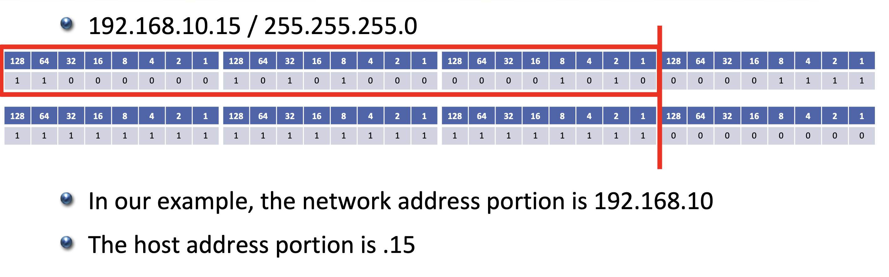

section6의 제목이 3계 - 네트워크층이지만  
실제로 다루는건 십진수 - 이진수 변환, 서브넷, 슬래시 표기법이다.  

## kind of cast in switch
- unicast: 말그대로 한호스트로만 패킷을 보낸다.
- broadcast: 패킷을 모든 호스트로 보낸다.
- multicast: 패킷을 특정 호스트들로만 보낸다.  

## subnet
sub-net 말그대로 network에서의 부분집합이란 의미이다.  
같은 서브넷에서의 통신은 호스트의 요청이 라우터에게 가고 라우터가 직접 수신 호스트에게 요청을 보내주지만, 다른 서브넷끼리의 통신은 호스트의 요청이 라우터로가면 마치 라우터가 요청을 보낸 호스트인 듯이 외부 서브넷의 라우터와 소통하는 것으로 알고 있다.  
이때 같은 서브넷인지 아닌지를 서브넷 마스크 주소를 통해 알 수 있는데 서브넷 마스크 주소의 생김새는 연속적인 1과 연속적인 0으로 이루어져있다.  
호스트의 IP주소와 서브넷 마스크가 있을때 아래사진처럼 서브넷 마스크의 1에 위치하는 주소부분이 **network address**이고 그 외 부분이 **host address**이다.   

그리고 서브넷 마스크의 생김새를 보면 알 수 있듯이 1과0이 바뀌는 부분이 명확한데, 이를 이용해 1의 개수를 세서 IP주소와 서브넷 마스크를 따로 표기하는 것이 아닌 IP주소/서브넷마스크(1개수)와 같이 간단히 표기할 수 있다. 

당연하게도 서브넷 내에서 호스트 주소가 같은 호스트가 존재해서는 안되고, 보통 호스트주소가 0으로 꽉찬 주소는 게이트웨이 주소 1로 꽉찬 주소는 브로드캐스트 주소로서 사용되기에 선점되어 있다.

서브넷을 사용하는 이유에는 에러검출 시 용이함, IPv4의 주소 개수 부족등 여러 이유가 있다.