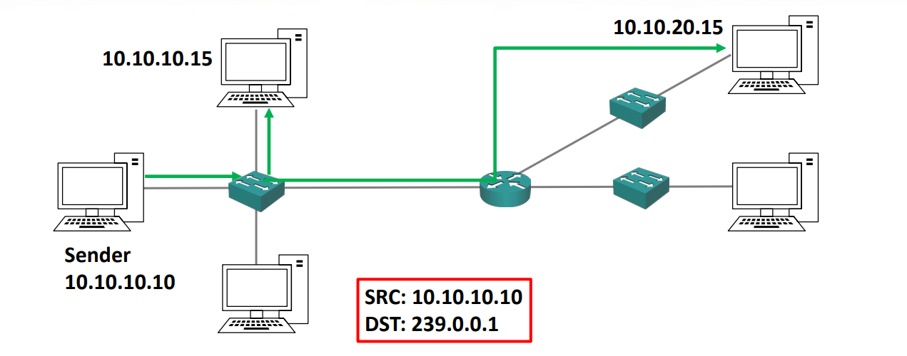

# IP 주소 클래스
-> 클래스 A,B,C,D,E가 존재

### IPv4의 문제점
- 원래 IPv4같은 경우, 회사가 인터넷을 쓰고자할 때, IP주소 범위를 신청하여 사용했다.
- IPv4를 만들 당시에, 사람들이 인터넷에 이렇게 몰리고, 사용자가 많아 질 지 몰랐다.  
-> 그래서 지금 모든 호스트를 감당하기에 숫자가 많지 않다.

-> 그것을 해결하기위해 IPv6가 나왔다. (128bit)

## 클래스 A
- 매우 많은 수의 호스트를 가진 네트워크에 할당됨.  
-> 작은 네트워크 파트와 큰 호스트 파트 
- 최상위 비트는 무조건 0 (그래서 유효한 네트워크 주소 범위는 1.0.0.0 ~ 126.0.0.0)
- 기본 서브넷 마스크는 /8 (유효한 호스트 주소 범위는 1.0.0.1 ~ 126.255.255.254)

- 127.0.0.1 ~ 127.255.255.255 는 로컬 ip 테스트 용 주소라서 유효하지 않다.
-> 부족할 것이라 예상하지 못해 호스트 주소로 쓸 수 있는 ip를 상당 수 날려먹었다.

A클래스를 할당 받은 회사는 이것을 모두 호스트 주소로 사용하지 않을 것이다. -> 수가 너무 많아 관리가 까다로움. -> 그래서 서브넷팅을 통해 더 작게 쪼게 할당 할 것이다. (부서 마다 다르게 라던가.)

## 클래스 B
- 원래 중대형 네트워크를 위해 만들어짐.
- 처음 두 비트가 무조건 1, 0 으로 세팅됨. (유효한 네트워크 주소 범위 128.0.0.0 ~ 191.255.0.0이다.)
- 기본 서브넷 마스크는 /16이다. (유효한 호스트 주소 범위는 128.0.0.1 ~ 191.255.255.254) 

## 클래스 C
- 소규모 네트워크에 사용됨
- 처음 세 비트는 무조건 1, 1, 0 (유효 네트워크 주소는 192.0.0.0 ~ 223.255.255.0)
- 기본 서브넷 마스크는 /24이다. (유효 호스트 주소 범위는 192.0.0.1 ~ 223.255.255.254)
- 작기 때문에 실제 환경에 그대로 할당할 수 있다.

## 사설 IP 주소
- 각 클래스에 예약된 사설 주소 범위 또한 존재한다.
- 이 주소는 다른 주소와 달리 호스트에 할당 될 수 있지만, 공용 인터넷에 라우팅되지 않는다. -> 인터넷 연결이 없는 IP 주소 (해킹 위험이 없음.)
- 클래스들의 각 범위는 
  1. A: 10.0.0.0 to 10.255.255.255
  2. B: 172.16.0.0 to 172.31.255.255
  3. 192.168.0.0 to 192.168.255.255

## 클래스 D
- 멀티캐스트 주소에 사용된다.
- 상위 네 비트는 무조건 1, 1, 1, 0 이다. (유효 IP 범위 225.0.0.1 ~ 239.255.255.255) 
- 이 클래스엔 호스트가 할당되지 않고, 서브넷 마스크도 없다.

- 10.10.10.10가 239.0.0.1이라는 멀티캐스트 주소로 데이터를 보내면 239.0.0.1에 접속해 있던 10.10.10.15와 10.10.20.15가 데이터를 모두 받을 수 있다.

## 클래스 E
- 실험용, 미래의 사용을 위해 확보된 주소다. 
- 상위 네 비트는 무조건 1, 1, 1, 1이다. (유효 IP 주소 범위 240.0.0.0 ~ 255.255.255.255)
- D와 마찬가지로 서브넷 마스크가 없다.
- 255.255.255.255는 브로드캐스트 주소로 사용된다. (해당 네트워크의 모두에게 데이터 전송)
- 다른 주소들은 전혀 사용되지 않는다.