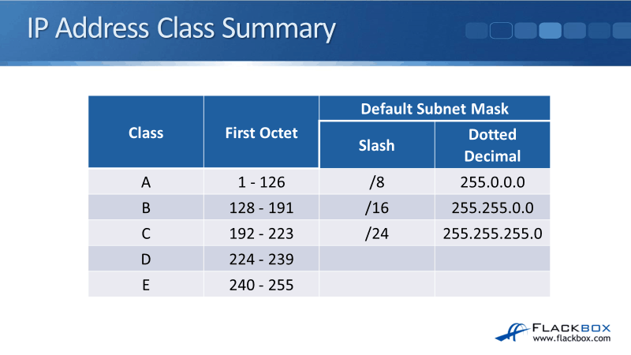
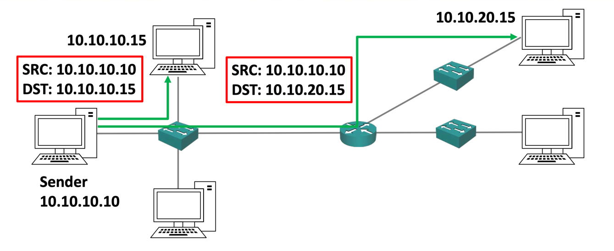
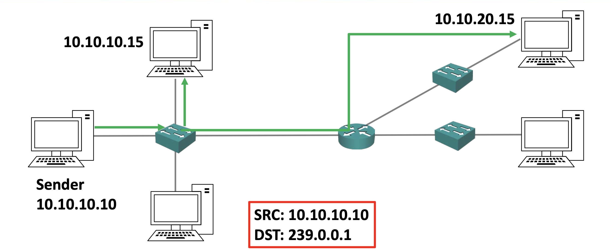

## IP class
IP주소에 class 체계가 있는 이유는 당시 시대상을 생각하면 이해할만 하다.  
당시엔 컴퓨터란게 이렇게 일반적으로 보급될지 예상하지 못했고 어느 기업이나 단체에서 IP주소를 요청하면 미래에 해당 기업이나 단체에 컴퓨터가 늘어날걸 예상해 넉넉하게 주고 알아서 서브넷으로 나눠서 사용하라했다.  
그리고 이를 A,B,C로 나눠 규모가 커서 많은 IP가 필요하면 A, 그리고 규모가 작다면 호스트 수도 적은 B, C를 보급하는 식으로 했다.  

각 class별 IP주소의 첫 옥텟의 왼쪽 비트들은 아래와 같이 고정돼있다.  
- A - 0
- B - 10
- C - 110
- D - 1110
- E - 1111

눈썰미가 좋으면 눈치챘겠지만 위 옥텟의 첫비트와 사진과는 일치하지않는점이 하나 있다.  
바로 A의 first octet의 범위가 1~126인 것.  
첫 옥텐의 첫비트가 0이라면 127도 가능할텐데 말이다.  
이는 미리 다른 용도로 선점돼있기 때문인데, 루프백이 그 목적이다.  
루프백 주소라하면 127.0.0.1, localhost라 이해하면된다.  
대표적으로 127.0.0.1만 사용해서 그렇지 사실 127.0.0.1 ~ 127.255.255.255 전부 루프백 주소로서 사용가능하다.  
IP주소도 부족한데 굳이 이렇게 비효율적으로 한 이유는......... 없다.  
과거엔 IP주소가 부족할지 모르고 그냥 A클래스의 한 네트워크 주소를 전부 사용한거라고 한다.

### D, E class
D,E는 특별한 용도로 사용되기에 개인 호스트의 IP 주소로서는 사용할 수 없다.  
E는 실험용으로서 사용되고, D는 멀티캐스트 목적으로 사용된다.  
멀티캐스트의 작동방식은 라디오 주파수와 비슷하다.  
유니캐스트는 패킷에 [src:개인호스트주소, dst:개인호스트주소]로 담아 보냈다면, 만약 멀티캐스트를 사용할 경우 라우터에 [src:개인호스트주소, dst:D클래스 주소]로 보낸 후 해당 D클래스 주소 즉 멀티캐스트 주소로부터 패킷을 받길 원하는 호스트에 패킷을 보내주는 식이다.

