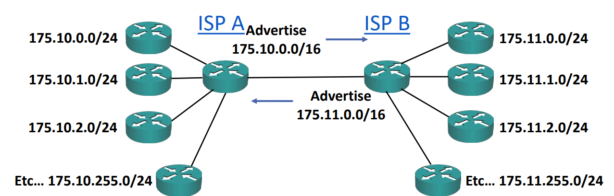
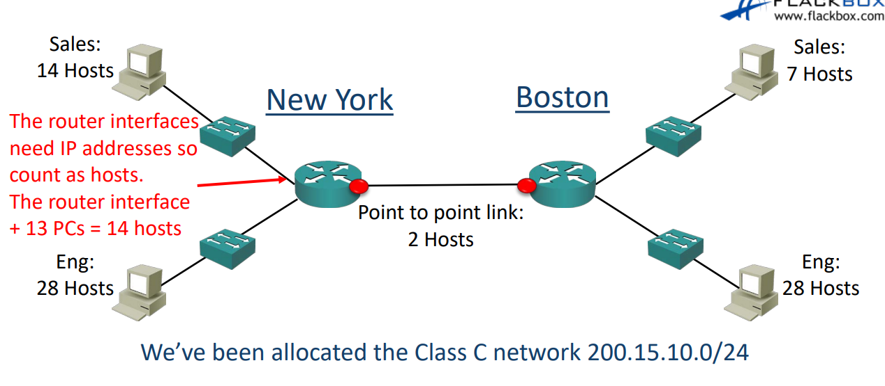
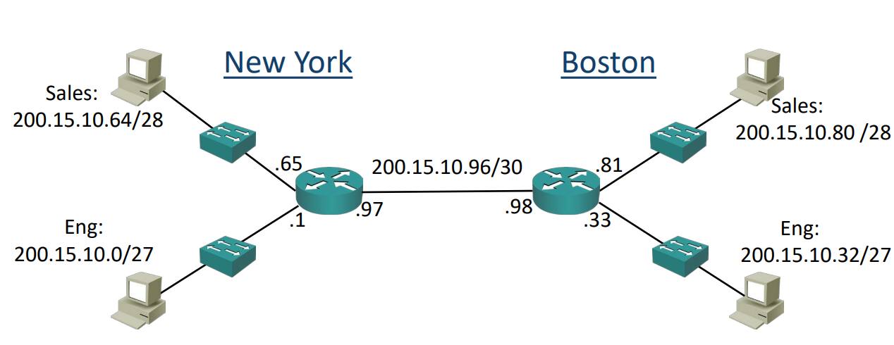
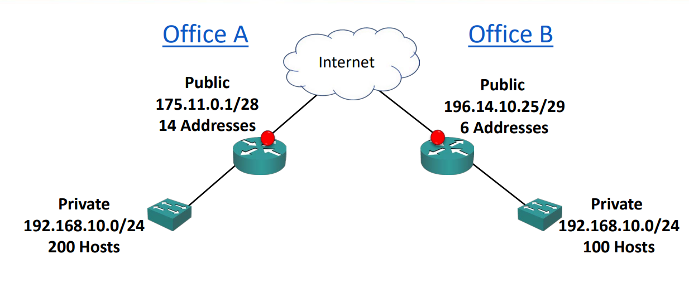
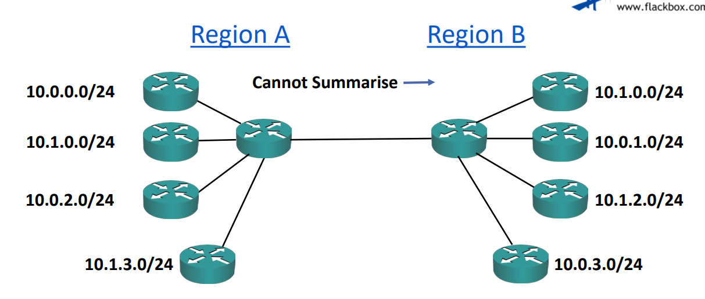

# CIDR (Classless Inter-Domain Routing)
- 기존 클래스들의 문제는 255개의 호스트가 존재하는 회사가 ip를 할당 받으려고할 때 발생한다.  
-> 클래스 C를 쓰자니 1개가 모자라고 B를 쓰자니 공간이 너무 낭비된다.

- CIDR은 클래스의 기준 서브네팅을 없애고(/8,/16,/24) 더 작은 네트워크로 분할 할 수 있도록 만들어준다. (이것을 서브네팅이라고 함.) ex. 175.10.10.0/20

- **또 다른 장점은 경로 요약이다.**
 
 - ISP A가 B에게 CIDR없이 자신의 네트워크를 통지하기 위해선, 175.10.0.0/24, 175.10.0.0/24... 모든 네트워크 256개를 통지해야하지만, CIDR을 사용하면 175.10.0.0/16 하나로 256개를 모두 통지할 수 있다.  
 -> 이렇게 경로 요약을 하면서 라우터의 메모리도 조금만 사용할 수 있다.

 - ISP A의 링크가 하나 다운되도, 요약 경로는 그대로기 때문에 ISP B엔 영향이 없도록 할 수 있다.

# 서브네팅
- 공공 ip는 사야한다. 하지만 나는 4개의 그룹으로 ip를 분할해 사용하고싶다. 그러면 4개의 공공 ip를 사는 것이 아닌, 클래스 C의 ip를 구매한 후, 그것을 더 잘게잘게 분할하는 것이다.  
기존 클래스 C의 서브넷 마스크는 /24지만 /28로 4개의 비트를 사용하여 네트워크 주소의 수를 늘리면 더 많은 네트워크로 분할 할 수 있을 것이다. (정확힌 16개의 네트워크를 더 사용할 수 있다.) 

###  ip subnet-zero
- 예전엔 호스트 ip중 모든 비트가 0인 것과 모든 비트가 1인 주소를 사용할 수 없는 것처럼, 네트워크도 동일하게 2가지 경우를 쓸 수 없었다. 하지만 이유가 없었다. -> 낭비하고있었음.

**Cisco 네트워크에선 ip subnet-zero라는 명령어를 통해 이것을 비활성화할 수 있다.**

## /31 서브넷
- /31 서브넷에선 브로드캐스트 주소가 딱히 없다. -> 네트워크 내에 호스트가 2개 뿐이라 브로드캐스트가 필요없음.

## /30 서브넷
- /30 서브넷의 경우에도 호스트는 2개뿐이다. (네트워크 주소와 브로드캐스트 주소 제외)

### /31 서브넷 vs /30 서브넷
- /31 서브넷의 경우 네트워크를 128개 더 많이 쓸 수 있고, /30의 경우 64개 더 많이 쓸 수 있다. 수로 봐도 알듯이 /31 서브넷은 네트워크 수를 극한으로 끌어 쓸 수 있다. 하지만 일반적으론 /30 서브넷을 자주쓴다.  
Why? -> 더 규격화 되어 있다.

## VLSM
- 초기 라우팅 프로토콜은 서브넷 마스크 FLSM만 지원하여 서브넷이 가능하지만, 네트워크 내 모든 서브넷 크기가 동일해야했다.

- 나중의 라우팅 프로토콜은  가변길이 서브넷 마스크 VLSM를 지원한다.
 
## 서브네팅 설계 순서
1. 가장 큰 세그먼트를 찾아 적절한 서브넷 크기를 할당한다.
2. 사용 가능한 주소 공간의 시작부분을 서브넷에 할당한다.
3. 반복

!! 실제 설계에선 확장이 가능하게끔 설계해야함 !!
-> 14개의 호스트가 있는 서브넷을 설계할 때, 나중에 누가 합류할 수 있으니 가장 큰 세그먼트를 30부터 시작하면 된다.  
 현재 14개의 호스트가 있는 네트워크는 30개의 세그먼트에서 또 서브네팅하여 할당하면된다.   
   그럼 나중에 30개의 호스트가 있는 부서를 하나 더 만들 수 있는 이점 또한 가져온다. 

### 클래스 C 서브네팅

### 풀이
1. 우리에게 가장 큰 세그먼트는 28개의 호스트가 필요한 Eng부서다.해당 부서는 /27으로 서브네팅한다. (문제니 확장성 고려 X)
2. 뉴욕의 Eng부서에 네트워크를 할당한다. 200.15.10.0/27
3. 보스턴의 Eng 부서에 다음 네트워크인 200.15.10.32/27 을 할당한다.
4. 다음은 비교적 작은 세그먼트인 NewYork Sale부서의 서브네팅을 진행한다. 해당 부서는 /28으로 서브네팅한다.
5. 200.15.10.63까지는 보스턴의 Eng부서에서 사용중이니 네트워크 주소 200.15.10.64 하지만 서브네팅을 1비트 더 했으니 + 16까지 사용이 가능하다. 뉴욕 Sale 부서의 ip 범위는 200.15.10.64 ~ 79 (64는 네트워크 주소 79는 브로드캐스트 주소)
6. 다음은 보스턴 Sale부서는 7개의 호스트가 필요하다. -> /28로 서브네팅 Why? 호스트만으론 /29가 가능하지만 네트워크 주소와 브로드캐스트 주소가 존재함. 
7. 따라서 보스턴 Sale부서의 네트워크 주소는 200.15.10.80/28 (보스턴 Sale 부서의 ip 범위는 200.15.10.80 ~ 200.15.10.95)
8. 보스턴, 뉴욕 사이 라우터에도 ip를 할당해야한다.  
-> 관리를 위한 루프백 주소도 할당한다, 링크할 것이 없으므로 /32를 할당함.
9. 보스턴, 뉴욕 라우터의 네트워크엔 2개의 호스트만 존재하므로 /30로 서브네팅한다.
10. 라우터들 링킹 네트워크는 200.15.10.96/30이 된다. 

### 결과

### 네트워크 주소 빠르게 알아내는 법
1. 다음 네트워크 주소를 구하는 법  
-> 서브네팅이 29로 되어있다면, 호스트에겐 4, 2, 1 를 의미하느 비트가 남아있을 것이고, 다음 크기의 비트는 8을 의미한다. 8을 더해주면된다.  
-> ex. 135.15.8의 다음은 135.15.16
2. 현재 네트워크 주소를 구하는 법  
  서브네팅이 십진수로 표기하고, (/29는 255.255.255.248이다.)  255 - 248 = 8 ==> 8씩 증가, 이런 식으로 증가 값을 알아낸다.  
  135.15.10.138의 네트워크 주소를 구하고자한다면, 이 숫자와 가장 가까운 8의 배수를 알아내면된다. (답은 136 따라서 네트워크 주소는 135.15.10.136)

# 사설 IP
- 오늘날 사설 IP 주소 지정의 최종 기준은 RFC 1918이다.
- 원래 사설 IP는 인터넷에 연결되지 않아야하는 호스트들을 위한 주소였다.
- 사설 IP는 우리가 각 클래스에서 무조건적으로 지켜야했던 규칙 쪽을 사용한다. A는 첫 비트 0, B는 두번째 비트 0  등등

# IPv6
- IPv6는 IPv4의 2배의 비트를 사용해서 부족할 일 없이 쓸 수 있따.
- 하지만 문제가 있다. IPv4에서 IPv6으로 이주할 수 있는 경로가 없다. 이미 설계를 다해놨다면 머리 아프다.
- 그래서 네트워크 주소 변환, NAT가 IPv6으로 전환하기 전에 임시방편으로 구현되어있다.
- 사설 IP를 공공 IP주소로 변환되도록 할 수 있다.

- NAT로 사설 IP를 공공 IP로 변환하여 200개의 host를 공공 ip로 추가적으로 사용할 수 있다. -> (*NAT는 어떻게 사설 IP를 공공IP로 변환하는거??*)

- NAT는 사설 IP에서 인터넷으로 통신을 할 때 사설 IP -> 공인 IP로 변환하여 외부와 소통을 할 수 있게 해줘 내부 호스트를 숨겨줘 보안상 이점이 있지만, 인터넷 -> 사설 IP론 라우팅이 불가능하다.

- IPv6는 휴대전화에서 많이 사용된다. -> PC는 아직 적용, 포팅 되기까진 많이 남았다.
- 2011년을 끝으로 IPv4는 소진됐다.

## 인접 네트워크에 관한 주의점

- 이런 식으로 인접한 네트워크 경로를 요약할 수 없도록 붙여놓으면, 모든 네트워크의 주소를 통보해야해서 메모리를 많이 잡아먹는다.

# 느낀점
- 예전 IPv4를 만들 때 당시의 역사를 같이 설명해 줘서 혼동 하지 않았던 것 같다.