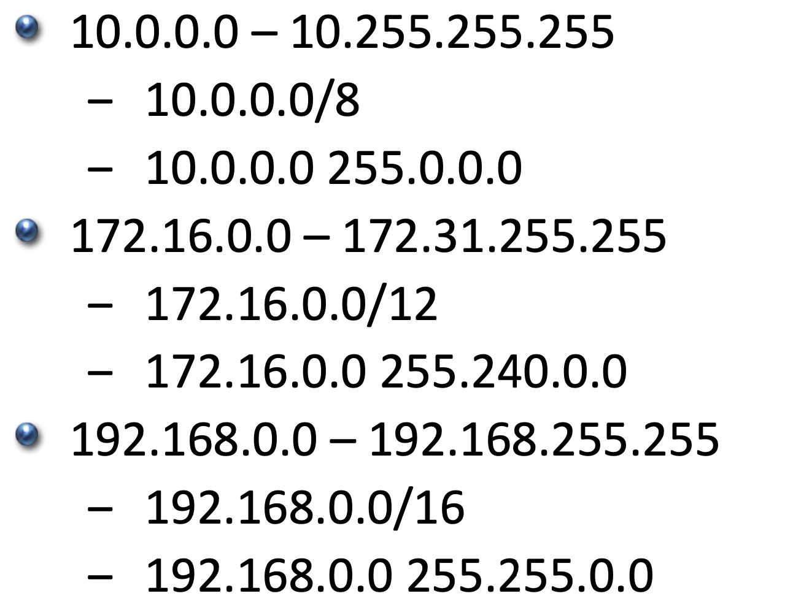

## Classless Inter-Domain Routing
IP class는 과거에 사용되던 방식으로 현대의 네트워크에서는 사용되지 않는다.
클래스간 호스트 수의 큰 간극으로 인한 IP주소의 낭비를 촉진시켰다.  
예를 들어 호스트가 300개있는 기업에서 IP주소를 요청하면 C클래스는 256개이므로 부족하고 B클래스를 할당해주어야하는데 B클래스는 호스트 주소가 6만개가량 되기에 나머지 주소는 전부 낭비된다.  

CIDR은 특별한것은 없고 그저 이전에 배운 서브넷이지만 A,B,C로 나누는 것이 아닌 **IP주소/서브넷마스크** 로 할당해주는 것이다.  
예로 CIDR블럭을 10.10.0.0/16으로 할당해주고 할당받은 기업은 더 작은 서브넷으로 나눠 부서에 맞게 할당해주는 것이다.  
서브넷을 나눌때 호스트수에 따라 호스트주소가 호스트수를 전부 커버할 수 있게 나누어줘야할텐데, 이때 여러 부서가 있으면 호스트가 많은 부서부터 서브넷을 할당해주어야한다.  
- 서울: 300
- 부산: 150
- 광주: 100
- 대전: 64

### practice
위와 같이 부서가 나눠져있는 기업이 있으면 서울-부산-광주-대전 순으로 서브넷을 할당해주어야한단 것이다.  
위의 예와 같이 문제를 하나 풀어보면,  
seoul부서는 300개의 호스트가 있으므로 호스트주소가 256으로부족하고 512부터 가능하므로  
**10.10.0.0/23** 서브넷이 부여될거고  
부산은 128은 부족하고 256부터 가능하므로  
**10.10.2.0/24** 서브넷이 부여될 것이다 세번째 옥텟이 2인 이유는 10.10.0.0 ~ 10.10.1.255는 서울부서에 할당됐기 때문이다.  
같은 방법으로 광주는 128개부터 가능하니  
**10.10.3.0/25** 서브넷이 할당될 것이다.  
대전은 **10.10.3.128/25** 서브넷이 할당될 것이다.  
대전은 호스트가 64개인데 서브넷 마스크가 /26이 아닌 /25인 이유는 호스트 주소 2개는 네트워크 주소와 브로드캐스트 주소로 인해 선점되있기 때문이다.  
때문에 실제론 서브넷이 512개의 호스트주소를 가지고있다면 실제로는 510개의 호스트주소를 부여해줄 수 있는 것이다.  

옛날엔 아무 이유없이 네트워크 주소도 2개 공제했지만(0또는 1로 꽉찬 주소) cisco에선 subnet zero라는 이름으로 이를 비활성화했다.

추가로 위에서 배운 내용을 통해 생각해보면 서브넷 마스크가 /31일 경우 브로드캐스트 주소나 네트워크 주소가 할당하면 호스트주소가 꽉차는데 어떻게 될까?  
이 경우 네트워크와 브로드캐스트 주소가 실제로는 필요가없기에 사용하지 않는다.  
생각해보면 어짜피 호스트가 두개면 브로드 캐스팅할때 반대편으로 유니캐스팅하면 되기 때문이다.

## IPv6, NAT
2000년대 초 네트워크 엔지니어들은 IP주소가 부족할 수 있겠다는 느끼게 되어 IPv6를 개발하게 되었다.  
기존 IPv4가 32비트를 사용하는 반면에 IPv6는 128비트이므로 정말 웬만해서는 주소가 부족할일이 없다.  
하지만 아직도 우리는 IPv4를 주로 사용하고 있다.  
이유는 주소부족의 대책이 너무 잘 작동해서 인데, RFC1918이라고도 불리는 개인 주소, 사설망 덕분이다.
  

위 사진처럼 각 class별로 사설주소가 선점돼있는데, 우리가 10.x.x.x, 192.168.x.x 주소가 익숙한 이유이다.  
사설망을 사용하면 network address translator의 약어인 nat가 필요한데, 기업에서 cidr블럭을 할당받으면 사설망을 구축하고 그 앞에 nat를 둔다.  
그러면 내부 사설망에서 인터넷으로 통신할때 nat가 사설망의 호스트의 개인 주소를 할당받은 cidr블럭의 공인 주소로 변환해 통신을 할 수 있게 해준다.  
만약 인터넷으로 사설 IP(개인주소)를 통해 연결하게 되면 라우터는 해당 패킷을 그냥 지워버린다.  
사설 IP는 수많은 사설망에서 사용되기에 어디에 패킷이 가야할지 모르기때문이다.  
물론 내부 사설망에서는 사설IP를 통해 통신이 가능할 것이다.  

추가로 모바일 기기에선 IPv6가 잘사용되는데 이유는 모바일 기기 산업은 IPv4의 주소가 부족할 거란 예상 이후에 발전되었기 때문이다.  
비슷하게 최근 발전되는 산업은 IPv6를 사용하고, 결국엔 전부 IPv6를 사용하는 날이 올 것이다.  

## review
네트워크 공부를할때 어려웠던게 사실 네트워크는 약속이기 때문에 "정말로 이게 맞는건가? 왜 굳이 이렇게 했지?"라는 생각이 들어 이해가 안돼 시간을 허비하는 경우가 많았는데, 강의에선 "과거엔 이렇게 했고 현재에는 이렇게 했다."라고 전문가가 말해주기에 빠르게 이해할 수 있었다.  
