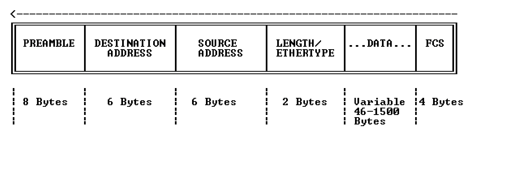

# 2계층 데이터 링크
- 데이터링크에서 부르는 PDU 이름 -> 프레임

## 이더넷 헤더
- 2계층 프로토콜을 이더넷을 쓴다면 이더넷 헤더 ㅎㅎ

- PREAMBLE: 수신자, 송신자의 동기화를 맞추기 위한 정보
- DESTINATION ADDRESS: 목적지 MAC 주소
- SOURCE ADDRESS: 출발지 MAC 주소 
- ETHERTYPE: 데이터를 캡슐화하는데 사용되는 타입, 보통 IPv4
- FCS: 프레임 검사 시퀸스, 무결성 검사와 손상 됐는지 검사하는데에 사용

### MAC 주소
- 크기: 48비트
- Mac주소는 역할에 따라 2개로 쪼개질 수 있다.
- 전반부 24비트를 OUI라고한다. (이더넷 포트의 제조업체, Cisco의 스위치의 oui는 cisco의 식별자가 있다.)
- 나머지 후반부 24비트는 제조업체에 의해 지정된다. 
- MAC주소는 세계적으로 고유하다.
- 논리적 주소가아니다. 그냥 고유한 평면 주소, 주소가 1이면 1인 것.
