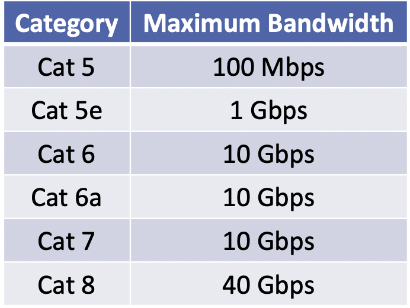

# 물리계층
- 물리계층은 실제로 비트로 된 스트림을 전기 신호로 전선에 올려두는 작업을 한다.
- 방법은 다양하다. 구리 케이블을 통한 전기 신호, 광섬유 케이블을 통한 빛 신호 등등...

- 원래 이더넷은 동축 케이블이 사용 됐지만, 요샌 사용되지 않는다. 꼬임 구리 쌍 케이블이나 광섬유, 무선을 사용한다.

## UTP
- UTP를 사용하기도하는데 이것은 차폐되지않는 꼬임 쌍을 뜻한다.
- 일반적으로 스위치와 데스크톱을 연결하는데에 사용된다.
- 최대 100미터의 길이를 가지고있다.
- 표준 네트워크 케이블은 끝에 RJ-45커넥터가 있다. (UTP도 포함)

### UTP 케이블의 변화

- 점점 최대 속도가 늘어났다.
-> 네트워크 장치들의 최대 속도가 증가함에 따라 케이블도 그에 맞춰 점점 발전함.
- 케이블을 더 높은 것으로 변경해도, 내가 속한 건물의 네트워크 장치가 그 속도에 못 미친다면 케이블을 변경해도 소용이 없다.

### 직렬 연결 케이블 vs 크로스 오버 연결 케이블
- RJ-45 커넥터 안엔 개별 송/수신 와이어가 존재한다.
- 그것을 직렬로 연결할 수 있고, 반대로 연결할 수 있다.
- 직렬 케이블은 pc, 라우터 같은 단말기를 스위치에 연결하는데에 사용된다.
- 크로스오버(반대로 연결) 같은 경우, 장치를 직접 연결할 때 사용한다. 같은 유형의 연결할 때 사용함. (두 대의 컴퓨터, 두 대의 스위치)
-> 두 대의 컴퓨터를 연결하는 것은 흔하지 않다.( 요샌 USB같은 외장 장치로 파일을 옮기거나하기 때문) 
- 하지만 스위치를 서로 연결하는 것은 흔함. 건물이 2층일 때, 1층 스위치 2층 스위치가 따로 있다면 1,2층의 단말기가 소통하고 싶다면 2개의 스위치를 크로스 오버 케이블로 연결 시켜주면 된다.

- 최신 스위치는 Auto MDI-X를 지원한다. 이것은 자동으로 신호를 재구성해 원하는 결과를 만들어준다. 그래서 최신 스위치를 사용한다면 스위치끼리도 직렬연결을 해도 상관 없다. (*왜 그럼 반대로 연결하는 거지?*)

## 광섬유 케이블 (Fiber Cable)
- 구리로 된 케이블 보다 더 긴 거리, 더 큰 대역폭을 지원한다.
- 그래서 더 긴 거리의 연결, LAN에선 건물과 건물 사이의 연결 같은 곳에 사용된다.
### 단일 모드 vs 다중 모드
- 단일 모드는 더 높은 대역폭과 더 긴 거리르 제공한다.

### 광섬유 케이블의 커넥터
- 광섬유 케이블의 커넥터는 단일 모드인지, 다중 모드인지에 따라 또한 필요한 거리, 대역폭에 따라 다양한 커넥터가 존재한다. (*단일 모드와 다중 모드의 차이는?*)
- RJ-45와 다른 점은 RJ-45는 스위치에 직접 연결되는 반면, 광섬유는 트렌시버를 거쳐 스위치와 연결된다.

### POE 스위치
- 일반적인 스위치를 사용하게 될 경우, 단말기에 전원을 공급하기 위해 콘센트에서 파워를 공급 받아야하지만, POE 스위치를 사용할 경우, 네트워크 케이블을 통해 파워까지 공급할 수 있다.

- Power Injector: 일반 스위치에 연결해 POE 스위치의 역할을 할 수 있게 해주는 중계기 역할.