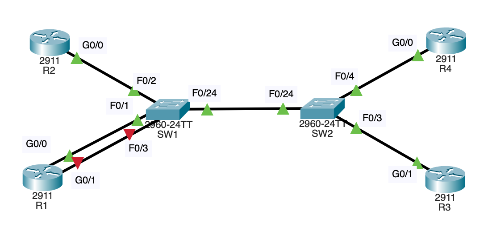

과제 폴더안에있는 pkt를 실행시키면 나오는 토폴로지

과제 pdf를 처음 키게 되면 순서대로
1. 각 라우터에서 `show ip interface brief`를 입력해 인터페이스와(e.g gig0/1) 해당 인터페이스에 할당된 IP주소[[1]](#1) 이외 상태 정보를 확인한다
2. 각 라우터에서 `show interface gig0/0`를 입력해 라우터의 mac address 확인
3. R1 라우터에서 나머지 라우터들의 IP로 ping을 날림
4. SW1 스위치에서 `show mac address-table dynamic`를 입력해 mac address table 확인 

이때 3번과정을 하기전에 4번과정을 하게되면 mac address table이 조금 비어있는 것을 확인할 수 있다.  
R1에서 다른 라우터들로 ping을 할때마다 mac address table이 채워지는 것을 확인할 수 있음[[2]](#2)

이후에 사진을 보면 R1 라우터의 G0/1 인터페이스가 빨간색 세모가 떠있는 것을 확인할 수 있는데(통신 안되는 중)  
해당 인터페이스에 10.10.20.1/24[[3]](#3)를 할당해주면 정상적으로 초록섹 세모가 뜨는 것을 확인할 수 있다.  

#### 1
인터페이스에 할당된 IP주소란게 무슨말인지 잘 모르겠음 IP주소는 장치에 할당된게 아닌가? 인터페이스에 할당되는거라면 연결된 다른 기기들이 나를 각자 다른 IP를 통해 통신한단건가?  
자문자답: 라우터는 여러 서브넷을 연결해주니까 각 서브넷에 맞는 IP주소를 가져야하니 인터페이스에 IP주소를 할당하는 거인듯

#### 2
스위치의 mac address table이 통신할때 패킷의 mac address를 확인해 동적으로 업데이트 된단 것을 알 수 있다

#### 3
그런데 강의에서 스위치는 다른 서브넷끼리는 연결해줄 수 없다했는데 SW1 스위치 모델은 찾아보니 3계층 스위치도 아닌데 10.10.10.1/24랑(R1 gig0/0) 10.10.20.1/24(R1 gig0/1) 서브넷이 연결되도 되는건가