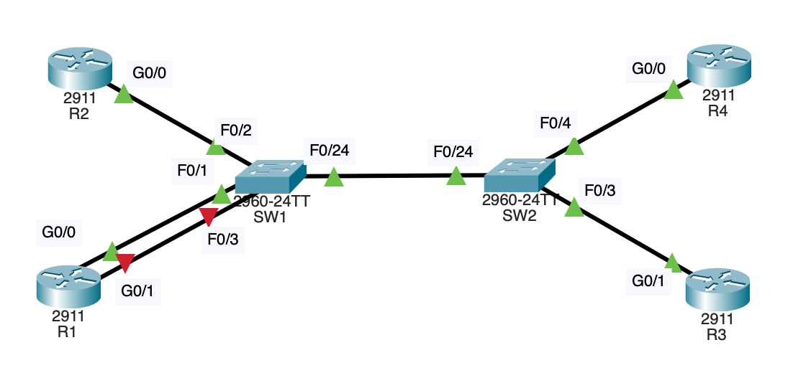

과제 폴더안에있는 pkt를 실행시키면 나오는 토폴로지

과제 pdf를 처음 키게 되면 순서대로
1. 각 라우터에서 `show ip interface brief`를 입력해 인터페이스와(e.g gig0/1) 해당 인터페이스에 할당된 IP주소[[1]](#1) 이외 상태 정보를 확인한다

#1 인터페이스에 할당된 IP주소란게 무슨말인지 잘 모르겠음 IP주소는 장치에 할당된게 아닌가? 인터페이스에 할당되는거라면 연결된 다른 기기들이 나를 각자 다른 IP를 통해 수신한단건가?