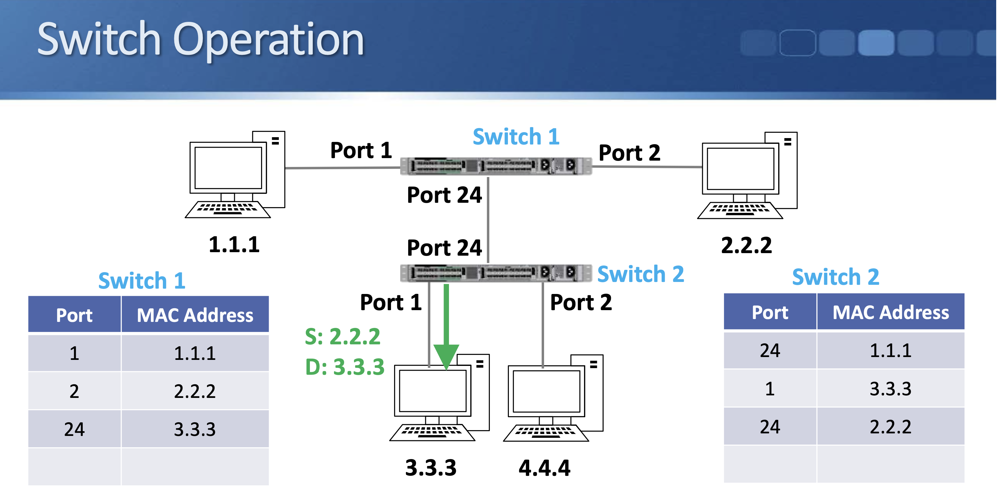

## Section 11 정리

#### 

이 섹션에서는 사용 가능한 다양한

Cisco 장치의 기초에 대해서 알아보겠습니다

허브와 스위치에 대해 배울 텐데요 이들이 어떻게 유사한지와

차이점은 무엇인지에 대해 알아보고 라우터로 넘어가기 전

라우터와 스위치의 차이점도 배울 겁니다

그리고 마지막으로 방화벽과 무선 LAN 컨트롤러

TelePresence처럼 라우팅과 스위칭 강의에서 다루지 않는

사용 가능한 다양한 플랫폼에 대해 살펴볼 겁니다

이후 섹션에서 살펴볼 장치에 대한 더욱 심화된 주제를 접하기 전에

알아 두어야 할 기반을 이 섹션을 통해 다지게 됩니다

#### 스위치 vs 허브

허브와 스위치는 로컬 네트워크의 PC, 서버, 프린터 같은 장치를 연결하는데 사용됩니다. 

과거에는 스위치가 고가였기 때문에 허브가 주로 사용되었지만, **지금은 스위치가 저렴해져 허브는 사용되지 않는다**.

- 허브는 반이중(Half-Duplex) 모드로 작동하여 데이터를 한 방향으로만 전송할 수 있으며, 모든 연결된 장치가 같은 충돌 도메인을 공유해 동시에 전송 시 충돌이 발생할 수 있다. 
    - 충돌이 발생하면 CSMA/CD 방식을 통해 충돌을 감지하고 복구한다. 
    - 또한, 허브는 OSI 모델의 1계층에서 작동하기 때문에 MAC 주소를 인식하지 못하고, 수신한 프레임을 모든 포트로 전송한다.

- 스위치는 전이중(Full-Duplex) 모드로 작동해 데이터의 수신과 전송을 동시에 할 수 있으며, 각 연결된 장치는 독립된 충돌 도메인(전용 통신 경로)을 가지기 때문에 충돌이 발생하지 않는다. 
    - 스위치는 OSI 모델의 2계층에서 작동하며, MAC 주소를 기억해 관련 포트로만 프레임을 전송함으로써 성능과 보안을 개선한다. 
    - 다만, 브로드캐스트 프레임이나 알 수 없는 유니캐스트(목적지의 포트를 모르는 상태인 경우) 프레임은 모든 포트로 전송된다.

- 하나의 허브나 스위치에 연결해야 하는 포트가 부족한 경우, 여러 허브나 스위치를 다른 포트로 연결하여 확장 가능하다.

#### 스위치의 동작

- MAC 주소 테이블을 참고하여 특정 포트로만 트래픽을 전송한다.
- MAC 주소 테이블: 연결된 포트와 MAC 주소를 매핑하는 테이블(표).
- 목적지가 MAC 주소 테이블에 없는 경우 동작
    - 수신 포트를 제외한 나머지 포트로 프레임을 전송한다.
    - 응답을 받은 모든 호스트는 프레임을 확인한다. 본인이면 응답하고, 아니라면 버린다.
    - 응답이 온 포트를 MAC 주소 테이블에 기록한다.
        - `포트: MAC 주소` 이런 느낌.
- 여러 스위치가 연결 된 경우, 한 포트에 여러 MAC 주소가 있을 수 있다.
    - 
    - 스위치 2의 포트 24에는 MAC 주소 1.1.1과 2.2.2가 기록될 수 있다. 스위치 1의 여러 호스트들이 모두 포트 24를 통해 스위치 2에 연결되기 때문.

#### 라우터 vs 스위치

- 라우터
    - 라우터는 여러 IP 서브넷 사이에서 트래픽의 방향을 지시하는 역할을 하며, OSI 모델의 제3계층에서 운용
    - 이는 라우터가 IP 서브넷 간의 트래픽 경로를 지정하는 데 필요. 
    - 제1계층과 제2계층에서도 운용되며(3계층 하위의 기능을 전부 지원하므로)
    - 다양한 인터페이스(이더넷, 시리얼 등)를 지원.
    - 브로드캐스트 트래픽을 전송하지 않음.
    - 호스트의 서브넷이 다른 경우, IP를 기준으로 통신하기 위해서 사용함.
- 스위치
    - 2계층에서 로컬 네트워크를 연결하는데 사용됨.
    - 보통 라우터보다 더 많은 포트를 가지고, 대부분 이더넷 인터페이스만 지원함.
    - 브로드캐스트 트래픽을 전송함.
    - 호스트의 서브넷이 같은 경우만 통신 가능함.
- 3계층 스위치 
    - IP를 인식 가능한 스위치
    - 스위치의 특징을 가짐: 이더넷 + 더 많은 포트
    - 로컬 네트워크 내에서 다른 서브넷 간 통신을 위해서 주로 사용함.

다양한 종류의 포트를 지원한다. (인터페이스를 사용해서 다양한 방식의 통신이 가능.) 

#### 기타 Cisco 기기

네트워크 공부에는 별로 안중요해서 생략

## 실습

- 그냥 자료해서 하라는거 그대로 따라하면 됨.
    - 프롬프트 관련한거 설명은 없어서, 이전 자료 찾아봄.

## 리뷰

허브가 이제 안 쓰인다고 하는데, 그럼 우린 어째서 학교에서 네트워크 수업시간에 CSMA/CD를 공부헀던걸까...

대충 들어만 봤던게 좀 더 명확해진 느낌.