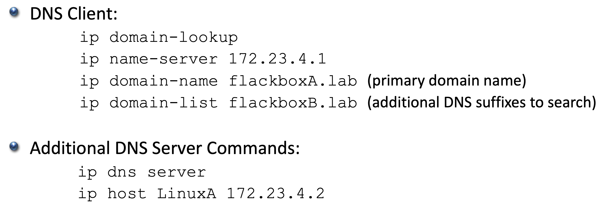
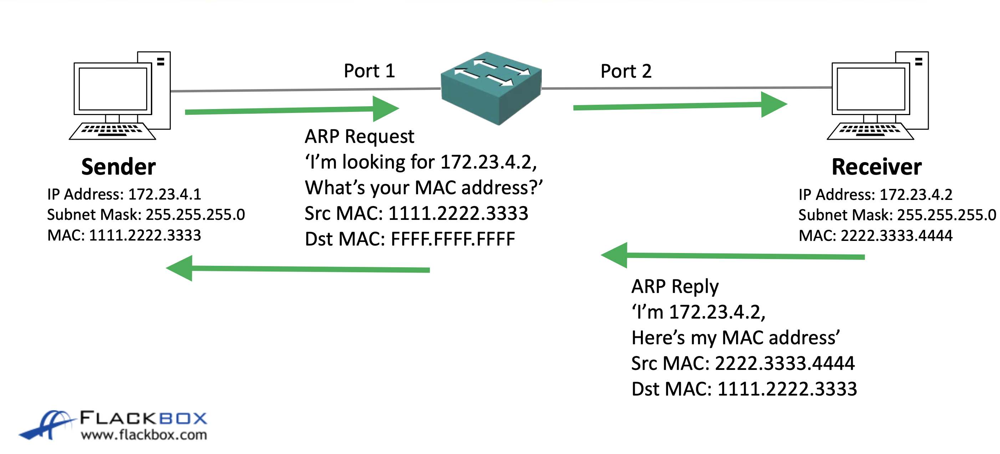

## DNS
DNS는 FQDN(Fully Qualified Domain Name)를 IP주소로 변환해주는 시스템이다.  

위 명령어를[[1]](#1) 통해 Cisco 라우터를 DNS client와 서버로 설정할 수 있다.  
실제로는 라우터를 DNS server로 사용하는 경우는 많지 않다.  

## ARP
ARP는 IP주소를 MAC주소로 변환해주는 시스템이다.  

위 사진을 기준으로 설명하면 sender는 receiver의 IP주소는 알지만 MAC 주소를 알지 못한다.  
때문에 스위치로 receiver의 IP에 대해 arp요청을 broadcast 요청으로 날린다.  
브로드캐스트 요청이므로 해당 서브넷의 모든 컴퓨터에 요청이 가고 receiver또한 해당 요청을 받으며 본인에 대한 ARP요청임을 확인한 receiver는 수신한 패킷의 source MAC 주소를 destination에 담아 reply한다.     

ARP는 2계층 프로토콜인 MAC 주소를 사용해 진행되므로 본인과 다른 서브넷에 있는 receiver에 요청을 보내고싶다면, 본인 서브넷에 있는 게이트웨이의 MAC 주소를 알아내(ARP를 통해) 해당 게이트웨이로 IP를 사용해 요청을 보내면 이후 hop마다 ARP를 진행해 receiver를 찾아간다.  

ARP과정에서 몇가지 이해 안되는 부분이 있어 질문을 남겨놨다.  
https://www.udemy.com/course/cisco-ccna-complete-guide-korean/learn/lecture/29448164#questions/22542915

#### 1
ip domain-lookup과 ip domain-name은 무슨 역할인지 잘 모르겠다.  
