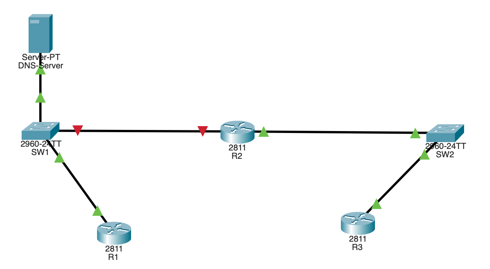
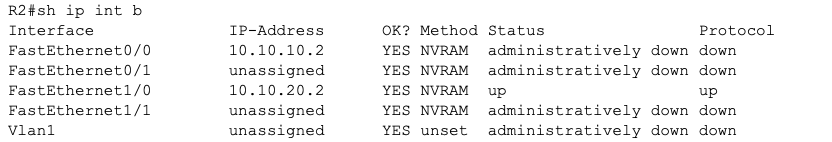
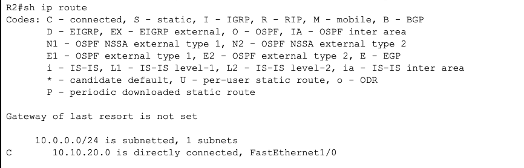
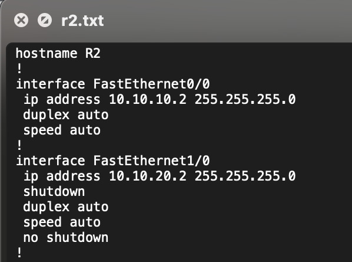
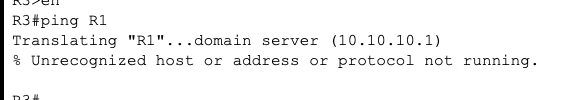

packet tracer에서 간편하게도 R2와 SW1의 연결이 안되는 것을 확인할 수 있다.  

이유를 알기위해 R2에 접속해 `sh ip int brief`와 `sh ip route`를 입력해보았더니 아래와 같은 결과가 나왔다.   

`sh ip int b`에서 f0/0의 프로토콜이 down으로 돼있는것을 보고 이상하게 느끼긴했지만 어떻게 해결하는지를 몰라서 일단 `sh ip route`에서 10.10.10.0 서브넷이 라우팅 돼있지 않으니 `conf t` `ip route`로 정적 라우팅을 추가해주려했다.  
하지만 추가해줌에도 `sh ip route`를 했을때 결과가 바뀌지 않았다.  
모르겠어서 이후 답지를 보니 해당 인터페이스에 접속해 `no shutdown`를 해줘야함을 알게되었다.  
`no sh`가 정확히 어떤 명령을 수행하는지는 모르겠지만 정상적으로 R2와 SW1이 연결됨을 확인할 수 있엇고, 이후 configuration 파일을 보니 실제로 f1/0을 설정할때는 `no sh`를 했지만 f0/0에서는 `no sh`명령어가 누락되어있음을 확인할 수 있었다.  

이후 R3에서 R1으로 ping을 해보니!  
여전히 동작하지 않았다.  
그 이유는 쉽게 확인할 수 있었다.  

DNS서버 주소가 10.10.10.1로 돼있었다.  

답지에서는 `no ip name-server 10.10.10.1`로 잘못된 DNS서버 설정을 먼저 제거해줬지만 그냥 `ip name-server 10.10.10.10`만해줘도 작동은 했다.

그리고 다시 한번 R3에서 R1으로 ping을 해보니 이번엔 정말로!  
작동하지 않았다.  
여기서 이유를 모르겠어서 답지를 보니 DNS서버에 on/off 기능이 있는데 off로 돼있어서 on으로 바꿔주니!  
이제 정말로 R3에서 R1으로 ping이 가능해졌다.  
