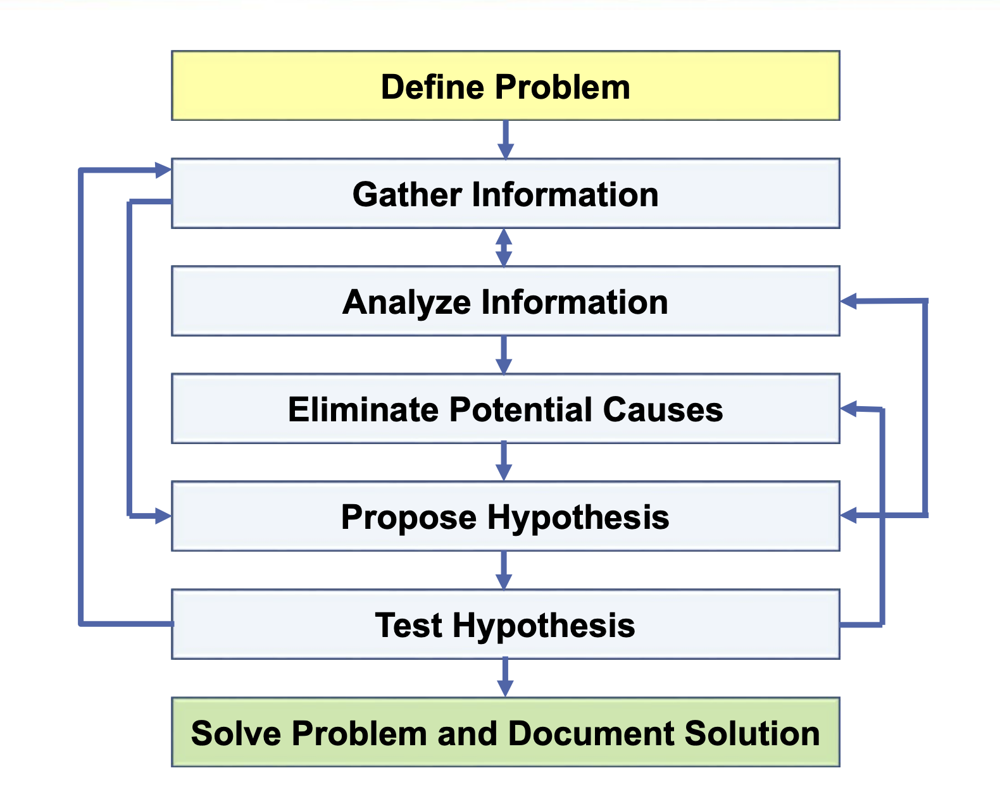

## troubleshooting methodology

위 사진은 씨스코에서 추천하는 네트워크 문제 해결 절차이다.

어느 문제를 해결할때 비슷하듯 문제 정의, 정보 수집, 가설 수립, 가설 검증의 단계로 이루어져있다.  
강의에선 트러블슈팅중 유용할 방법과 명령어를 설명해준다.  

- compare configuration
- trace the path
- swap the components

먼저 설정이 잘못되지 않았는지 확인한다.  
후술할 명령어에서 traceroute라는 명령어로 각 장치를 hop by hop으로 각 장치에 문제가 있는지 확인할 수 있다.  
마지막으론 정말 모든게 정상인데도 작동하지 않는다면 같은 설정값으로 하드웨어만 변경해볼 수도 있다.  

- ping
- traceroute
- telnet

ping은 유명하듯 ICMP프로토콜을 사용해 패킷을 보내 연결이 정상적으로 진행되는지 확인할 수 있다.  
traceroute는 hop by hop으로 TTL이 하나씩 들어날때마다 결과값을 반환해 연결 과정에서 어느 부분에 문제가 있는지 확인할 수 있다.  
telnet은 4계층에서의 연결을 확인할 수 있는 명령어로, ping과 비슷하지만 목적지의 port까지 설정할 수 있어 해당 port가 열려있는지 확인할 수 있다.  
