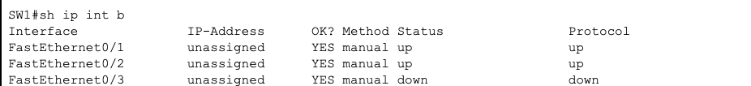
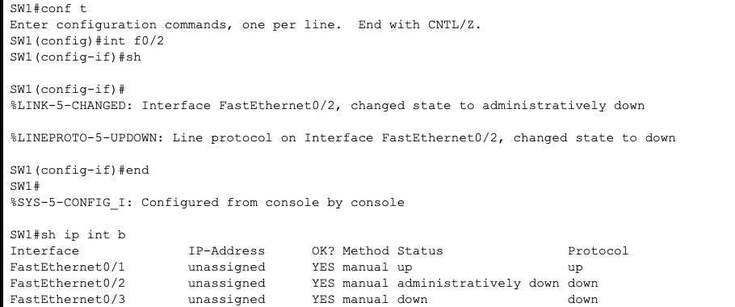
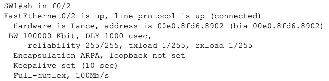
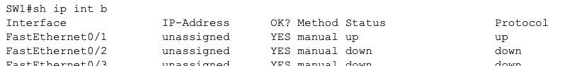
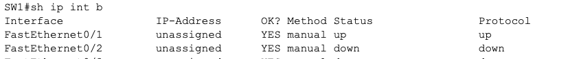
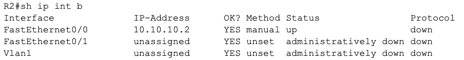

- `hostname R1`
- `hostname R2`
- `hostname SW1`
- `conf t` `int f0/0` `ip add 10.10.10.1 255.255.255.0` `no sh`
- `conf t` `int f0/0` `ip add 10.10.10.2 255.255.255.0` `no sh`
- `conf t` `int vlan 1` `ip add 10.10.10.10 255.255.255.0` `no sh`
- `ip de 10.10.10.2`
- `ping 10.10.10.2`
- `description link to R2`
- `sh int f0/1`
- `conf t` `int f0/2` `duplex full` `speed 100` R2에서도 동일하게, 인터페이스만 바뀜
- `show version`
- `sh cdp ne`
- `conf t` `int f0/1` `no cdp enable`
- `conf t` `no cdp run` `cdp run`
- `sh cdp ne`
- 
- 
- 
- `conf t` `int f0/2` `duplex half`
- 
- `conf t` `int f0/2` `duplex full`
- `conf t` `int f0/2` `speed 10`
- 
- 