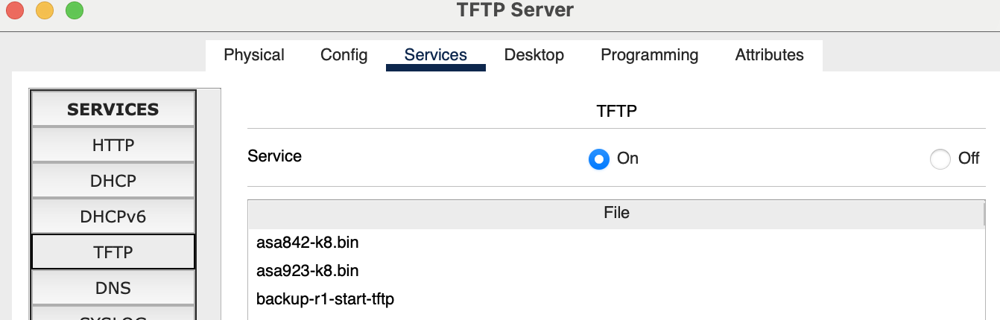
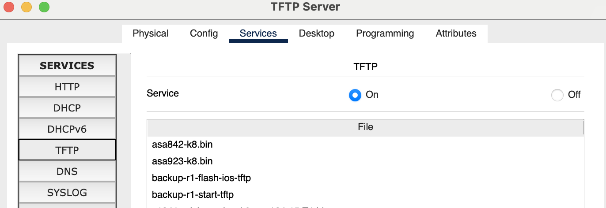

### 1) View the running configuration on R1. Note that the hostname and interface have been configured.
```R1#sh run
Building configuration...

Current configuration : 696 bytes
!
version 15.1
no service timestamps log datetime msec
no service timestamps debug datetime msec
no service password-encryption
!
hostname R1
!
!
!
!
!
!
!
!
ip cef
no ipv6 cef
!
!
```
### 2) Factory reset R1 and reboot.
```
write erase
reload
```
### 3) Watch the boot up process as the router boots.
ok
### 4) The router should boot into the Setup Wizard. Exit out of the wizard and then confirm the startup and running configurations are empty.
```
Would you like to enter the initial configuration dialog? [yes/no]: no
```
### 5) Paste the configuration for R1 from the '15 Cisco Device Management Configs.zip' file back into the configuration and save. You will find it here:
```
Router#conf t
Enter configuration commands, one per line.  End with CNTL/Z.
Router(config)#hostname R1
R1(config)#!
R1(config)#int gig0/0
R1(config-if)#ip address 10.10.10.1 255.255.255.0
R1(config-if)#duplex auto
R1(config-if)#speed auto
R1(config-if)#no sh

R1(config-if)#
%LINK-5-CHANGED: Interface GigabitEthernet0/0, changed state to up

%LINEPROTO-5-UPDOWN: Line protocol on Interface GigabitEthernet0/0, changed state to up
!
R1(config-if)#line con 0
R1(config-line)#exec-timeout 30 0
R1(config-line)#end
R1#
%SYS-5-CONFIG_I: Configured from console by console

R1#copy run start
Destination filename [startup-config]? 
Building configuration...
[OK]
```
### 6) Set the enable secret 'Flackbox1' on R1 and save the running-configuration.
```
R1#conf t
Enter configuration commands, one per line.  End with CNTL/Z.
R1(config)#enable secret Flackbox1
R1(config)#do copy run start
Destination filename [startup-config]? 
Building configuration...
[OK]
```
### 7) Configure the router to boot into the rommon prompt on next reload with an appropriate command and reboot the router.
```
R1(config)#config-register 0x2120
R1(config)#end
R1#
%SYS-5-CONFIG_I: Configured from console by console

R1#reload
Proceed with reload? [confirm]
```
### 8) In rommon mode, configure the router to ignore the startup-config when booting up, and reload the router.
```
rommon 1 > confreg 0x2142
rommon 2 > reset
```
### 9) The router should boot into the Setup Wizard. Exit out of the wizard.
```
Would you like to enter the initial configuration dialog? [yes/no]: no
```
### 10) What do you expect to see if you view the running and startup configurations? Confirm this.
blank configuration
### 11) Copy the startup config to the running config. Do not miss this step or you will factory reset the router!
```
Router#copy start run
Destination filename [running-config]? 

767 bytes copied in 0.416 secs (1843 bytes/sec)
R1#
%SYS-5-CONFIG_I: Configured from console by console
```
### 12) Verify the status of interface GigabitEthernet0/0. Why is it down?
```
R1#sh ip int gig0/0
GigabitEthernet0/0 is administratively down, line protocol is down (disabled)
```
답지에서는 shutdown이 디폴트고 `no sh`는 startup config에 명시적으로 나타나지 않아서라고 함
### 13) Bring interface GigabitEthernet0/0 up.
```
R1#conf t
Enter configuration commands, one per line.  End with CNTL/Z.
R1(config)#int gig0/0
R1(config-if)#no sh
```
### 14) Remove the enable secret.
```
R1(config)#no enable secret
```
### 15) Ensure the router will reboot normally on the next reload and that you will be able to access the router.
```
R1(config)#config-reg 0x2102
R1(config)#end
R1#
%SYS-5-CONFIG_I: Configured from console by console

R1#copy run start
Destination filename [startup-config]? 
Building configuration...
[OK]
```
### 16) Reboot the router and confirm it has the expected configuration.
```
R1#reload

R1#sh ip int b
Interface              IP-Address      OK? Method Status                Protocol 
GigabitEthernet0/0     10.10.10.1      YES NVRAM  up                    up 
GigabitEthernet0/1     unassigned      YES NVRAM  administratively down down 
GigabitEthernet0/2     unassigned      YES NVRAM  administratively down down 
Vlan1                  unassigned      YES NVRAM  administratively down down
```
### 17) Backup the running configuration to Flash on R1. Use a suitable name for the backup file. Verify the configuration has been backed up.
```
R1#copy run flash
Destination filename [running-config]? 
Building configuration...
[OK]

R1#sh fla

System flash directory:
File  Length   Name/status
  3   33591768 c2900-universalk9-mz.SPA.151-4.M4.bin
  4   696      demo
  5   718      running-config
  2   28282    sigdef-category.xml
  1   227537   sigdef-default.xml
[33849001 bytes used, 221894999 available, 255744000 total]
249856K bytes of processor board System flash (Read/Write)
```
질문에는 이름을 지정하라 했지만 지정하지 않았더니 기본값인 5번에 running-config로 저장된 모습
### 18) Backup the R1 startup configuration to the TFTP server. Use a suitable name for the backup file. Verify the configuration has been backed up.
```
R1#copy start tftp
Address or name of remote host []? 10.10.10.10
Destination filename [R1-confg]? backup-r1-start-tftp

Writing startup-config....!!
[OK - 718 bytes]

718 bytes copied in 3.024 secs (237 bytes/sec)
```

### 19) Backup the IOS system image on R1 to the TFTP server. Verify the configuration has been backed up.
```
R1#sh fla

System flash directory:
File  Length   Name/status
  3   33591768 c2900-universalk9-mz.SPA.151-4.M4.bin
  4   696      demo
  5   718      running-config
  2   28282    sigdef-category.xml
  1   227537   sigdef-default.xml
[33849001 bytes used, 221894999 available, 255744000 total]
249856K bytes of processor board System flash (Read/Write)


R1#copy flash tftp
Source filename []? c2900-universalk9-mz.SPA.151-4.M4.bin
Address or name of remote host []? 10.10.10.10
Destination filename [c2900-universalk9-mz.SPA.151-4.M4.bin]? backup-r1-flash-ios-tftp

Writing c2900-universalk9-mz.SPA.151-4.M4.bin...!!!!!!!!!!!!!!!!!!!!!!!!!!!!!!!!!!!!!!!!!!!!!!!!!!!!!!!!!!!!!!!!!!!!!!!!!!!!!!!!!!!!!!!!!!!!!!!!!!!!!!!!!!!!!!!!!!!!!!!!!!!!!!!!!!!!!!!!!!!!!!!!!!!!!!!!!!!!!!!!!!!!!!!!!!!!!!!!!!!!!!!!!!!!!!!!!!!!!!!!!!!!!!!!!!!!!!!!!!!!!!!!!!!!!!!!!!!!!!!!!!!!!!!!!!!!!!!!!!!!!!!!!!!!!!!!!!!!!!!!!!!!!!!!!!!!!!!!!!!!!!!!!!!!!!!!!!!!!!!!!!!!!!!!!!!!!!!!!!!!!!!!!!!!!!!!!!!!!!!!!!!!!!!!!!!!!!!!!!!!!!!!!!!!!!!!!!!!!!!!!!!!!!!!!!!!!!!!!!!!!!!!!!!!!!!!!!!!!!!!!!!!!!!!!!!!!!!!!!!!!!!!!!!!!!!!!!!!!!!!!!!!!!!!!!!!!!!!!!!!!!!!!!!!!!!!!!!!!!!!!!!!!!!!!!!!!!!!!!!!!!!!!!!!!!!!!!!!!!!!!!!!!!!!!!!!!!!!!!!!!!!!!!!!!!!!!!!!!!!!!!!!!!!!!!!!!!!!!!!!!!!!!!!!!!!!!!!!!!!!!!!!!!!!!!!!!!!!!!
[OK - 33591768 bytes]

33591768 bytes copied in 0.476 secs (7409657 bytes/sec)
```

### 20) Delete the system image from Flash and reload.
```
R1#delete flash:c2900-universalk9-mz.SPA.151-4.M4.bin
Delete filename [c2900-universalk9-mz.SPA.151-4.M4.bin]?
Delete flash:/c2900-universalk9-mz.SPA.151-4.M4.bin? [confirm]
```
delete 명령어는 강의에는 안나왔는데;
### 21) Use Internet search to find system recovery instructions for your model of router. Recover the system image using the TFTP server.
https://community.cisco.com/t5/routing/downloading-image-file-from-tftp-server-in-flash-from-rom-mode/td-p/4418210
```
R1#conf t
Enter configuration commands, one per line.  End with CNTL/Z.
R1(config)#config-register 0x2120
R1(config)#reload
            ^
% Invalid input detected at '^' marker.
	
R1(config)#end
R1#
%SYS-5-CONFIG_I: Configured from console by console

R1#reload
System configuration has been modified. Save? [yes/no]:
% Please answer 'yes' or 'no'. 
System configuration has been modified. Save? [yes/no]:yes
Building configuration...
[OK]
Proceed with reload? [confirm]
System Bootstrap, Version 15.1(4)M4, RELEASE SOFTWARE (fc1)
Technical Support: http://www.cisco.com/techsupport
Copyright (c) 2010 by cisco Systems, Inc.
Total memory size = 512 MB - On-board = 512 MB, DIMM0 = 0 MB
CISCO2911/K9 platform with 524288 Kbytes of main memory
Main memory is configured to 72/-1(On-board/DIMM0) bit mode with ECC disabled

Readonly ROMMON initialized
```
```
IP_ADDRESS=10.10.10.1
IP_SUBNET_MASK=255.255.255.0
DEFAULT_GATEWAY=10.10.10.0
TFTP_SERVER=10.10.10.10
TFTP_FILE=c2900-universalk9-mz.SPA.155-3.M4a.bin
TFTP_RETRY_COUNT=20
```
```
R1>en
R1#sh fla

System flash directory:
File  Length   Name/status
  6   33591768 c2900-universalk9-mz.SPA.155-3.M4a.bin
[33591768 bytes used, 222152232 available, 255744000 total]
249856K bytes of processor board System flash (Read/Write)
```
### 22) Verify SW1 is running C2960 Software (C2960-LANBASE-M), Version 12.2(25)FX
```
SW1#sh ve
Cisco IOS Software, C2960 Software (C2960-LANBASE-M), Version 12.2(25)FX, RELEASE SOFTWARE (fc1)
Copyright (c) 1986-2005 by Cisco Systems, Inc.
Compiled Wed 12-Oct-05 22:05 by pt_team
```
### 23) Use the TFTP server to upgrade to c2960-lanbasek9-mz. 150-2.SE4.bin
```
SW1#copy tftp flash
Address or name of remote host []? 10.10.10.10
Source filename []? c2960-lanbasek9-mz.150-2.SE4.bin
Destination filename [c2960-lanbasek9-mz.150-2.SE4.bin]? 

Accessing tftp://10.10.10.10/c2960-lanbasek9-mz.150-2.SE4.bin....
Loading c2960-lanbasek9-mz.150-2.SE4.bin from 10.10.10.10: !!!!!!!!!!!!!!!!!!!!!!!!!!!!!!!!!!!!!!!!!!!!!!!!!!!!!!!!!!!!!!!!!!!!!!!!!!!!!!!!!!!!!!!!!!!!
[OK - 4670455 bytes]

4670455 bytes copied in 3.043 secs (123393 bytes/sec)
SW1#conf t
Enter configuration commands, one per line.  End with CNTL/Z.
SW1(config)#boot system c2960-lanbasek9-mz.150-2.SE4.bin
SW1(config)#end
SW1#
%SYS-5-CONFIG_I: Configured from console by console

SW1#copy run start
Destination filename [startup-config]? 
Building configuration...
[OK]
```
### 24) Reboot and verify the switch is running the new software version.
```
SW1#reload
Proceed with reload? [confirm]
```
```
SW1#sh ve
Cisco IOS Software, C2960 Software (C2960-LANBASEK9-M), Version 15.0(2)SE4, RELEASE SOFTWARE (fc1)
Technical Support: http://www.cisco.com/techsupport
Copyright (c) 1986-2013 by Cisco Systems, Inc.
Compiled Wed 26-Jun-13 02:49 by mnguyen
```