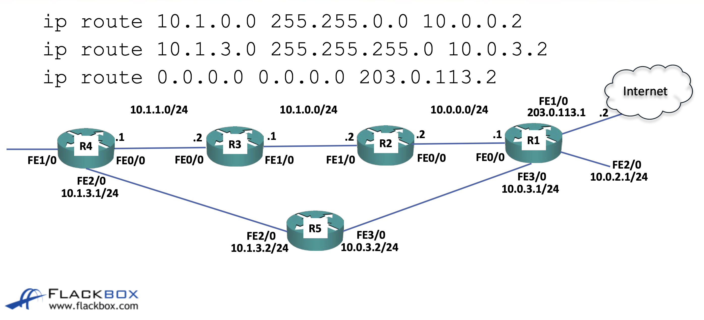

## routing table
이전 강의에서 해왔던대로 라우터의 인터페이스에 ip를 할당해주면 해당 정보는 라우팅 테이블에 저장된다.  
라우팅 테이블은 `show ip route`명령어를 통해 확인할 수 있다.  
기존에는 `sh ip route`를 사용하면 인터페이스에 할당된 서브넷만 보여주고 ip주소는 보여주지 않아 인터페이스 할당된 ip주소를 보려면 `show ip interface brief`를 사용해야했는데, ios 15버전 이후로는 ip주소도 보여준다.  

## static routing
라우터는 직접연결되있지 않은 서브넷에 트래픽을 보내려면 어느 라우터를 거쳐야 하는지 알아야한다.  
위 작업을 다음 명령어로 수행할 수 있다.  `ip route 목적지ip 목적지mask 중간라우터ip`

## ping
ping은 양방향으로 통신을 진행한다.  
예로 router a에서 router b로 ping을 보내는데 a는 b로 가는 길을 알지만 b는 a로 가는 길을 모를때 ping은 실패한다.  
하지만 router b에서 `debug ip icmp`명령어를 입력해놓으면 정상적으로 요청이 들어오는걸 확인할 수 있다.  

## summary routes
만약 바로 다음 hop 너머에 10.1.0.0, 10.1.1.0이 있다면 두 주소를 각각 라우팅해주지 않고 10.1.0.0 255.255.0.0으로 요약하여 라우팅 테이블에 저장할 수 있다.

## longest prefix match

위와같은 토폴로지가 있을때 R1에서 R5로 가는 방법은 두가지가 있다.  
R2 R3 R4를 거쳐서 가냐, 직접 R5로 가냐, 당연히 후자가 더 좋아보인다.  
이때 라우터는 서브넷 마스크의 prefix가 더 긴 경로로 간다.  
라우터를 거쳐가는 경로의 서브넷 마스크는 255.255로 직접가는 경로의 서브넷 마스크인 255.255.255보다 짧다.(이진수로 보았을때)  
때문에 R1은 직접 R5로 가게된다.  

하지만 여기서 R5의 주소가 10.1.0.0 255.255.0.0으로 요약돼있을 수 있는데, 이렇게 prefix의 길이가 같을때는 트래픽을 반반 분배하여 보낸다.  
이때 반반 보내는 방식은 round robin이 아닌 ip주소의 해시값에 의해 결정된다.  
같은 종류의 패킷이 다른 경로로 가는것은 원치 않기 때문이다.  
또한 인터넷을 나가는 경로의 경우 0.0.0.0으로 입력해둔다.  

