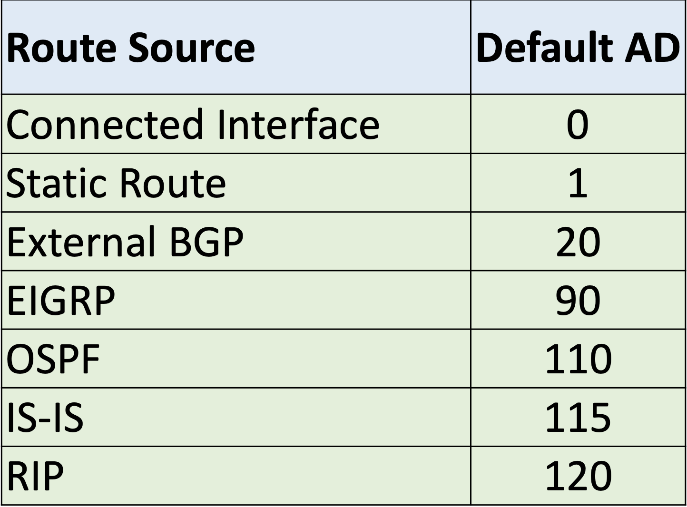
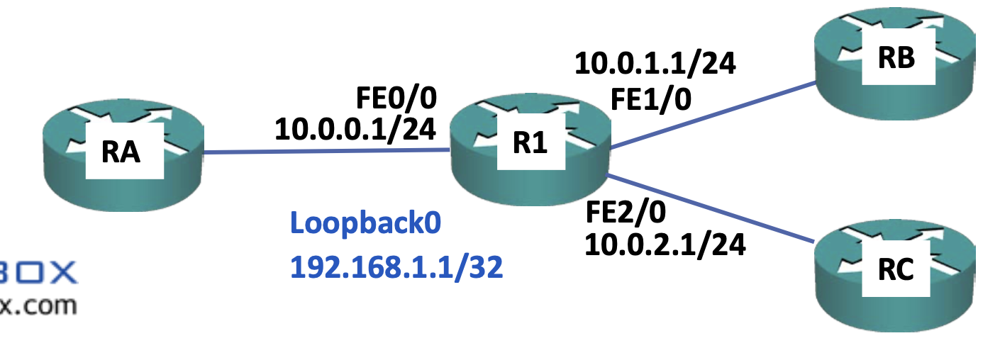

## dynamic routing
이전 섹션에서 배운 정적 라우팅은 당연히 현실에선 쓰기 어려운 부분이있다.  
모든 라우팅을 하나하나 관리자가 설정해주어야하기 때문이다.  
물론 테스트 환경이나 특정상황에선 정적라우팅을 쓰겠지만 대부분의 경우 동적 라우팅을 사용한다.  
동적 라우팅의 기본적인 작동 방식은, R1이 R2에게 나는 A라는 인터페이스를 가지고있어 라고 통보하면 R2는 해당 통보가 들어온 인터페이스를 hop으로 라우팅 테이블에 해당 정보를 업데이트 할 수 있을 것이다.  
그리고 R2에 R3도 연결돼있다면 R2도 R3에게 본인의 인터페이스 정보를 알려주는데 이때 R1이 알려준 정보와 함께 R3에게 전해준다.  

뒤에서 설명할 수도 있지만 여기서 드는 의문은 네트워크는 방대한데 점점 정보를 전달할 수록 정보의 크기가 커지면 뒤쪽에 있는 라우터들은 메모리가 꽉차버리는건 아닌지, 물론 경로 요약이 있긴하지만  
그리고 "뒤쪽에 있는 라우터"는 누가 되는건지, 위에서 든 예시론 R1->R2->R3로 전달됐는데 R3에있는 정보를 R1에 알리려면 어떻게 하는지, 만약 다시 전달한다면 R3는 R1->R2를 통해 받은 정보를 가지고있을텐데 해당 정보들도 같이 알려주게 되는지,  

## routing protocol types
- IGPs(Interior Gateway Protocols)
  - Distance Vector Routing Protocol
    - RIP(Routing Information Protocol)
    - EIGRP(Enhanced Interior Gateway Routing Protocol)
  - Link State Routing Protocol
    - OSPF(Open Shortest Path First)
    - IS-IS(Intermediate System - Intermediate System)
- EGPs(Exterior Gateway Protocols)
  - Path Vector Routing Protocol
    - BGP(Border Gateway Protocol)

동적 라우팅 프로토콜에는 위와같은 종류가 있다.  
보통 거리벡터 라우팅 프로토콜이 링크 상태 라우팅 프로토콜보다 열등하다고 여겨지는데,
거리벡터 라우팅 프로토콜은 인접한 라우터들에게 받은 정보를 받고 업데이트하고 다시 그정보를 인접한 라우터에게 전해주어 rumor 라우팅이라고도 불리지만
링크 상태 라우팅 프로토콜은 네트워크 상의 모든 라우터에 대한 정보를 수정없이 전달하기 떄문이다.  

## metric
네트워크에서 라우터에서 다른 라우터로 가는 경로는 여러개일 수 있다.  
이때 동적 라우팅 프로토콜에서는 최적의 경로를 계산해 해당 경로만 남겨둔다.  
그리고 최적의 경로를 계산하는 지표는 각 프로토콜마다 다르다.  

RIP는 hop count를 사용하고 이는 최대치가 15이며 수정할 수 없다.  
15를 넘어가는 hop count를 가진 경로는 갈 수 없는 경로라 판단한다.  
때문에 RIP는 확장성이 떨어져 최근에는 거의 사용하지 않는다.  
또한 각 연결의 대역폭은 고려하지 않기에 hop count는 적지만 실제로는 더 안좋은 경로로 라우팅할 수도 있다.  

IS-IS또한 hop count를 지표로 사용하지만 대역폭을 고려하게끔 설정해줄 수 있다. 
RIP에서는 수정할 수 없다.

EIGRP와 OSPF는 대역폭을 지표로 사용해 최적의 경로를 계산한다.

최근에는 거의 EIGRP와 OSPF만 사용한다.  
EIGRP는 CISCO의 장치에서만 사용가능하지만 유지보수가 좀더 용이하다.  

여기서 또 하나 의문점이 드는건 대역폭이 높긴하다만 혼잡도가 더 높아서 속도가 더 떨어지는 링크면 어떻게 되는지.

## Equal Cost Multi Path
특정 경로까지 가는 비용이 동일한 경로가 여러개 있을 경우 이전 정적 라우팅때처럼 반반 분산하여 트래픽을 보낸다.  
이때도 같은 트래픽은 같은 경로로 보내고 다른 트래픽은 다른 경로로 보낸다.  

## Administrative Distance
물론 대개의 경우 그러지 않겠지만 만약 여러 동적 라우팅 프로토콜을 사용하게됐을때, 어떤 메트릭을 기준으로 라우팅 테이블에 저장해야하는지 정해놓은 표가있다.  

AD는 라우팅 프로토콜의 지표보다 먼저 계산되어 OSPF와 RIP 두 종류의 라우팅 정보를 받았을때 RIP의 정보는 무시해버린다.  
정적 라우팅의 경우 AD가 1이기에 정적라우팅을 해두면 해당 경로가 더 비효율적일지라도 트래픽을 해당 경로로만 보내게 된다.  
백업 경로를 목적으로 정적 라우팅을 해두고싶다면 `ip route`명령어 마지막에 AD값을 높게 설정해주면 된다.  

## Loopback Interface
라우터의 IP주소같은 느낌?  
원래 라우터는 인터페이스에 IP주소가 할당되기에 같은 라우터한테 가는 경로더라도 목적지 IP주소가 다르게 되는데, 논리적인 IP주소를 라우터에 할당해, 만약 해당 라우터로 가는 인터페이스중 하나가 막혀도 루프백 인터페이스 주소로 통신하면 바로 다른 물리적 인터페이스를 통해서 갈 수 있게끔 해준다.  

## passive interface
동적 라우팅 프로토콜은 전역 설정에서 구성 되고 각 인터페이스 설정해서 활성화/비활성화 된다.  
라우팅 프로토콜은 서로 활성화 돼있을 경우에 정보를 교환한다.  

위와 같은 토폴로지에서 RC는 외부 협력사의 네트워크라 R1의 내부 네트워크 정보를 알려주면 보안상의문제가 생긴다.  
이때 R1의 FE2/0 인터페이스를 수동 인터페이스로 설정하면 RA와 RB가 RC로 가는 경로는 학습하지만 RC에서 정보를 알려주진 않는다.  
만약 FE2/0의 라우팅 프로토콜을 아예 활성화하지 않으면 RA와 RB는 RC로 네트워크 정보를 보내지 않고 RC로 가는 경로도 학습하지 않는다.  
