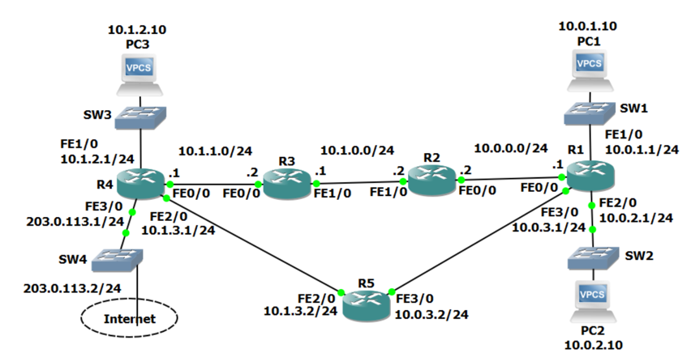

## extended ping

위 토폴로지에서 R1에서 PC3로 ping을 날리면 성공하지만 PC1에서 PC3로 ping을 날리면 실패한다.  
이유는 R4에서 R1의 10.0.0.0/24 서브넷(인터페이스)로 가는 경로는 알지만 10.0.1.1/24 서브넷(인터페이스)로 가는 경로는 모르기 때문이다.  
이때 PC1에 접속해서 테스트해볼수는 없는 상황일때 extended ping을 사용할 수 있다.  
ping뒤에 목적지를 적지 않고 입력하게되면 프로토콜, 목적지 주소, TTL, timeout 등을 물어보게 되는데 과정에서 출발지 주소도 정해줄수 있다.  
extended ping은 ios에서 가능하며(PC는 안됨) 연결된 인터페이스가 아닌 주소를 출발지 주소로할 경우 에러가 발생한다.  

## how traceroute works
hop단위로 패킷의 상태를 확인할 수 있는 traceroute명령어는 TTL을 활용해 동작한다.  
traceroute 명령어를 입력시 처음에는 목적지로 TTL이 1인 패킷을 보내 첫 라우터에서 받고 TTL을 -1 한뒤 TTL이 0이 되었으므로 패킷을 폐기한후 해당 사실을 출발지에 알린다.  
이후엔 TTL이 2인 패킷을 보낸다.  
이를 목적지에 도착할떄까지 반복한다.