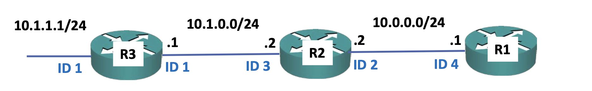

## OSPF process ID

OSPF에는 process ID라는 것이 존재한다.  
라우터에서 OSPF 구성시  `router ospf {process ID}`라는 명령어를 입력하게 되는데 process ID는 로컬, 즉 한 라우터 내에서만 영향을 끼친다.  
이게 무슨말이냐하면 위 사진에서 R2는 R1, R3와 정상적으로 인접성을 이룬다.  
process ID가 서로 다르지만 상관없기 때문이다.  
하지만 로컬 내에선 process ID가 다르면 다른 인스턴스를 사용한다는것이고 데이터베이스도 공유하지 않게 되는데 때문에 위 사진에서 R1과 R3는 서로의 정보를 학습하지 못하게 된다.  
R2의 두 인터페이스간의 process ID가 다르므로 서로의 데이터베이스가 공유되지 않는데 각 데이터베이스에 따로 R1과 R3의 네트워크 정보가 담겨있기 때문이다.  

## route injection
인터넷으로 나가는 경로에 대해서는 라우터들이 자동으로 학습하지 않는다.  
이때 정적 경로로 입력해줘야하는데 각 라우터마다 정적 경로를 입력해주긴 귀찮으니 인터넷과 연결된 라우터에서 정적경로를 입력하고 `router ospf {ID}`로 ospf 인스턴스에 접속 후 `default-information originate` 를 입력하면 기본 경로로 설정돼 ospf를 사용하는 다른 라우터에서도 자동으로 해당 경로를 학습하게 된다.  

## area
ospf 에서 `network`명령어 사용시 마지막에 area {ID}로 해당 라우터의 영역을 정할 수 있다.  
area라는 개념은 네트워크에 계층을 형성한다.  
약속상 area 0번이 backbone으로서 역할을 하고 0번을 제외한 area끼리는 통신이 불가능하다 . 
area0번과 나머지 area를 나누는 라우터를 ABR(Area Border Router)라고한다.  
계층 구조의 장점은 경로 요약이다.  
area0번에서 나머지 하위 area들의 경로를 학습할때 ABR이 경로를 요약해서 알려준다.  
경로요약의 장점은 이전에 설명했으니 생략하겠다.

https://www.udemy.com/course/cisco-ccna-complete-guide-korean/learn/lecture/29448304#questions/22597111
ABR에서 경로 요약을 자동으로 해줄 수 있을거 같은데, 강의에선 그런 모습은 안나오고 명령어로 직접 해주어가지고 질문 남겨둠

## metric
ospf에서 각 링크의 cost는 $참조 대역폭 / 인터페이스 대역폭$으로 계산되며 단위는 Mbps이다.  
하지만 문제가 ospf는 매우 오래 사용된 프로토콜이며 cost의 최소값은 1이라는 것이다.  
참조 대역폭은 기본값이 100인데 이는 fastethernet을 사용할때 1이된다.  
즉 gigabitethernet과 같은 cost를 가지게 된다.  
과거 네트워크 엔지니어들은 
> 100Mbps보다 빠른 네트워크가 나오긴하겠지 하지만 그 일은 매우 먼미래일거고 불가능에 가까울거야

라고 생각했지만 현대에서는 대부분이 기가인터넷을 사용한다.  
이를 해결하기위해 참조 대역폭 값을 `auto-cost reference-bandwith {value}`를 통해 설정해줄 수 있다.
`ip ospf cost {value}`를 입력해 수동으로 cost를 정할수도 있다.  

## DR, BDR
원래라면 두 라우터끼리 네트워크 정보를 공유할때
1. Hello 패킷을 통해 인접성 확인
2. DBD 패킷을 통해 네트워크 정보 공유
3. LSR 패킷을 통해 추가적인(디테일한) 네트워크 정보 요청
4. LSU 패킷을 통해 추가적인(디테일한) 네트워크 정보 공유
5. LSAck 패킷을 통해 정보 공유 완료
6. 이후 지속적인 Hello 패킷을 통해 서로의 health check

의 과정을 거치는데, 스위치에 라우터가 여러개 연결된 상황엔 서로 모두 인접성을 가지고 위 과정을 거치므로 중복된 정보를 공유하니 비효율적이다.  
때문이 리더 라우터인 DR(Designated Router)와 부리더 BDR(Backup DR)를 뽑아 해당 라우터가 인접한 라우터들로부터 네트워크 정보를 받고 다른 라우터들에게 정보를 공유한다.  
DR과 BDR이 임명되는 기준은 ID(주소)가 제일 높은 라우터가 DR로 임명되고 그 다음 라우터가 BDR로 임명된다.  
DR을 임의의 임명하기 위한 기능이있는데, `ip ospf priority {0~255}`를 입력해 우선순위가 가장 높은(큰) 라우터가 DR로 임명된다.  
이 값은 1이 기본값이며 모든 라우터의 우선순위가 같을때 위에서 설명한 라우터의 ID를 통해 DR, BDR을 임명하게 된다.  

