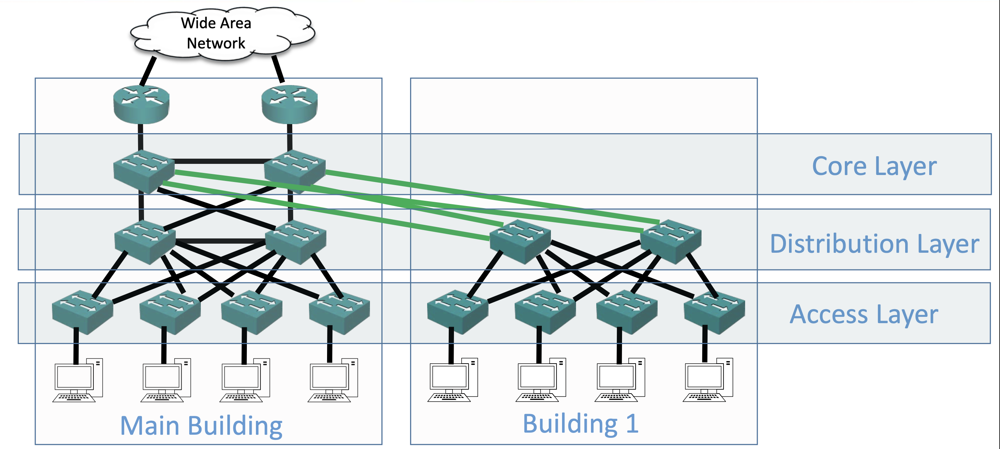
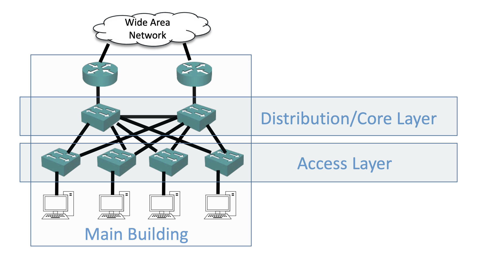
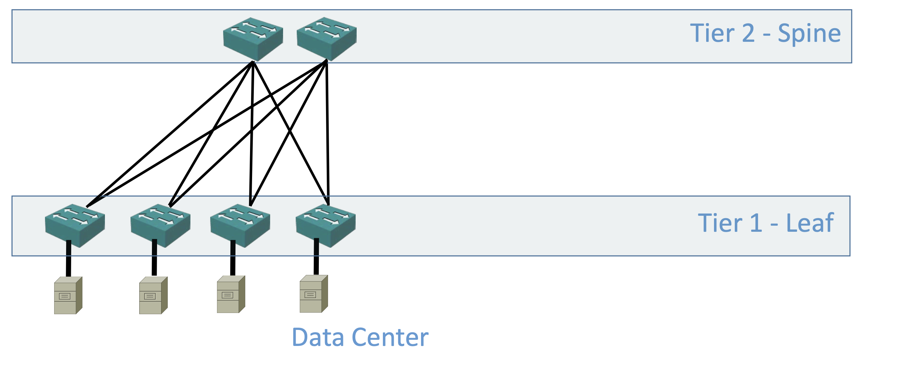
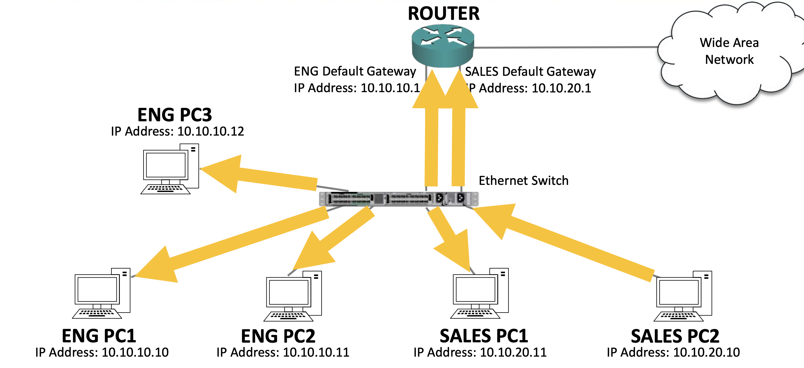
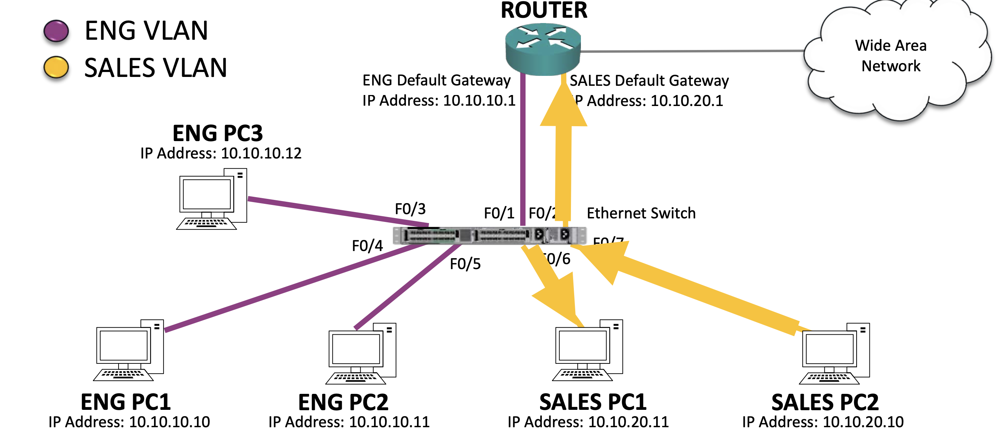
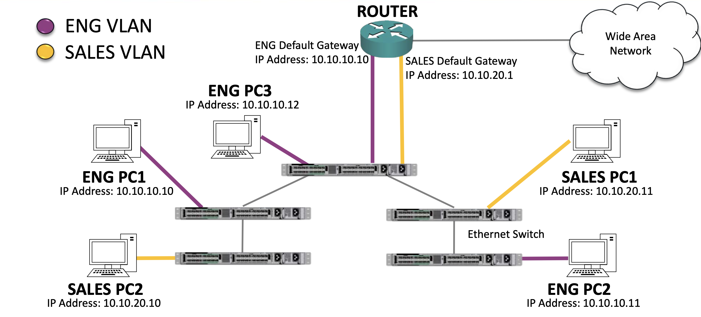

## design LAN
LAN을 설계할때 두가지 아키텍처가 있다.  
전통적인 access, distribution, core layer로 이루어진 3티어 계층 구조가 있고, 최근 네트워크 트렌드에 맞춰진 스파인-리프 구조가 있다.  
전통적인 3티어 계층구조부터 알아보면 아래 사진처럼 설계된다.   

사진에선 각 access layer의 스위치에 한 호스트만 연결돼있지만 실제론 여러 호스트가 연결돼있다.  
access layer끼리는 보통 연결돼있지 않으며 호스트도 직접 분산 레이어에 연결되는 경우는 없다.  

분산층에서는 서비스 품질 정책과 같은 대부분의 소프트웨어 정책이 활성화된다.  
위와 같은 경우는 큰규모를 가진곳에서 사용되고 core layer까지 필요없는 규모에선 아래처럼 축소된 구조를 사용하기도 한다.  
  

다음을 스파인-리프 구조를 알아보면 아래와 같다.  

스파인-리프 구조가 나온 이유는 최근 네트워크 트렌드 때문이다.  
과거엔 보통 북-남으로 트래픽이 이동했지만 최근에는 데이터 센터의 규모가 켜저서 각 호스트간의 트래픽 이동이 많아져서(동-서 트래픽) 위 구조가 고안됐다.  

근데 솔직히 전통적인 구조도 분배층에서 서로 스위치가 연결돼있고 분배층의 스위치가 액세스층의 스위치와 전부 연결돼있는데 무슨 의미인가 싶다.  
그래서 질문을 남겨두었다.  
https://www.udemy.com/course/cisco-ccna-complete-guide-korean/learn/lecture/29448306#questions/22597299

## VLAN
VLAN이 고안된 이유는 스위치에서 브로드캐스트의 보안상의 문제때문이다.  
방화과 라우터에서의 보안규칙은 3계층에서 일어난다.  
유니캐스트의 경우 다른 서브넷으로 요청을 보낼때 기본 게이트웨이를 거치므로 라우터를 거치게된다.  
하지만 브로드캐스트의 경우 아래와같이 라우터를 우회하고 요청을 보낼수 있게 된다.  

VLAN은 이 브로드캐스트를 같은 VLAN으로만 보내게끔 막아주는 역할이다.  

VLAN을 설정하고 브로드캐스트를 보내면 위와 같이 같은 VLAN으로만 트래픽을 보낸다.  
`switchport mode access`
`switchport access vlan {number}`
명령어를 통해 활성화가 가능하다.  

## trunk
vlan을 사용할때 위에서 설명한 상황처럼 스위치가 하나라면 문제가 없겠지만 스위치가 여러개라면 문제가생긴다.  

위 사진과같은 토폴로지에서 스위치간 링크를 vlan에 속하자니 eng나 sales중 하나를 택해야하고 만약 그렇게하면 스위치간 링크와 다른 vlan을 가진 스위치 아래의 호스트는 스위치 내부말고는 통신이 불가능할 것이다.  
이때 여러 vlan을 링크에 허락해주는 것이 trunk이다.
`switchport mode trunk`명령어를 통해 활성화가 가능하고 구식 스위치에서는 `switchport trunk encapsulation dot1q`를 이전에 추가해줘야한다.  
그 이유는 과거엔 lsp란 trunk의 프로토콜또한 존재했는데, 현재는 dot1q만 사용되기 때문이다.  
trunk포트로 트래픽이 나갈때에는 어떤 vlan으로 보내야하는지 태그가 붙는다.  

또한 `switchport trunk allowed vlan {num},{num}`명령어를 사용해 trunk 포트로 나갈 vlan을 제한해줄 수가 있다. 

## native
trunk 포트로 태그가없는 트래픽이 나갈때가 있는데, 허브를 사용하는경우 이러하다.  
현대에서는 허브를 사용하지 않음은 물론 구매할 수도없지만, 사용하는 네트워크를 위해 구성해주어야한다.  
native트래픽은 기본으론 vlan 1로 보내지만 이는 보안상의 문제가 있기때문에 `switchport trunk native vlan {num}`명령어를 사용해 사용하지 않는 vlan으로 보내는것이 좋다.  

## vtp
vlan을 모든 스위치에 하나하나 설정해주긴 귀찮으니 VTP(VLAN trunking protocol)을 사용한다.  
`vtp mode client`명령어를 통해 vtp client가 된 스위치는 vtp server로부터 vlan정보를 받아온다.  
vlan번호와 이름등의 정보만 가져오고 각 물리적 포트에는 vlan을 직접 설정해주어야한다. 
transparent모드는 vtp server로부터 vlan정보를 가져오지만 본인 vtp database에 해당정보를 저장하지 않고 독자적인 vlan설정을 사용한다.

transparent모드가 굳이 필요한가해서 찾아봄
https://community.cisco.com/t5/switching/practical-purpose-of-vtp-transparent-mode/td-p/804721
대충 혹여 VTP 데이터베이스가 삭제될걸 우려해 사용한다는데... 잘 모르겠음

### trunk
trunk가 대충 여러개를 우겨넣는 한번에 보내는 그런 뉘앙스 인듯?