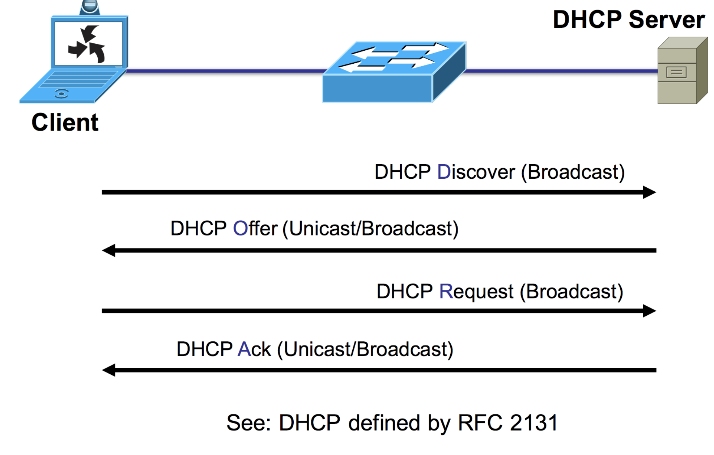
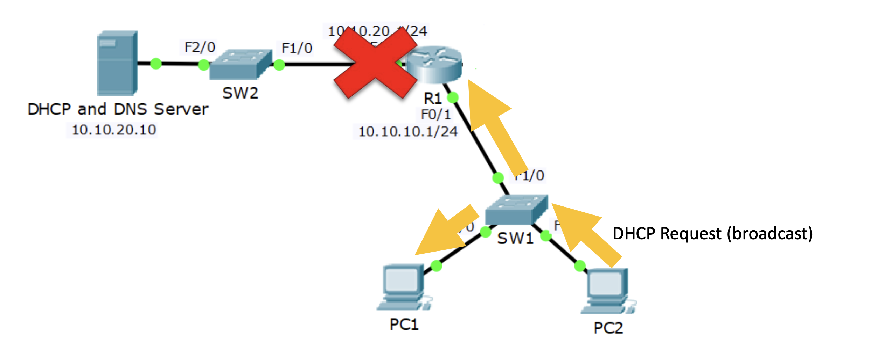

## Dynamic Host Configuration Protocol
만약 네트워크 규모가 크다면 각 호스트마다 IP주소와 서브넷, DNS 서버 주소등을 구성해주는 것은 고된일이 될 것이다.  
이런걸 자동으로 해주기 위한 프로토콜이 DHCP이다.  

DHCP는 서버와 클라이언트로 나뉘어지는데 서버가 클라이언트에게 할당가능한 IP주소 서브넷 등을 구성해준다. 


## Cisco DHCP
Cisco DHCP는 라우터에서 DHCP 서버 역할을 해주는 것이다.  

```
R1 (config)#ip dhcp excluded-address 10.10.10.1 10.10.10.10
R1 (config)#ip dhcp pool {name}
R1 (dhcp-config)#network 10.10.10.0 255.255.255.0
R1 (dhcp-config)#default-router 10.10.10.1
R1 (dhcp-config)#dns-server 10.10.20.10
```
구성은 위 명령어들로 해주면 되는데 
ip dhcp excluded-address 명령어는 네트워크 내 고정 IP를 사용하는 HOST들을 위해 일부 범위의 IP들을 DHCP로부터 제외하는 명령어다.  
default-router는 기본 게이트웨이 주소를 설정해주는 명령어다.  

## external DHCP server
만약 DHCP가 라우터가 아니라면 어떨까?  
작은 네트워크 규모에서야 간단히 라우터를 DHCP서버로 사용해도 되겠지만 대부분의 경우 외부 서버를 DHCP서버로 사용한다.  
이때 문제가 발생하는 것이 아래 사진과 같다.  

pc2가 켜지면 DHCP 서버를 찾기위해 브로드캐스트 요청을 날릴텐데, 그 요청은 R1에 도착하게 된다.  
하지만 라우터는 기본적으로 브로드캐스트 요청을 날리지 않기에 해당 트래픽은 DHCP서버가 있는 서브넷에 도착하지 못하게 되고 PC2는 IP를 할당받지 못한다.  
이를 위해 라우터가 DHCP클라이언트가 있는 서브넷의 인터페이스에 `ip helper-address {addr}`명령어를 입력해주어야한다.  
{addr}에는 DHCP서버가 의 주소를 입력해, 해당 인터페이스로부터 DHCP요청이 들어오면 DHCP서버로 트래픽을 라우팅해준다는 의미이다.  

## Cisco DHCP Client
라우터를 DHCP 클라이언트로 사용하는 경우가 있다.  
인터페이스에 접속해 `ip address dhcp`를 입력해주면되는데, 정적 공인 IP주소가 없을때 인터넷을 바라보는 인터페이스에 이처럼 설정해준다는데.. 잘 이해가 안간다.
챗지피티한테 물어보니 외부에서는 내부망으로 접속할 서버가 없어서 정적 공인 IP주소가 필요없는데 내부망에선 외부 인터넷으로 접속하고 싶은 경우라고 한다.  
이때 외부 인터넷과 바라보는 인터페이스의 주소를 ISP의 DHCP서버로부터 받아오는 주소로 설정하는건데, `ip route 0.0.0.0 0.0.0.0 {addr}`에서 addr에 들어가기 위한 공인 주소를 가져오는 걸까 
