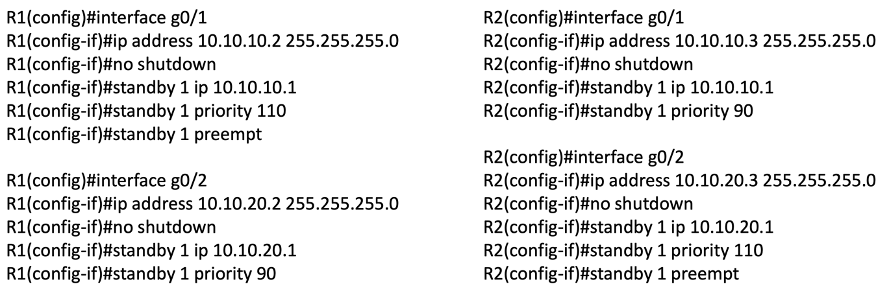

## network redundancy
네트워크도 SPOF가 생기지 않게 DDIA에서 했던것처럼 다중화를 진행한다.  
이때 외부망으로 나가는 기본 게이트웨이도 여러개가 되는데, 메인 게이트웨이 라우터가 다운이 돼 백업용 게이트웨이 라우터가 활성화될때 각 호스트에 직접 게이트웨이 주소를 재설정해주어야하는데 이는 고된일이 될것이다.  
이를 위해 다중화된 라우터들의 실제 주소가 아닌 하나의 논리적인 게이트웨이 주소를 만들어 기존에는 메인 라우터가 가상 주소를 사용하다가 메인 라우터가 다운됨을 백업용 라우터가 확인하면 백업용 라우터가 가상 주소를 사용하는 방식이다.  
이 프로토콜에는 3가지 종류가 있다.  
- Hot Standby Router Protocol
- Virtual Router Redundancy Protocol
- Gateway Load Balancing Protocol

HSRP와 VRRP는 전자는 Cisco 전용이고 후자는 공개 표준이라는점 빼고는 거의 비슷하다.  
GLBP도 HSRP와 마찬가지로 Cisco 전용으로, 다수의 라우터에 걸쳐 활성/활성 부하 분배를 지원한다.  
활성/대기 쌍으로 부하 분배를 하지 않는 게 아니라  GLBP를 사용하면 동일 IP 서브넷 상의 두 개 라우터에 부하를 분배하도록 할 수 있다.  

## HSRP
HSRP의 구성 방법은 인터페이스에 접속해 `standby {group_id} ip {VIP}`를 입력하면 된다.  
`standby {group_id} priority {value}`를 통해 어떤 라우터가 메인(활성) 라우터가 될지 우선순위를 정할 수 있고 높을 수록 우선순위가 높으며 기본값은 100이다.  
만약 우선순위가 같은 경우 라우터의 물리 주소가 더 높은쪽이 메인 라우터가 된다.  
또한 `standby {group_id} preempt`를 통해 선점을 할지 안할지 정할 수 있는데, 선점을 활성화 할 경우 R1이 활성 라우터에 선점이 활성화 돼있고, R2가 standby라우터라 할때, R1이 다운되었다가 다시 켜졌을때 R1이 메인 라우터가 된다.  
만약 선점을 활성화 하지 않으면 R1이 켜지더라도 R2가 그대로 메인 라우터가 되게 된다.  

같은 그룹내에선 하나의 라우터만 활성 라우터가 될 수 있기에 기본적으론 HSRP를 사용해 부하 분산을 하는건 불가능하다.  
하지만 우회하여 부하 분산을 하는 몇가지 방법이 존재한다.  

첫번째론 여러 그룹을 생성하는 것이다.

위 사진 처럼 라우터를 구성하고, 호스트들을 절반은 1번 그룹의 VIP인 10.10.10.1을 나머지 절반은 2번 그룹의 VIP인 10.10.10.254를 기본 게이트웨이 주소로 사용하게 하면 된다.  

두번째 방법은 여러 서브넷을 사용하는 것이다.  
HSRP의 그룹은 인터페이스 아래 생성되기에, 다른 인터페이스에 같은 번호의 그룹이 있으면 두 그룹은 다른 HSRP 그룹이된다.  

개인적으론 1번이 더 직관적인듯 하다.

