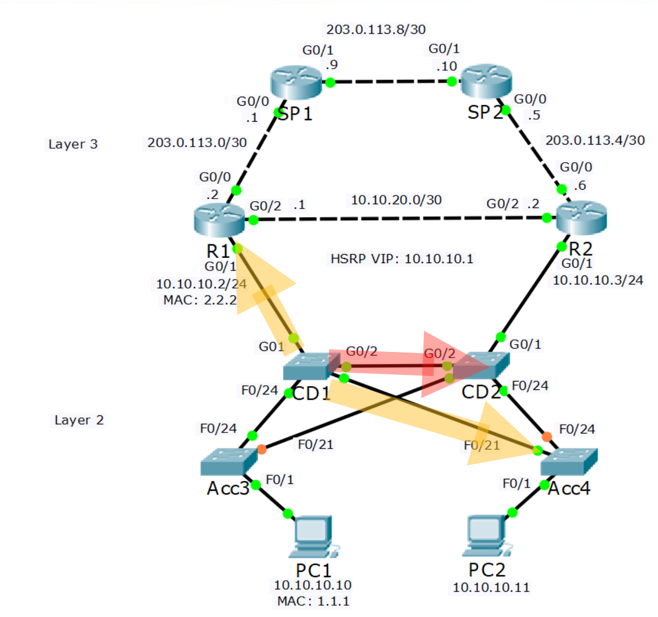
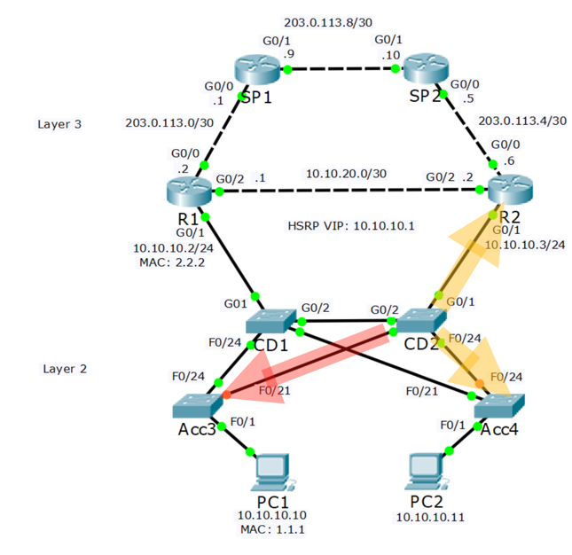
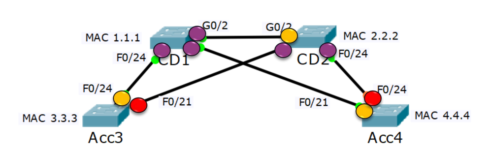
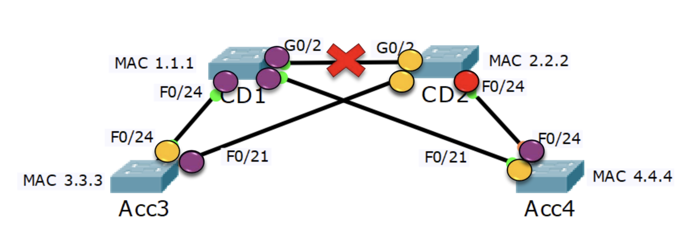
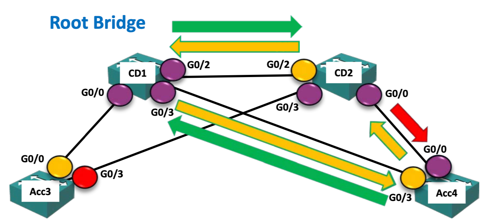

## why we have spanning tree protocol
loop를 방지하는 방법중 하나로 TTL을 배웠었다.  
작동방식은 IP 헤더에있는 TTL을 라우터를 거칠때마다 1씩 감소시켜 0이 되면 해당 패킷을 폐기하고 timeout을 반환하는거다.  
하지만 이는 3계층에서만 작동한다.  
그럼 만약 2계층에서 loop가 발생하면 어떻게 해야할까?

여기서 STP가 쓰이는데 STP의 가장 기초는 물리적인 업링크 포트를 아예 막아버리는거다.  
2계층에서 loop가 일어나는 상황을 예로 들어보면

위의 토폴로지의 트래픽 흐름은 PC1이 기본게이트웨이인 R1을 통해 인터넷으로 나가기 위해 ARP를 통해 R1의 MAC주소를 알아내려는 과정이다.  
ARP는 브로드캐스트를 통해 이루어지기 때문에 현재 Acc3 -> CD1까지 간 브로드캐스트 트래픽과 그다음인 CD2까지 간 트래픽을 보여주고 있다.  
그리고 예상할 수 있듯이 위 트래픽은 loop가 생성될뿐만 아니라 트래픽이 스위치를 거칠때마다 2개로 늘어나기에 복제가 된다.  
이를 broadcast storm이라한다.  

여기서 토폴로지를 잘보면 Acc3의 f0/21과 Acc4의 f0/24의 링크가 주황색인걸 확인할 수 있는데, 비활성화 해놨다는 의미이다.  
이렇게하면 액세스 레이어의 트래픽은 CD1으로만 가게 되고 따라가다보면 루프가 생기지 않는걸 확인할 수 있다.  
하지만 당연하게도 물리적인 링크를 비활성화 한것이기에, 기존에 사용하던 대역폭을 줄인것이다.  
이러한 비효율을 최소화 하기 위한 방법을 고안해낸것이 STP이다.

## bridge
토막 상식? 느낌으로 브리지가 뭔지에 대해 간단히 알아보자면, 과거 허브가 주로 사용되던 시절에 브리지는 큰 충돌 도메인을 여러 작은 충돌 도메인으로 나눠주던 역하을 했다.  
무슨말이냐하면 허브는 1계층 장치이기에 MAC주소를 학습하지도 않고 유니캐스트,멀티캐스트도 없어 그저 들어오는 트래픽을 모든 포트로 보내는 역할을 했다.  
때문에 보안상, 성능상의 문제가 있엇고 브리지를 허브 사이에 끼워넣어 각 허브 내의 트래픽은 반대쪽 허브로 넘어가지 않고 필요시에만 브리지를 통해 넘어가는 방식이었다.  
브리지는 2게층 장치이며 MAC주소도 학습한다.  
"그럼 그냥 스위치 아닌가?" 생각할 수 있는데 맞다.  
사실 브리지는 과거 스위치가 기술상 포트가 현재의 라우터처럼 매우 적었기에 위처럼 사용된 것이다.  
현재는 허브와 브리지 둘다 구할 수 없다.  

갑자기 브리지에대해 알아보는 이유는 스패닝 트리 프로토콜은 과거 브리지가 사용되던 시절에 나온 프로토콜이기에 용어중에 스위치대신 브리지가 사용되는 경우가 있기 때문이다.  

## how spanning tree works
스패닝 트리의 작동방식을 좀더 자세히 알아보자.
스위치가 켜지면 모든 포트로 Bridge Protocol Data Units을 보내 잠재적인 루프가 있는지 확인하고 루프가 없어지기 전까진 트래픽을 내보내지 않는다.   
이는 수렴하는데 50초가량 걸릴 수 있다.  
과정에서 LAN에 있는 스위치들의 존재도 확인한다.

먼저 목차로 봐보자면    
1. 브리지 ID가 제일 낮은 스위치가 루트 브리지가 된다.  
2. 루트 브리지로 가는 cost가 가장 낮은 포트는 root 포트가 된다. 이때 root 포트가 여러개일 수 있는 경우 포트 맞은편의 스위치의 브리지 ID가 가장 낮은곳의 포트가 root 포트가 된다.
3. root 포트와 마주보는 포트는 designated 포트가 된다.
4. 이제 남은 링크들 중 루트 브리지로 가는 cost가 가장 낮은 스위치, 만약 cost가 동일하다면 브리지 ID가 가장 낮은 스위치가 백업 브리지로 선정된다.(백업 브리지는 내가 임의의 지은 이름이다) 
5. 백업 브리지의 포트는 designated 포트가 되고 이를 마주보는 포트는 blocking 포트가 된다. blocking 포트를 마주보는 designated 포트는 지속적으로 BPDU를 보낸다.  

실패 복구 과정은
1. 만약 백업 브리지의 루트 포트가 있는 링크가 다운되면 백업 브리지는 blocking 포트 들로 BPDU를 보내지 못하게 되고, blocking 포트에서 이를 감지하면 BPDU를 보낸다.  
2. 기존 blocking 포트는 desginated 포트가 되고 백업 브리지의 포트는 root 포트가 된다.  
3. 이후 여분의 링크가 있다면 동일한 방법으로 blocking 포트를 정한다.  
4. 만약 백업 브리지가 아닌 스위치에서 root 포트의 링크가 다운되면 여분의 링크가 root 포트가 된다

   
Bridge ID는 스위치의 MAC주소와 관리자가 임의로 정한 우선순위 값으로 구성되는데, 우선순위 값은 0~65535이며 기본값은 32768이다.  
우선순위값을 먼저 확인하고 동일할 경우에 MAC주소가 사용된다.  
MAC주소나 우선순위 값이나 더 작을 수록 우선순위가 높다.  
BPDU는 Bride ID와 루트 브리지로 가는 비용을 담고있다.  

## STP version
STP에는 공개 표준버전과 CISCO 독점 버전이 있다.  
공개 표준 버전은 아래와 같이 여러 버전이 있다. 
- 802.1D (STP)
- 802.1w (Rapid STP)
- 802.1s (Multiple STP a.k.a MST)  

RSTP는 오래걸리던 수렴속도를 개선한 버전이고 MST는 수렴속도에 더해 부하 분산까지 지원하는 가장 최신 버전이다.  
MST에서는 vlan을 사용해 부하분산을 지원하는데, vlan 범위별로 10~19는 스위치1이 루트 브리지 20~29는 스위치2가 루트 브리지가 되도록해 트래픽을 반반 분산 시킬 수 있다.

CISCO 독점 버전에는 아래와 같이 여러 버전이 있다.  
- PVST+ (per VLAN Spanning Tree Plus)
- RPVST+ (Rapid per VLAN Spanning Tree Plus)

PVST는 .1D와 거의 비슷한 시기에 나왔는데 MST처럼 부하 분산을 지원한다.  
하지만 수렴속도는 느리다.  
RPVST는 .1w와 비슷한 시기에 나와 오래걸리는 수렴속도를 개선한 버전이다.  

PVST에서 부하 분산을 지원하는 방법은 MST와 거의 동일하지만 MST에선 vlan 그룹화가 가능했던거에 반해 PVST에서는 각 vlan마다 STP 인스턴스를 활성화 해줘야한다.  
때문에 스위치에 부하가 좀더 크다.  

## Manipulating the root bridge
root 브리지 선정 방법에는 웃긴점이 있다.  
바로 MAC주소가 낮을 수록 우선순위가 높다는건데, 웃긴 이유는 MAC 주소는 오래된 스위치일 수록 그 값이 낮기 때문이다.  
오래된 스위치는 대역폭이 더 낮을 테니 비효율적인 LAN이 구성될 것이다.  
또한 루트 브리지가 access 레이어에 있을 경우 루트 브리지가 코어 레이어에 있을때보다 비효율적인 구조가 될것이다.  
때문에 이런경우 우선순위를 직접 설정해주어야하는데
아래와 같은 명령어로 설정가능하다.  

Core1(config)# spanning-tree vlan 1 root primary
Core1(config)# spanning-tree vlan 1 priority 24576

Core2(config)# spanning-tree vlan 1 root secondary 
Core2(config)# spanning-tree vlan 1 priority 28672

각 명령어 쌍은 동일한 명령을 수행한다.  
secondary가 있는 이유는 만약 기존 루트 브리지가 다운될 경우 다시 비효율적인 스위치가 루트 브리지로 선정될 수 있기 때문이다.  

priority 값은 0~61440 사이의 4096의 배수만 가능하다.  
이유는 모르겠다.

## portfast, BPDU Guard and Root Guard
portfast는 단일 호스트에서 STP 수렴시간 없이 네트워크에 접근하기 위한 방법이다.  
스위치에서 loop가 일어나기 위해선 일단 스위치랑 스위치가 연결돼야한다.  
단일 호스트는 프레임을 수신해도 다시 네트워크로 내보내지 않기때문이다.  
이에 스위치에서 단일 호스트에 연결돼있는 포트를 portfast로 설정하면 해당 포트를 바로 활성화 시킨다.  
하지만 여기서 문제가 일어날 수 있는게 해당 네트워크의 사용자들이 기존에 pc에 연결돼있던 포트에 스위치를 연결할 수 있다.(포트 부족등의 문제로)  
이를 위해 포트에 BPDU 가드를 구성할 수 있는데, 이 경우 해당 포트에 BPDU 프레임이 들어오면 해당 포트를 비활성화 해버린다.  
BPDU는 스위치끼리만 주고받는 프레임이기에 PC가 있어야할 곳에서 PBDU 프레임이 들어온다면 해당 포트에 스위치가 연결돼있음을 알 수 있기 때문이다.  

Root Guard는 굴러온 스위치가 박힌 스위치를 빼지 않도록 해준다.  
무슨 말이냐하면 기존에 코어층에 있던 스위치가 루트 브리지였는데 액세스층에 추가된 스위치가 우선순위가 더 높아 엑세스층에 추가된 스위치가 루트 브리지가 되게하는걸 막는다.  
root gurad를 설정해두면 해당포트에 더 우선순위가 높은 BPDU 프레임이 들어왔을때 해당 포트를 "루트 불일치" 상태로 전환하고 해당 포트로 트래픽을 내보내지 않는다.  

## loop guard
단방향 링크 장애로 인해 단방향 루프가 일어나는 경우가 생길 수 있다.  

위 토폴리즌 현재 CD2에서 Acc4로 가는 링크는 다운되고 그 역은 정상인 상황이다.  
이때 Acc4는 CD2로 부터 BPDU를 받지 않으니 원래 차단 포트였던 포트를 designated 포트로 전환하며 CD2에 BPDU를 보내고 CD2는 본인보다 열등한 BPDU가 들어오니 desginated포트를 그대로 둔다.  
이때 위 사진처럼 반시계 방향으로 도는 루프가 생길수 있다.  
이런 경우를 해결하기 위해 loop guard라는 것이 있는데, loop guard를 활성화 해놓은 포트에서 BPDU가 수신되지 않으면 해당 링크로 트래픽을 보내지 않는다.  
위에서 Acc4의 차단포트 였던 G0/0 에 루프가드를 구성해놨으면 해당 링크를 비활성화하고 다시 링크를 구성할 것이다.  
중요한 점이 designated 포트는 원래 BPDU를 받지 않으므로 loop guard는 root, blocking 포트에서만 활성화가 가능하다.  
또한 잘 보면 loop guard는 작동방식이 root guard와 상호 베타적인데, Root guard는 포트에 BPDU가 오면은 해당 포트로 트래픽을 내보내지 않는 식이었다.  
하지만 loop guard는 BPDU가 들어오면 비활성화 하는 식이 한 포트에 두 guard를 동시에 활성화 시킬 수는 없다.  
