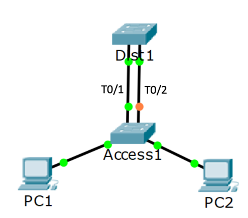
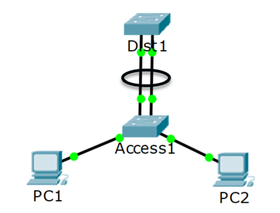
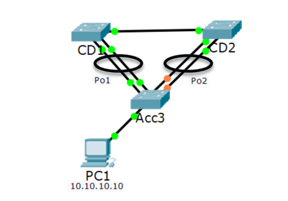
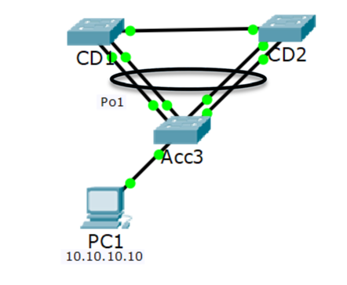

## EtherChannel
스위치간 대역폭 확장을 위헤 포트를 여러개 연결하는 경우가 생길 수 있다.  
이 경우 STP의 관점에선 루프가 생길 수 있으니 한 포트를 제외하고 전부 막아버린다.

10Gbps 포트를 4개 연결해서 40Gbps의 대역폭을 기대하지만 10Gbps밖에 사용하지 못하는 것이다.  
이를 해결하기 위해 여러 링크를 하나의 논리적 링크로 묶어 주는 것을 EtherChannel이라고 하고 실무해선 PortChannel 이라고 주로부른다.

이러한 EtherChannel 프로토콜의 종류에는 여러가지가 있다.  
- LACP(Link Aggregation Control Protocol)
- PAgP(Port Aggregation Protocol)
- static

LACP는 공개 표준이고 PAgp는 CISCO 전용이다.  
둘다 양쪽 스위치에서 포트 채널을 협상한다.  
static은 말그대로 자동으로 협상해 포트 채널을 구성해주지 않고 직접 포트 설정을 통해 구성해주어야한다.  
LACP는 공개 표준이므로 대부분의 장치에서 지원되지만 지원되지 않는 경우에 static이 보통 사용된다.  

`interface range f0/23 - 24`
`channgel-group {id} mode [active|desirable|on]`
으로 포트 채널을 생성하고 
`interface port-channel {id}`
로 포트 채널에 접속해 원래 인터페이스에서 하듯이 포트 채널을 구성해주면된다.  
그리고 구성할때 설정값은 반대쪽 스위치에서도 같은 값으로 해주어야한다.  

강의에서 각 프로토콜의 차이를 용어와 명령어만 설명해주는데, 좀 아쉬움

하지만 위와 같은 토폴로지에서는 아직도 STP에 의해 절반의 대역폭을 사용하지 못한다.  
이떄 멀티 섀시를 사용하면 남은 절반 대역폭도 사용할 수 있다.  

위와 같이 멀티 섀시 포트 채널을 구성하면 모든 대역폭을 사용할 수 있다.  
하지만 이를 위해선 다른 물리적 스위치이지만 한 논리적 포트채널로 묶이는 CD1, CD2 스위치가 서로 대화가 가능하며 다운스트림으로 내려가는 포트 채널의 공유를 지원하는 고급 스위치여야 한다. 
Cisco에선 이를 StackWise, VSS, vPC라는 이름의 기술로 지원하는데, 한 스위치에서 이 3가지 기술을 전부 지원하지는 않고, 셋중 하나만 지원한다.  

## layer 3 EtherChannel
STP가 필요한 이유는 스위치에서의 브로드캐스트 루프때문이었다.  
하지만 독자적인 서브넷을 가지고있는 3계층 스위치에서라면 STP가 필요하지 않다.  
기본 게이트웨이도 액세스 층의 스위치가 될 것이다.  
기본 게이트웨이는 같은 서브넷에 있어야하니 당연하다.  

과거엔 스위치 대신 허브를 사용했던 것처럼 3계층 스위치의 비용때문에 이를 실현하기가 불가능했지만, 최근엔 기술의 발달로 인해 3계층 스위치의 가격이 저렴해져 점점 대체되어가는 추세이다.  
