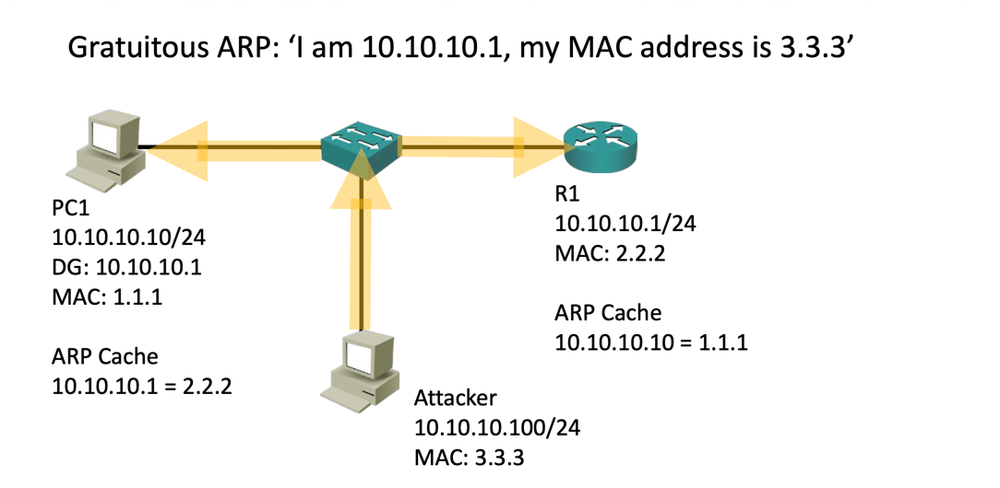

## DHCP snooping
DHCP서버가 만약 디폴트 게이트웨이와 DNS 서버를 제공할 경우 해당 DHCP로부터 정보를 제공 받는 서브넷은 네트워크와 단절 된다.  
이러한 일을 막기 위해 허가된 포트로 들어오는 DHCP트래픽만 받는 DHCP snooping을 사용한다.  
만약 허가되지 않은 포트에서 DHCP요청이 들어올 경우 해당 트래픽은 폐기된다.  

## Dynamic ARP Inspection
DAI는 ARP Spoofing을 막기위한 방법이다.  
ARP Spoofing이란 공격자가 악의적인 ARP를 보내 다른 장치들을 속여 중간에서 트래픽을 훔쳐보는 공격이다.  

1. PC1을 공격자의 PC가 라우터인 것처럼 속이기 위한 Gratutious ARP를 보낸다.  
2. PC1은 공격자의 PC가 라우터인 것으로 ARP Cache를 업데이트한다. 
3. 라우터에게는 공격자가 PC1인 것처럼 ARP를 보낸다. 
4. 라우터는 PC1의 MAC주소를 공격자의 MAC주소로 업데이트한다. 
5. 이후 PC1이 보내는 트래픽은 공격자에게 가고 공격자는 이를 라우터로보내며 라우터는 반환된 트래픽을 공격자로 보낸다.  

이를 방지하기 위해선 스위치에 DHCP snooping이 활성화 돼있어야한다.  
스위치에 DHCP snooping이 활성화 돼있을 경우 DHCP로부터 받은 MAC주소에 매핑되는 IP주소를 알고 있다.  
때문에 만약 MAC주소와 IP주소의 매핑이 일치하지 않는 ARP요청이 들어올 경우 해당 트래픽을 무시한다.  

## 802.1X Identity Based Networking
이는 인증하기 전까지 호스트가 네트워크의 다른 부분에 접근하지 못하게하는 방법이다.

supplicant가 처음 스위치에 연결되면 인증서버만이 연결돼있다.  
이후 supplicant가 ID와 password를 보내고 인증서버에서 허가된 유저라면 이를 스위치에 알려 스위치에게 해당 호스트에서(정확히는 호스트와 연결된 포트) 오는 트래픽을 허가하는 방식이다.  

## Port Secuirty 
포트 보안은 허가 되지 않은 호스트가 LAN에 접근하는 걸 막아준다.  
작동 방식은 옵션에 따라 조금씩 달라진다.
아무 옵션없이 포트 보안을 활성화하면 단순히 해당 포트에 여러개의 MAC주소가 감지되면 차단한다.    
만약 수동으로 MAC주소를 설정해주면 해당 포트로부터 들어오는 MAC주소를 확인해 다르면 차단한다.    
sticky 옵션을 활성화할 경우 활성화 이후 가장 먼저 들어온 트래픽의 MAC주소를 기억해둬 이후 트래픽의 MAC주소를 비교해 다르면 차단한다.  

차단도 옵션에 따라 조금씩 달라지는데 설정값에 따라 해당 트래픽을 무시하거나 아예 인터페이스를 down시킨다.(down시키는 것이 기본 값)  
물론 정말 악의적인 공격자라면 기존 포트에 연결돼있던 장치를 해제하고 본인의 장치를 꽂은후 공격 장치의 MAC주소를 기존 MAC주소로 변경해 트래픽을 보내면 연결을 할 수 있다.  
하지만 포트보안의 용도는 위와같은 상황이아닌, 기존에 호스트가 연결돼있던 포트에 무선 액세스 포인트나 새로운 스위치를 추가해 허가 되지 않은 장치가 LAN에 접근하는걸 막는 용도이다.  

