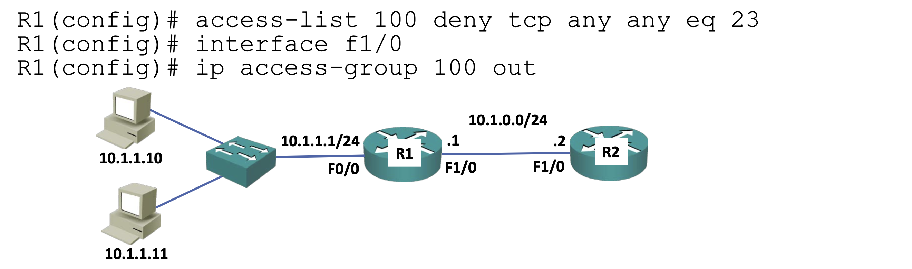

## ACL
ACL은 라우터에 트래픽이 들어왔을때 허가할지, 차단할지 역할을해 보안장치로서 역할도 하고, 특정 트래픽에 우선순위를 부여해 소프트웨어 정책을 충족시키는 역할도 한다.  
ACL 명령어는 2가지 버전이 있는데 standard와 extended 버전이다.  
standard는 목적지만 설정할 수 있고 extended는 추가적인 조건을 구성할 수 있다.  
standard버전의 명령어는 다음과 같다.  
`access-list {num: 0~99, 1300~1999} {deny|permit} {src} {wildcard mask}`
extended버전의 명령어는 다음과 같다.  
`access-list {num: 100~199, 2000~2699} {deny|permit} {protocol} {src} {wildcard mask} {eq|lt|gt} {port} {dest} {wildcard mask} {eq|lt|gt} {port}`

num값을 통해 standard이지 extended인지 설정할 수 있다.  
num값의 범위의 경우 기존에는 0~99와 100~199 밖에 없었지만 규모가 큰 기업의 경우 인터페이스가 많아 이 범위가 부족할 수 있어 더 확장시킨것이다.  
이에 또 개선한 버전이 named ACLs인데, 여기선 숫자가 아닌 직접 extended와 standard를 입력해 버전을 정할 수 있고, ACL의 이름도 지정할 수 있어 더욱 가독성이 좋아졌다.  
named ACLs의 명령어는 다음과 같다.  
`ip access-list {extended|standard} {name}`  
이렇게 명령어를 입력하게 되면 해당 이름의 ACL을 구성할 수 있는 프롬프트로 들어가게되는데 이후에 기존명령어에서 `access-list {num}` 부분을 제외하고 명령어를 입력해 ACL을 구성하면 된다.  
명령어는 약어나 `0.0.0.0 255.255.255.255 -> any`  
추가적인 기능 `Log` `host` 에 따라 조금씩 달라질 수 있다.  

## ACE order
ACL을 구성할때 access control entry(ACE)의 순서를 유의해야한다.  
그 이유는 트래픽을 ACL을 통해 필터링할때 위에 부터 읽기 때문인데,   
예를 들면 10.10.10.0/24 서브넷을 허가하지만 10.10.10.10에서 오는 트래픽만 거부하고 싶을때,  
1. `permit 10.10.10.0 0.0.0.255`  
2. `deny 10.10.10.10 0.0.0.0`  

로 하게 되면 우리의 의도와 달리 10.10.10.10 트래픽도 허락하게된다.  
위에서부터 아래로 읽으니 `permit 10.10.10.0 0.0.0.255` 구문에서 필터링 돼 트래픽을 허가하기 때문이다.  
이 때문에 각 엔트리에는 기본적으로 번호가 부여돼있고 이후 추가할때 엔트리의 번호도 부여해줄 수 있다.  

## deny any
인터페이스에 ACL이 활성화 돼있지 않으면 모든 트래픽을 허가하지만, ACL이 활성화 되면 모든 트래픽을 거부한다.  
그 이유는 ACL의 맨 마지막 엔트리에는 기본적으로 deny any가 있기 때문이다.  

## traffic on self
라우터에서 자체적으로 생성한 트래픽은 outbound ACL에 걸리지 않는다.  
무슨 말이냐 하면 

위와 같이 구성했을때 PC에서 R2로 telent(port번호 23)을 보냈을때는 정상적으로 deny되지만, R1에서 R2로 telent을 보낼경우 트래픽이 간다는 뜻이다.  
때문에 R1에서 R2로 보내는 telnet 트래픽도 막고 싶다면 R2에서 inbound ACL을 활성화 해야한다.  

