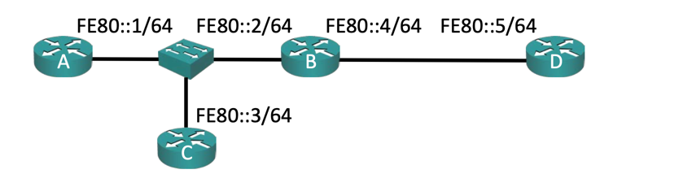

## ipv6 address format
먼저 IPv6 주소가 어떻게 생겼는지 알아보 8비트씩 .을 구분자로 4개로 나눠졌던 ipv4에 비해 IPv6는 16비트씩 :을 구분자로 8개로 나누어진다.  
XX:XX:XX:XX:XX:XX:XX:XX 처럼 생겼다.  
IPv4 각 8비트를 옥텟이라고 했던것에 비해 IPv6에서는 각 16비트를 부르는 통합된 명칭은 없지만 대개 헥스텟이라고 부른다.  
또한 가독성을 위해 주소를 요약하는 방법이 있다.  
1. 헥스텟에서 앞부분의 0을 제거 : 00cd -> cd
2. 0인 헥스텟이 연속으로 나오면 ::으로 요약 cd:0:0:0:8 -> cd::8

예를 들어 cd80:0000:000e:2f04:0000:0000:0000:0000 라는 주소가 있을때 
cd80:0:e:2f04:: 로 줄일 수 있다.  
또한 당연히 두번째 방법은 한번만 가능하다.  
헥스텟이 연속으로 0인 구간이 두개 있을때 두 구간 모두 요약해버리면 어느 구간에서 0이 몇개였는지 알 수 없기 때문이다.  

또한 IPv6는 정말 그 범위가 셀 수 없이 많기에 조금 흥청망청 사용해도 된다.  
때문에 기업에는 /48을 보통 할당해주고 각 호스트는 /64서브넷을 가지는 것이 규칙이다.  
기업에는 /48을 할당해줬으므로 16비트는 내부 서브넷으로 사용하고 각 호스트는 64비트의 호스트 주소를 가지는 것이다.  

심지어 라우터와 라우터만 이어져있는 포인트2포인트 토폴로지에서도 /64 서브넷을 사용한다.

## local link
FE80::/10에서 FEB0::/10범위에서 사설주소를 할당할 수 있다.  

위 토폴로지에서 FE80::1~3/64은 서로 통신이 가능하지만, FE80::4~5/64와는 통신이 불가능하고 FE80::4~5/64는 서로 통신이 가능하다.  

## EUI-64
EUI-64는 MAC주소를 기반으로 IPv6 주소를 생성하는 방법이다.  
2000:db8:0:1::/64 서브넷이 있을때 네트워크 주소를 MAC주소를 기반으로 생성해준다.  
생성 방식은 MAC주소의 7번째 비트를 반전시키고 MAC주소 중간에 FF:FE를 넣는다.  
7번째 비트를 반전시키는 이유는 아마 MAC주소로부터 IPv6주소를 알아내지 못하게 하기 위함이었던거 같은데 현재는 모두가 아는 사실이라 의미가 없고, 중간에 FF:FE를 넣는 이유는 MAC주소는 48비트인것에 비해 IPv6의 호스트 주소는 대부분 64비트 이기 때문이다.  

예시로 MAC주소가 ca01.2f24.0000이라면 호스트 주소는 c801:2fff:fe24:0000이 된다.
하지만 말했듯이 EUI-64는 MAC주소로부터 IPv6 주소를 유추해낼 수 있다는 점때문에 사용되지 않는다.  

## SLAAC
StateLess Address AutoConfiguration은 호스트에 IPv6주소를 할당해주는 방법이다.  
기존에는 DHCP서버에서 주소 지정을 관할해 특정 MAC주소에 IPv4주소를 할당해주는, 즉 stateful한 방법을 사용했지만, SLAAC를 사용하면 DHCP서버가 필요없어져 신경써야할 부분이 하나 사라진다.  
작동방식은 단순하다.  
라우터가 인터페이스에 주소를 할당하면 이를 로컬 링크에 전부 광고한다.  
호스트는 이로부터 본인의 네트워크 주소를 알게되고 호스트 주소를 직접 생성해 IPv6주소를 생성한다.  
호스트 주소를 생성하는 방법은 크게 EUI-64와 랜덤 방식이 있는데, 위에서 말했듯이 EUI-64는 현재는 사용하지 않는다.  
또한 라우터는 호스트에게 게이트웨이 주소또한 광고한다.  

하지만 기존 DHCP가 제공하던거에 비해 하나 부족한것이 보일것이다.  
바로 DNS서버인데, 현대 네트워크 통신에서 DNS는 필수적이고 SLAAC으로 DNS서버 주소도 제공하기 위한 여러 방법을 고안 중이지만, 대대적으로 지원하고 있지는 않다.  
하지만 DHCP서버로부터 DNS서버 주소만을 할당받는 다면 DHCP서버가 IP:MAC 주소 매핑을 가지고 있는건 아니므로 여전히 stateless하다고 볼 수 있다.  

