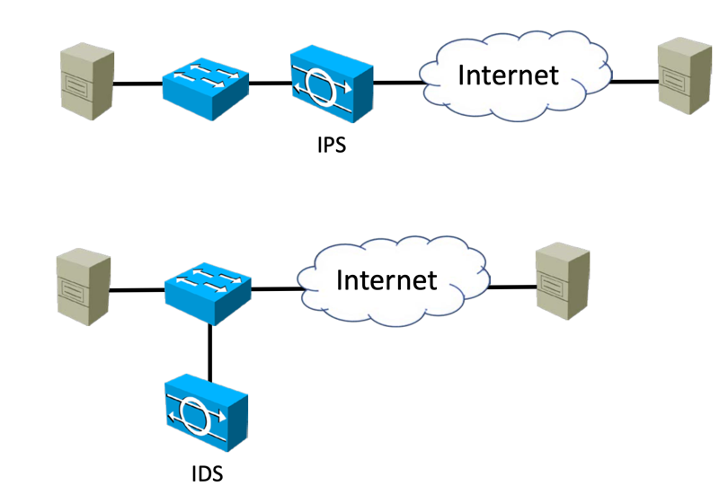

## Security terms
- threat: IT 자산에 피해를 줄 가능성
- vulnerability: 시스템의 보안이나 기능을 손상시키는 약점
- exploit: vulnerability를 사용해 공격자가 시스템에 피해를 주는 행위
- risk: 공격이 일어날 가능성
- mitigation: risk를 줄이는 것

- malware: 악성 프로그램
- viruses: 컴퓨터에서 컴퓨터로 전파되는 소프트웨어. 인간의 상호작용이 필요함(사이트에 접근, 프로그램 다운로드 등)
- worms: 자가 복제 가능한 바이러스. e.g. 데이터베이스에 worm이 감염될 경우 해당 데이터베이스를 사용하는 시스템으로 네트워크를 통해 전파 될 수 있음
- trojan horses: 겉으로는 멀쩡해보이는 악성 프로그램. e.g. 마인크래프트 무료 다운로드 시 몰래 같이 다운로드 되는 프로그램
- ransomware: 사용자의 모든 데이터를 공격자의 키로 암호화해 그에대한 값을 요구하는 프로그램.  

- sniffers: 네트워크 정보를 중간에 채가는 프로그램
- ping sweepers: 특정 IP 범위에 ping을 보내 해당 주소에 시스템이 있는지 정찰하는 프로그램
- port and vulnerability scanners: ping sweepers로 감지한 시스템의 포트번호와 취약점을 알아내는 프로그램

- script kiddies: 인터넷에서 사용하기 간편한 해킹 프로그램을 다운로드 받아 사용하는 초보 해커들의 멸칭. 이들은 보통 특정 표적을 노리고 공격하는 것이 아닌 단순히 취약점이 있는 랜덤한 시스템을 찾아 공격함  

## common attacks
### reconnaissance
공격자는 본격적인 공격을 하기 전에, 정말 알아차리기 힘든 수준으로 먼저 시스템에 대한 정찰을 수행한다.  
whois database(시스템의 담당자에 대한 정보), 회사 전화번호부, 더 나아가 구인공고를 통해 시스템에 대한 전반적인 정보를 수집한다.  
이후에 ping sweepers나 port scanner를 사용해 더 많은 정보를 수집한다.  
수집된 정보는 소셜 엔지니어링에도 쓰일 수 있는데, 예를 들어 담당자의 전화번호와 직책을 수집해 전화를 걸어 IT 담당자 인것처럼 연기해 비밀번호를 바꾸게하거나 회사의 기밀을 유출하게 만드는 방식이다.  
소셜 엔지니어링의 유명한 예로는 Phishing이 있다. 문자로 대기업인것처럼 속여 악성 사이트에 가입하게 하는 식이다.  

### Denial Of Service
많이 들어봤을 DOS이다.  
서비스가 감당하지 못할 정도의 트래픽을 보내 해당 서비스를 마비시키는 방법이다.  
보통 해당 트래픽의 source를 차단하는 것으로 막을 수 있다.  
유명한 방법으로는 TCP SYN flooding이 있다.  
TCP 3way handshake에서 SYN만 무지하게 보내고 ACK는 반환해주지 않는 방식이다.  
서비스는 ACK를 기다리고 있고 점점 리소스를 차지하게 될테니 서비스가 마비된다.  

트래픽의 source를 차단하는 것으로 DOS를 막을 수 있다 했는데, 공격자도 이를 방지하기 위해 Distributed DOS를 사용한다.  
여러 botnet군단을 만들어 다양한 source에서 서비스로 DOS를 날리는 식인데, botnet을 만드는 방법은 트로이 목마와 같은 malware들을 통해 이루어진다.  
특정 사용자의 pc가 malware에 감염돼 좀비pc가 되면 malware를 통해 좀비pc를 제어한다.  
보통 방화벽은 inbound 트래픽에 대해 검사하고 차단하지만, malware는 내부에서 밖으로 나가는 트래픽을 보내고 그에대한 반환값을 보내 방화벽은 이를 차단하지 않는다.  

### spoofing
스푸핑은 일전에 배웠던 arp spoofing처럼 본인을 다른사람인것처럼 속이는 것이다.  
이를 통해 reflection와 amplification 공격을 할 수 있는데, 특정 사용자의 pc의 IP를 탈취해 source주소를 해당 IP로 보내면 사용자의 pc는 해당 트래픽에 대해 반환할때 본인 pc에 보내게 되니 pc가 다운된다.  

arp spoofing은 man in the middle 공격이라는 이름도 있는데, 정상적인 두 호스트 트래픽 사이에 공격자 pc를 집어넣어 중간에서 패킷을 확인, 수정을 가능하게하는 공격기법이다.  

### password attacks
서비스의 로그인화면에서 말그대로 로그인을 통해 접근권환을 탈취하는 방법이다.  
최근의 서비스는 대부분 이를 막아두지만 사용자의 ID를 알아낼 수 있는 기술이 있고, 이에 여러 password를 대입해본다.  
대입하는 방법에는 대표적으로 3가지가 있다.  
- guessing: 될만한걸 하나씩 쳐봄
- brute force: 입력가능한 모든 경우의 수를 대입해봄
- dictionary attack: 사전에 있는 단어들을 전부 대입해봄  

### buffer overflow attacks
입력칸에 정상적이지 않거나 매우큰 사이즈의 데이터를 입력해 dos를 유발하거나 서비스의 접근권한을(대표적으로 sql injection) 제공하게되는 방법이다.

### packet sniffers
서비스로부터 받은 packet을 확인해 민감한 정보가 있는지 확인한다.  
이를 통해 더 디테일한 공격을 시도해본다.  

## firewalls, IDS/IPS
IDS는 intrusion detection system이고  
IPS는 intrusion prevention system이다.  

IDS와 IPS는 7계층에서 트래픽 패턴을 분석해 잘 알려진 공격과 매치시키거나 비정상적인 흐름의 트래픽을 감지한다.  
IDS와 IPS를 잘 튜닝해 false positive와 false negatives를 줄이는 것은 전문가의 기술이 필요하다.  
false positives, 즉 오탐은 공격이 아닌데 공격으로 판단하는 것을 의미하고, false negatives는 공격인데 공격임을 감지하지 못하는 것을 의미한다.  

IDS와 IPS의 차이점은 IDS는 공격을 감지하면 관리자에게 이를 알리지만 IPS는 직접 막는다. 물론 IPS도 관리자에게 통지해줄 수도 있다.  

IPS는 위 사진처럼 직접 트래픽의 흐름의 inline에 있어야하지만 IDS는 따로 빠져있어도 호환되는 방화벽이 있다면 방화벽에 공격을 알려 조치를 취하게 할 수 있다.  
물론 원래는 IDS로 가는 트래픽이 아니기에 IDS로도 트래픽을 전달해주기 위한 트래픽 미러링 기술을 사용해야한다.  
위와같이 두 방법이 있는 이유는 IPS가 병목지점이 되는 경우 때문이다.  
IPS가 트래픽을 처리하지 못하고 병목지점이 될때 트래픽의 속도를 낮추는 것 대신 IDS,방화벽을 사용하는 방법이 있는것이다.  

방화벽은 IP주소나 port를 확인해 트래픽을 차단하는 식의 규칙을 사용하고 IDS/IPS는 signature를 사용한다.  
signature가 뭔지 모르겠어서 찾아봄: https://chatgpt.com/c/673d9803-fac0-800d-a28b-e41df5ac938e. 정규 표현식에서 표현식 같은 느낌인듯?  

방화벽은 보통 필수적으로 internet edge에 설치돼있고 추가적인 정책을 위해 내부망에도 구성돼있을 수 있다.  
최근에는 IPS와 방화벽이 하나로 합쳐진 제품도 출시된다.  

## firewalls vs packet filters
방화벽에는 연결 테이블이란 것이 있다.  
예를 들어 방화벽이 내부에서 외부로 가는 트래픽은 허용하지만 외부에서 내부로 오는 트래픽은 전부 차단할때, 외부에서 시작하는 내부로 오는 트래픽은 차단하지만, 내부의 호스트가 외부 서버로 요청을 보내고 그에대한 반환값이 호스트로 돌아올때 방화벽은 연결테이블을 확인해 해당 트래픽이 반환 트래픽임을 확인하고 외부에서 내부로 오는 트래픽임에도 허용해준다.  
이에 방화벽은 stateful하다고 불린다.  

반면 packet filter인 ACL은 연결 테이블이 없기에 반환트래픽이더라도 바깥 인터페이스의 인바운드 규칙에 전부 deny를 해뒀으면 차단된다.  

이러면 ACL은 왜필요한가 싶을 수 있는데, 더 심층적인 보안을 위해 방화벽과 ACL이 함께 쓰일 수 있다.  
애초에 보안 장치로서 방화벽만을 사용한다면 방화벽이 뚫릴 경우 내부망 전체가 뚫려버리게 되고 ACL을 통해 누배에 추가적인 보안 정책을 보장할 수 있다.  

## TLS
TLS의 작동 원리에 대해 알아보겠다.  
먼저 사용자는 접근하려는 사이트가 PKI(Public Key Infrastructure)에서 인증한 안전한 사이트인지 알고 싶다.  
이를 위해 해당 사이트에게 인증서를 보내달라하고 해당 인증서를 PKI의 공개키로 복호화 해본다.  
만약 해당 인증서가 정상적으로 복호화 됐다면 읽을 수 있는 인증서일 것이고, 해당 인증서는 PKI의 비밀키로 암호화 됐던 것일테니 해당 인증서가 유효한 인증서임을 확인할 수 있다.  
하지만 해당 인증서는 누구든 가질 수 있으므로 지금 내가 접근하려는 사이트가 정말 그 인증서를 발급받은 사이트인지 확인하기 위해, 임의의 데이터를 보내고 이를 해당 사이트의 비밀키로 암호화 해서 반환해달라고 한다.  
이후 사용자는 처음 인증서에 포함된 사이트의 공개키로 복호화 해본다.  
정상적으로 이전에 보낸 랜덤값과 동일한 결과로 복호화 된다면, 접근하려는 사이트는 공개키에 맞는 비밀키를 가지고 있단 것이고, 비밀키는 실제 사이트만이 가지고 있을테니 신뢰할 수 있는 사이트임을 확인할 수 있다.  

하지만 비대칭키로 통신하는건 느리므로 사용자는 랜덤한 대칭키를 만들어 공개키로 복호화 하고, 사이트는 비밀키로 복호화하여 대칭키를 확인한다.  
이후 대칭키를 사용해 통신한다.  

