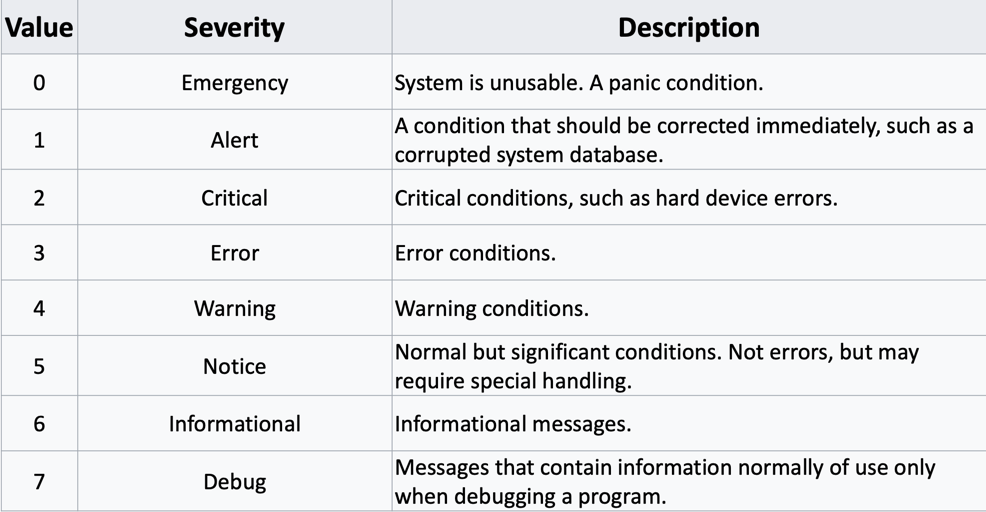
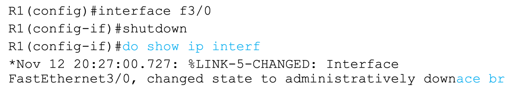

## syslog
말그대로 CISCO 장치에서 어떤 이벤트가 발생했을때 남는 로그이며, 그 로그의 표준형식을 Syslog라고 한다.  
format은 다음과 같다.  
```seq no:time stamp: %facility-severity-MNEMONIC:description```

serverity는 해당 이벤트의 위험도를 나타내는 수치인데 0이가 가장 위험한 수치이다.  

### logging synchronous
default 값으로는 다음과 같이 명령어 입력중 로그가 출력될시 명령어 입력 중간에 나타난다.  
  
기억력이 매우 좋지 않은이상 이 경우 보통 기존 입력하던 명령어를 다 지우고 입력해야한다.  
때문에 `logging synchronous`를 활성화 시켜 이를 방지할 수 있다.  
`logging synchronous` 활성화 시 로그 출력이후 기존 입력하던 명령어가 그대로 다음 명령줄에 같은 내용으로 입력돼있다.  

### terminal monitor
log를 출력하게끔해도 아무것도 화면에 나타나지 않는 경우가 있는데, `terminal monitor`를 입력해보자.  
telent이나 ssh로 접속 시 해당 명령어를 입력해주지 않으면 로그를 출력해도 화면에 나타나지 않는다.  


## SNMP
강의에서 SNMP도 설명하는데 이게 네트워크 내용인가 싶기도하고, Syslog와의 차이도 잘 모르겠다.  
단순 SNMP는 버전이 있는데 3부터 암호화를 통해 데이터의 보안을 보장해주는 것 정도