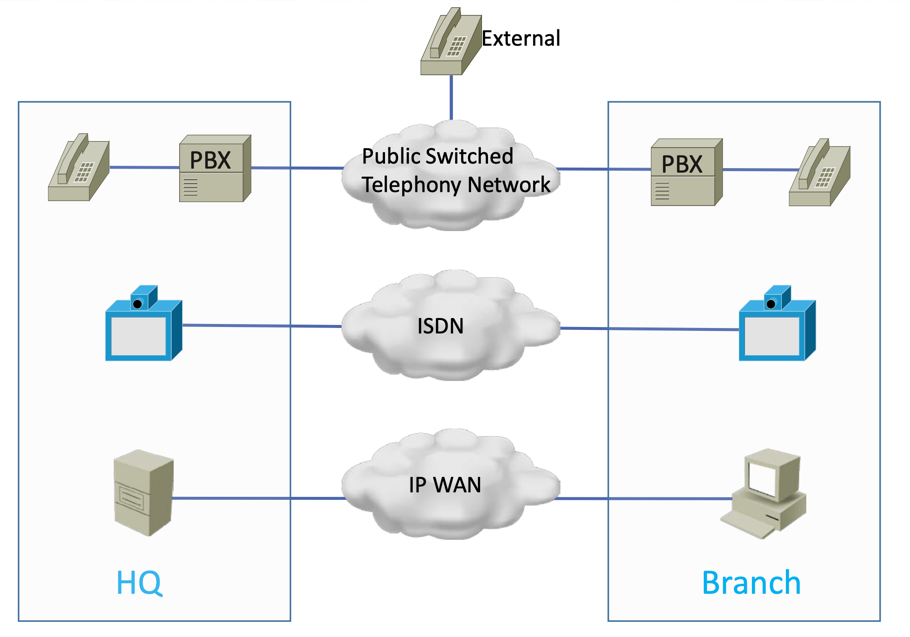

## QoS
Quality of Service, 말그대로 서비스의 품질을 나타내는 용어이다.  
과거에는 아래 사진처럼 장치의 종류별로 개별된 네트워크를 사용했다.  

하지만 최신 네트워크는 비용을 포함한 여러 이유로 인해 아래 사진처럼 하나의 공유된 WAN을 사용한다.  

이로인해 네트워크에 혼잡이 발생할 확률이 높아졌다.  
보통 호스트간 패킷은(data packet) 크기가 크고 전화통화에 사용되는 패킷의(voice packet) 크기는 작다.  
하지만 같은 네트워크를 사용하니 data 패킷을 처리하는 동안 voice 패킷은 라우터의 대기열에 있으니 전화통화에 요구되는 최소 네트워크 품질이 보장되지 않는다.  

## classification and marking
위에서 설명한 문제를 해결하기 위해서는 voice 패킷을 대기열의 앞으로 당겨줘야할 것이다.  
또한 그러기 위해서는 일단 패킷이 어떤 패킷인지 구별할 수 있어야하는데, 이를 위한 여러 기술이 있다.  
- Class of Service Marking
- Diffrentiated Service Code Point Marking
- ACL
- Network Based Application Recognition

먼저 CoS는 2계층 헤더를 사용한다.  
2계층 802.1q 프레임 헤더에 3비트 필드가 있으며 CoS 표시를 이행하는 데 사용된다.  
802.1q 헤더의 3비트 필드가 QoS 표시에만 사용된다.  
3비트는 0부터 7의 값을 가질 수 있고 최선형 트래픽을 위해 기본값은 0으로 설정된다.
CoS 6 및 7은 라우팅 프로토콜이나 네트워크 제어 트래픽 등 네트워크 용도로만 사용되므로 사용 가능한 값 중에 가장 높은 값은 5이다.  


DSCP 값은 3계층 IP 헤더에 설정된다.  
IP 헤더에는 ToS라고 불리는 바이트가 있는데 바로 ToS 바이트에 DSCP 값이 설정되죠 ToS는 1바이트니까 8비트이며 DSCP가 그 중 첫 여섯 비트를 사용한다.
6비트는 64개의 경우의 수가 가능하고 이또한 기본값은 0이다.

이때 중요한 개념이 신뢰구간인데, 컴퓨터를 잘 다루는 사람이 패킷의 CoS나 DSCP값을 임의로 수정해 더 높은 값을 가지게하는 일을 방지하기 위해, PC에서 오는 트래픽은 DCSP와 CoS값을 0으로하고 IP전화에서 오는 패킷은 신뢰하게끔 구성해야한다.  


ACL은 알듯이 3계층 정보인 주소와 4계층 정보인 패킷을 통해 트래픽을 구별할 수있게 해준다.  


NBAR은 3계층에서 7계층 정보를 보고 트래픽을 분석할 수 있게 해준다.  


가장 많이 쓰이는 방식은 DSCP이다.  
이제 이렇게 구별하고 marking해놓은 정보를 기반으로 라우터에서 queuing을 해준다.  


## congestion management
- Class Based Weighted Fair Queuing
- Low Latency Queuing

CBWFQ는 특정 타입의 트래픽에게 일정 대역폭을 보장해주는 알고리즘이고 LLQ는 CBWFQ에 우선순위 큐가 추가된 것이다.  


```
class-map VOICE-PAYLOAD
match ip dscp ef
class-map CALL-SIGNALING
match ip dscp cs3
!
policy-map WAN-EDGE
class VOICE-PAYLOAD
priority percent 33 
class CALL-SIGNALING
bandwidth percent 5 
class class-default
fair-queue
!
interface Serial0/0/0
bandwidth 768
service-policy out WAN-EDGE
```

위 명령어가 라우터에서 혼잡제어를 구성하는 명령어들인데,  
`class-map`은 특정 타입의 트래픽에 이름을 설정해주는 명령어이다.  

이후 `policy-map`을 사용해 정책을 생성하는데, `class` 명령어를 사용해 먼저 이전에 생성한 트래픽 타입을 불러와 해당 트래픽에 대역폭을 보장해준다.  
bandwidth와 priority명령어의 차이점은 bandwidth는 대역폭을 보장만해주고 priority는 큐에서 해당 트래픽을 맨앞에 배치시켜준다.  
bandwidth가 어떻게 트래픽에게 대역폭을 보장해주는지 궁금해서 chatgpt에게 물어보니 라우터에 여러 큐가 잇고 bandwidth큐에게는 해당 대역폭을 보장해주는 방식이었다.

> priority와 bandwidth 큐가 여러 개 있을 수 있는가?  
    1) priority 큐
일반적으로 라우터에서는 하나의 priority 큐를 사용하는 것이 권장됩니다.  
이유: priority 큐는 항상 대기열 맨 앞에서 트래픽을 처리하므로, 여러 priority 큐가 있으면 다른 트래픽이 배제될 가능성이 높아집니다.  
하지만, 특정 장치와 상황에 따라 여러 priority 큐를 설정할 수도 있습니다.  
예: 음성 트래픽과 비디오 트래픽을 각각 별도 priority 큐로 지정.  
    2) bandwidth 큐  
여러 개의 bandwidth 큐를 만들 수 있습니다.  
각 큐에 대해 지정된 대역폭을 설정하여 트래픽 유형별로 보장 대역폭을 다르게 할당.  
예: 음성 신호용 큐(5%), 데이터 트래픽용 큐(10%), 파일 다운로드용 큐(20%) 등.  
bandwidth 큐는 보장 대역폭 이외에 여유 대역폭이 있을 경우 이를 추가로 사용할 수 있기 때문에, 여러 개가 있어도 문제가 없습니다.  


## shaping and policing
대역폭을 보장해주는 것외에도 대역폭을 제한하는 기술도 있다.  
어쩌면 이쪽이 더 익숙할 수도 있다.  
예를들어 핸드폰 요금제가 400mbps인데 그 이상을 너기면 ISP에서 정한 정책에 맞지 않고 심할경우 다른 고액의 요금제를 사용하는 고객에게 SLA를 보장할 수 없을 수도 있다.  

shaping은 트래픽이 일정 수준 이상을 넘어가면 그 속도를 조절해 트래픽의 양을 줄이는 것이고 policing은 일정 수준을 넘어갈시 이후 트래픽을 drop해버린다.  
```
policy-map WAN-EDGE class class-default
shape average 10000000 service-policy NESTED
Interface FastEthernet0/0
service-policy out WAN-EDGE
```
