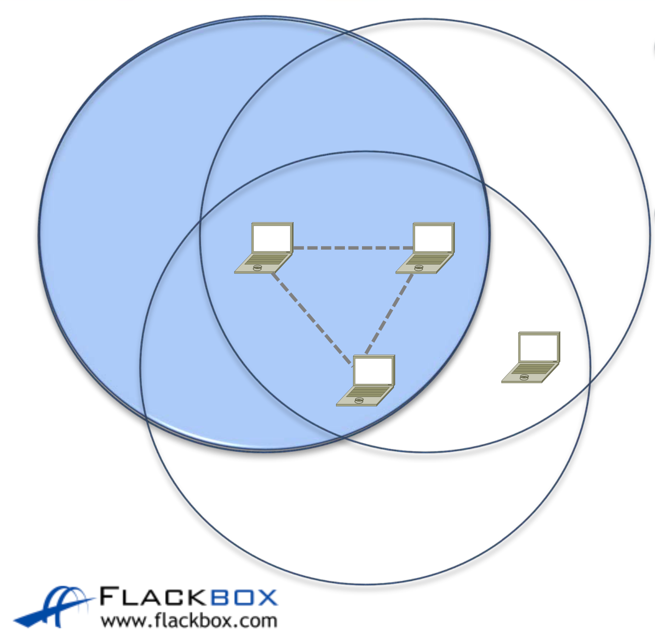
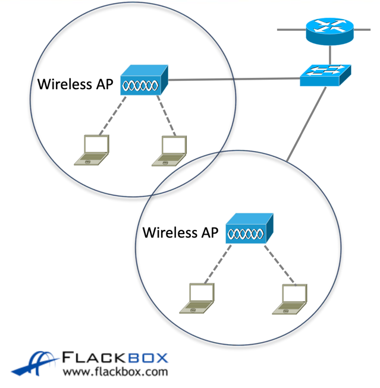

## wireless network types
LAN, WAN, MAN처럼 무선 네트워크에도 종류가 있다.  
- W(ireless)P(ersonal)AN: 블루투스와 같이 좁은 반경, 10m 이내 
- WLAN: 100m 이내, 캠퍼스/기업용
- WMAN: 도시 규모 네트워크

무선 네트워크를 운영하는데에도 여러 종류가 있다.  
- Ad Hoc: 두개 이상의 무선 station(네트워크 통신을하는 장치를 칭함)이 직접 서로 통신하는 것을 의미한다.  Independent Basic Service Set라고도 불린다.   
- Infrastructure Mode: wireless AP(access point)가 존재해 호스트들이 AP를 통해 통신하는 것을 의미한다.    

또한 무선 통신은 반이중 통신이다.  

## EEE 802.11 terms
- Basic Service Set(BSS)는 AP를 중심으로 형성된 하나의 무선 네트워크 단위이다.  
    모든 무선 장치는 AP를 통해 통신한다.

- Distribution System(DS)는 무선 통신하고 있는 호스트를 유선 네트워크에게 제공하는 것을 의미한다.  
위의 infrastructure mode를 설명할때 쓰인 사진에서 스위치가 DS가 되는 것이다.  

- BSS Identifier는 무선 네트워크에서 장치 식별을 위한 개념이다.  
    AP의 MAC주소가 BSSID로 쓰인다.  

- Basic Service Area는 BSS의 커버리지 영역이다.  
    wireless cell이라고도 불린다.  

- Service Set Identifier는 무선 네트워크인 WLAN을 칭하는 고유 식별자이다.   
    단일 액세스 포인트는 여러 SSID를 지원할 수 있다.

- Roaming은 동일한 WLAN에서 다른 AP로 연결하는 것을 의미한다.

## Wireless Lan Controller
큰규모에서는 당연하게 AP도 여러개가 설치된다.  
그런 AP를 하나하나 관리해주는건 어려우니 WLC가 중앙에서 제어를 해준다.  
WLC를 사용하면 lightweight AP라하고 WLC없이 작동하면 standalone AP라고 하는거 같다.  

ZTP는 AP가 WLC를 자동으로 검색해 구성을 다운로드하는 방식이다.  

CAPWAP(Control and Provisioning of Wireless Access Points)은 WLC와 AP간 통신을 위한 프로토콜이다.  
UDP포트 5246,5247을 사용한다.  
WLC를 사용할경우 AP와 WLC의 역할이 각각 분담된다.
이를 splict MAC구조라하고 각 열할은 아래와 같다.  

- AP
    - 실시간 트래픽(지연 민감 트래픽).
    - 클라이언트 핸드셰이크, 비콘 관리, 암호화.
- WLC에서 처리되는 작업:
  - 인증, 로밍 제어, 무선 주파수 관리, 보안 및 QoS.

