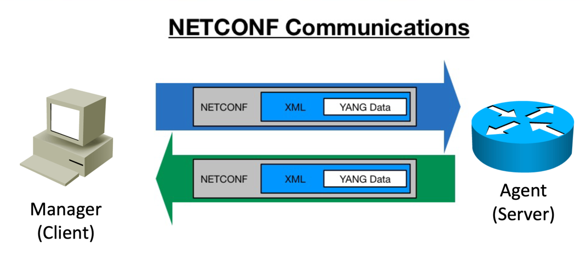

## Yet Another Network Generation
YANG은 네트워크 장치 간 데이터 교환에 표준을 제공하기 위한 데이터 모델링 언어이다.  
2010 IETF에서 표준화 되었다.  

YANG을 사용하는 프로토콜은 NETCONF가 있다.  
NETCONF는 SNMP의 보안문제를 보완하기 위해 출시 됐고 2006 IETF에 의해 표준화 됐다.  

특이하게 YANG을 사용하는 NETCONF가 YANG보다 일찍 표준화 됐는데, 실제로 YANG이 나오기 전까진 netconf는 표준화만 됐을뿐 실제로 사용은 하지 않았다.   

또한 최근 트렌드에 맞게 netconf에 REST를 합친 RESTCONF도 존재한다.  
네트워크 장치와 통신하는 프로토콜에는 gRPC도 존재한다.  

## configuration and management tools
네트워크 장치를 자동으로 일괄구성 하기위한 도구가 여럿 있다.  
pull/push model로 나누자면  

- push
  - ansible
  - terraform
- pull
  - puppet
  - chef

push모델은 중앙 소프트웨어가 관리 받는 장치에 구성 정보를 push해주는 방식이다.  
때문에 관리받을 장치는 따로 소프트웨어를 설치할 필요가 없다.  

pull은 그 반대로 관리받는 장치에서 중앙 소프트웨어로부터 구성값을 일정 주기마다 pull해온다.  
때문에 장치받을 관리에서 에이전트를 다운로드해놔야한다.  

각각의 장단점이 있긴하지만 Cisco 장치에서는 에이전트를 실행하는 지원이 제한적이기에, 네트워크 장치 관리에는 push model이 일반적으로 쓰인다.  

또한 ansible과 terraform은 상호배타적이지 않다.  

Terraform: 인프라 프로비저닝에 뛰어나다
Ansible: 리소스 구성 및 관리에 뛰어나다

이러한 특징을 잘 활용해 ansible 초기 단계에서 terraform을 통해 초기 인프라를 프로비저닝 하고 이후 구성을 ansible을 통해 관리할 수 있다.  

## Software Defined Networking
먼저 네트워크 아키텍처는 data plane, control plane, management plane으로 나뉘는데, 여기서 plane은 비행기라는 뜻은 아니고 평면이라는 느낌으로 해석되서 영역? 정도로 해석해도 될듯하다.  
데이터 영역은 장치를 통해 트래픽을 전달하는 영역을 의미한다.  
이러한 데이터 영역은 제어 영역에 의해 제어된다.  
관리 영역은 장치의 구성 및 모니터링을 담당한다.  

SDN은 제어 영역과 데이터 영역을 분리해주는 소프트웨어이다.  
편리하게 SDN에게 프로그래밍 언어로 명령을 내리면 각 장치는 SDN이 구성해준다.  

CISCO에서 지원하는 SDN은 대표적으로 세가지가 있다.  
- APIC
- APIC-EM
- DNA Center(Catalyst Center와 같은말, ssl과 tls처럼)

현재는 가장 최신버전인 catalyst center가 일반적으로 쓰인다.  

## catalyst center
catalyst center의 핵심 목표는 무엇을 하고싶은지를 SDN에게 명령하면 어떻게 해야하는지는 SDN이 직접 구성하는 것이다.  
때문에 Indent Based Networking(IBN)이라고 불린다.  
