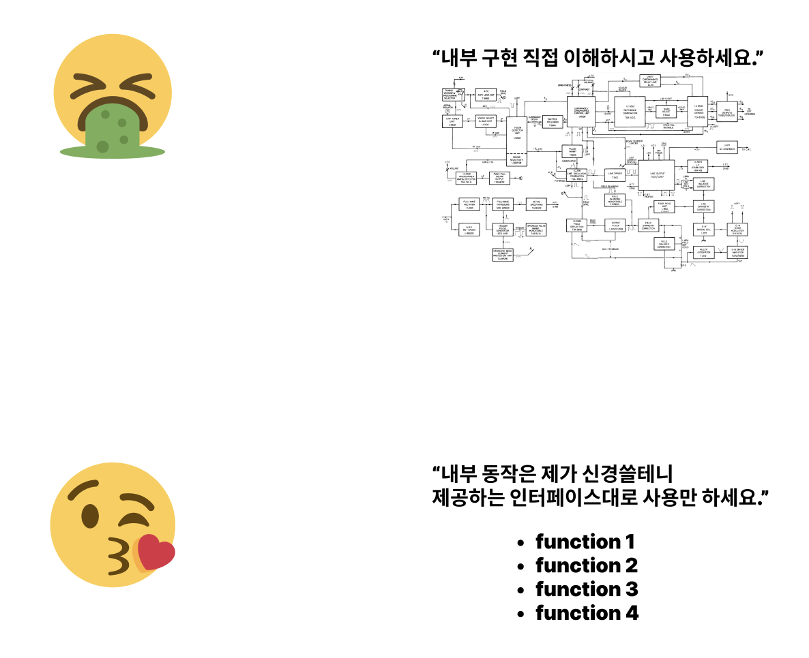

## introduction

### summary
0 챕터에서는 `abstraction`과 `implementation`이 핵심키워드이다.  
무언가를 만들때 내가 만든 module의 사용자는 내 모듈의 실제 implementation은 몰라도 되야한다.  

무슨 말이냐 하면 개발을 할때 해당 언어의 문법만 알면되지,  
실제 내부 컴파일러가 각 단어 하나하나를 어떻게 인식하는지 또 한번 컴파일된 그 언어를 어떻게 기계가 이해할 수 있게 바꾸는지는 사용자는 몰라도 되게끔 해야한다는 것이다.  
실제로 우리가 개발할때 cpu의 동작구조, 메모리에 값이 어떻게 담기고 읽히는지 하나하나 알아야만 개발할 수 있다면 개발자들 초봉은 몇억하지 않을까.  

그리고 그렇게 사용자가 실제 내부 구현 implementaion을 몰라도 되게끔 사용법 interface만 제작하는 등의 작업을 abstraction, 추상화라고 하는 것이다.  
추상화라는 단어는 아마 익숙할 거라 생각된다.  
개발 단게에서 모듈화, 추상화라는 단어를 많이 들어봤을테니 말이다.  
아마 컴퓨터 공학에서의 이런 `abstraction`과 `implementation`개념이 소프트웨어 공학 까지 이어지지 않았나 싶다.

또한 개발자들은 일반적으로 무언가를 사용할때에는 그 사용법만 알고싶어하고 본인이 신경쓰는 도메인에만 집중하고 싶어하는 DNA가 있기에 이런 추상화는 컴퓨터공학과 소프트웨어 공학에서 뗄레야 뗄 수 없는 개념인 거 같다.

