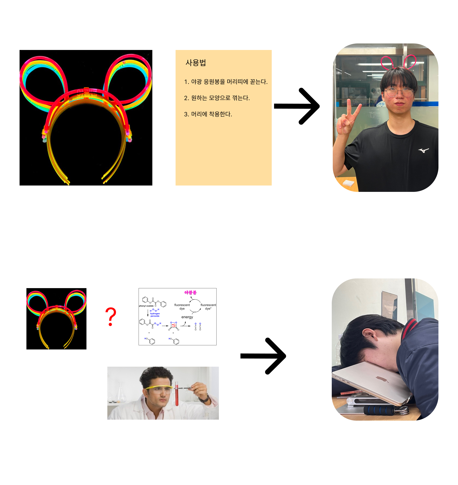

# 0. 하드웨어

Hello World를 출력하는 프로그램은 겉으로는 간단해 보인다.  
이런 간단한 프로그램도 실제로 동작하는 데 많은 과정이 있다.

> 현대 컴퓨터 시스템은 꼭대기만 보이는 거대한 빙산 같다. 

## 추상화와 구현   
여러 모듈로 무언가를 구현을 할 때 추상화-구현 패러다임을 적용한다.

**추상화**는 모듈이 **“무엇을 하는지”**  
**구현**은 모듈이 **“어떻게 하는지”**

어떤 모듈이든 구성 블록을 사용할 때 모듈의 추상화에만 집중하고 상세 구현은 완전히 무시해야한다.

> ex) RAM을 구현할 때 RAM을 수십억 개의 레지스터로 구현해야하는 것은 알아야 하지만   
이 레지스터가 어떻게 구현되는지는 몰라도 된다.

구현에 필요한건 모듈이 **무엇**을 하는지 설명하는 인터페이스,  
**어떻게** 수행하는지에 대해서는 몰라도 된다.

이 추상화-구현 패러다임을 통해 개발자는 매우 큰 시스템을 잘 정의된 모듈로 쪼개서  
오류 처리와 수정 및 구현 작업을 수행하기 쉽게 만들 수 있고 시스템의 복잡성을 줄일 수 있다.

