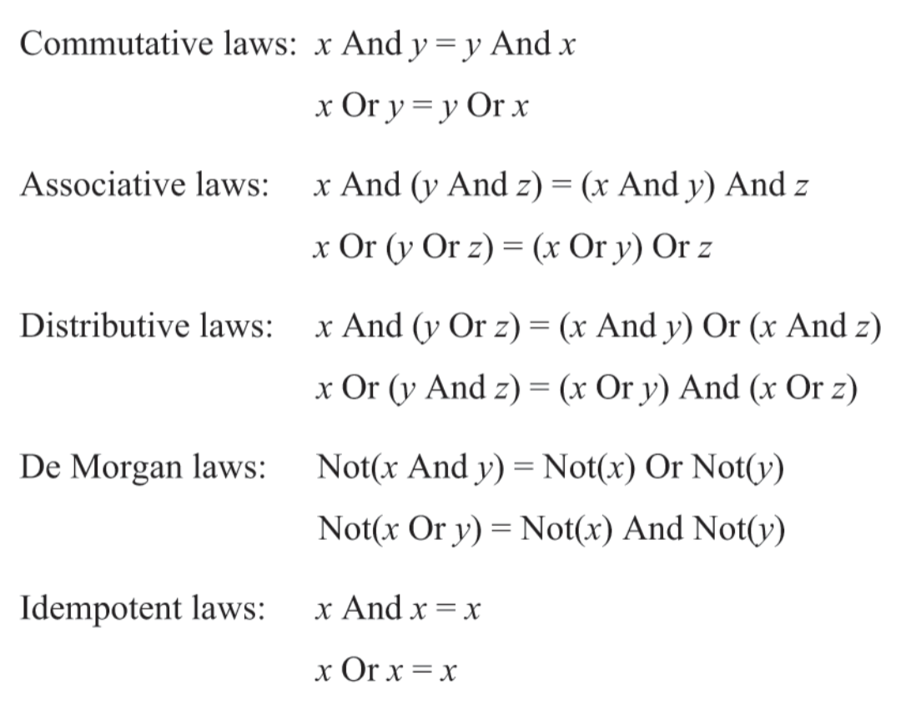
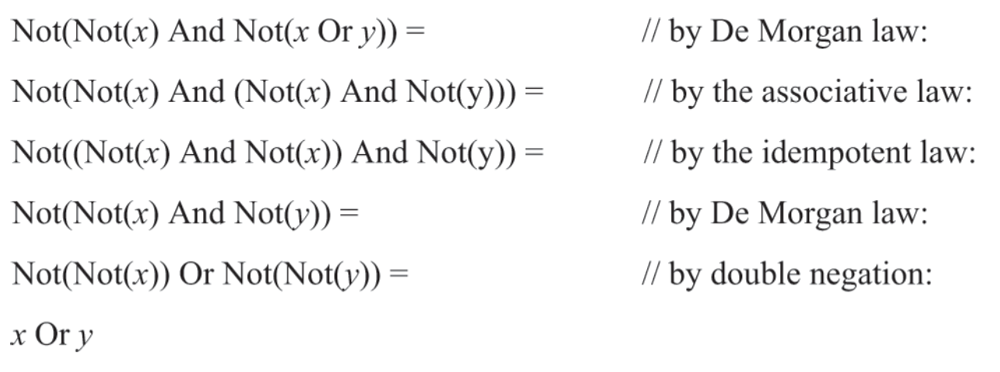

## boolean algebra
바로 아래서 알아보겠지만 불 연산은 항상 다른 여러 연산의 조합으로 표현될 수 있고, 그 다른 표현들이 더 짧거나 효율적일 수 있다.  
또 이렇게 수식이 다른 불 연산으로 표현될 수 있는 점은 하드웨어 최적화로 향하는 첫 걸음이다.

## simplify boolean function

불 대수 연산에는 위 사진과 같은 법칙들이 적용된다.  
이를 통해 복잡해 보이는 연산들을 간단히 만들 수 있다.  
책에 좋은 예시가 나와있다.  

복잡해보이는 불 연산을 단순한 or연산으로 줄일 수 있었다.  
첫 수식은 로직게이트가 5개 쓰이는데 반해 or연산은 로직 게이트 하나만 쓰이는 만큼, 기존 수식에 비해 속도, 에너지 효율 면에서 5배 더 효율적이다.

하지만 이 분야에는 아직 문제 하나가 남아있다.  
바로 위 예시처럼 어느 수식의 가장 간단한 형태를 구하는 것이 NP-hard 문제라는 것이다.  
즉 수식을 최적화 했을때 이 수식이 정말 최적의 형태인지 알 수 없다.  
물론 위에 처럼 입력이 2개일 경우엔 수식이 결국 16가지 경우의 수중 하나와 같은 동작을 할 것이므로 출력 결과를 보고 최적화 할 수 있을 것이다.(라고 내가 생각했었다.)
하지만 입력이 3개, 4개 라면? 입력 수를 k라 할 때 출력 결과의 가지 수는 $2^{2^k}$ 이다.

## nand to tetris
책의 주제를 왜 다시 적냐?  
왜냐면 책의 첫번째 파트(hardware)에서 보여주겠지만 실제로 보여주는 것 말고도 이론적으로 증명하여 보여주는 방법도 있기때문  
증명까지 적기엔 길어서 정리만 적겠다.  
1. 모든 불 연산은 and, or, not만을 사용해 구현될 수 있다.(입력이 3개 이상이여도)
2. 모든 불 연산은 and, not을 사용해 구현될 수 있다.(드 모르간 법칙을 통해 or연산은 and로 치환 가능)
3. 모든 불 연산은 nand만을 사용해 구현될 수 있다.(not(x) == nand(x,x), and(x,y) == not(nand(x,y)))

이러한 정리를 통해 결국 컴퓨터는 불 연산을 통해 구현되므로 결국 컴퓨터도 nand연산 하나만으로 구현될 수 있다.

## logic design
위에서 말했 듯 가장 최적화된 로직게이트를 구하는 것은 np-hard문제이므로, 어떤 동작을 하는 게이트의 명세나 인터페이스가 주어졌을때 최소한의 게이트로만 해당 기능을 구현하는 것이 logic design의 미학이다.  
(엄청 깔끔하고 잘 설계된 코드를 작성하는 것과 비슷한 느낌인가)

## the range of computer science
책이나 강의를 보다 보면 그 이상은 컴퓨터과학이 아니다 라는 말을 하는데,  
컴퓨터 과학은 부울 대수를 이용해 그 위의 다른 로직, 더 나아가 cpu, ram등을 구현하는게 컴퓨터 과학이지,  
그 아래 가장 기초가 되는 and, or, not, nand등 elemental 로직게이트를 구현하는 방법(모스펫으로할지, 진공관으로할지, 스위치로 할지 등)은 컴퓨터 과학 분야를 넘어가는 거라고 한다.
