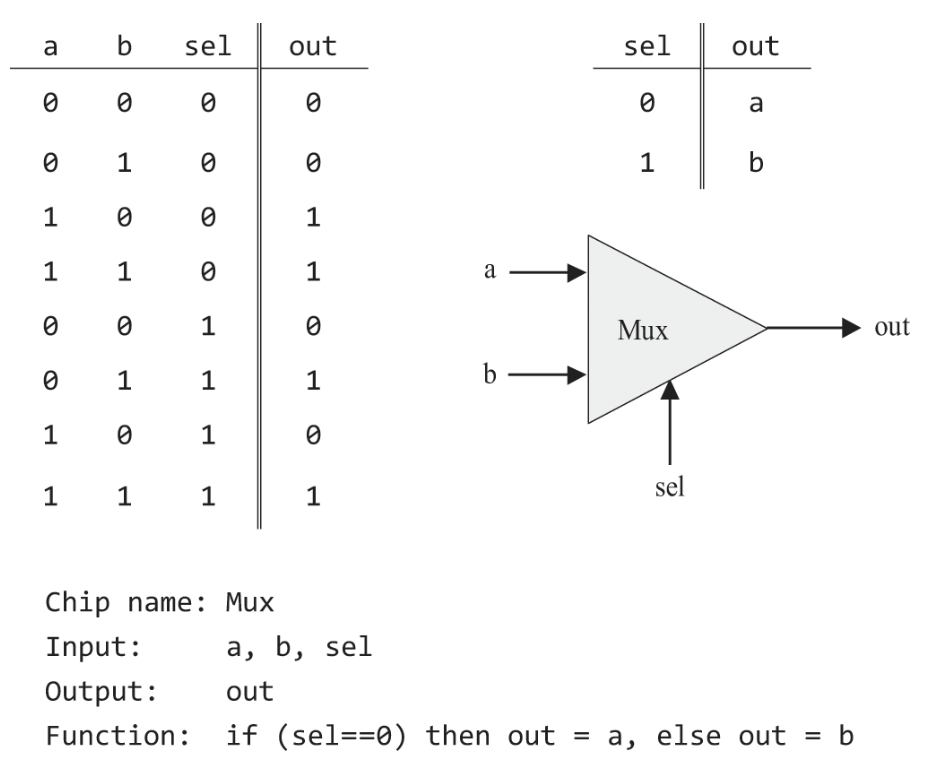
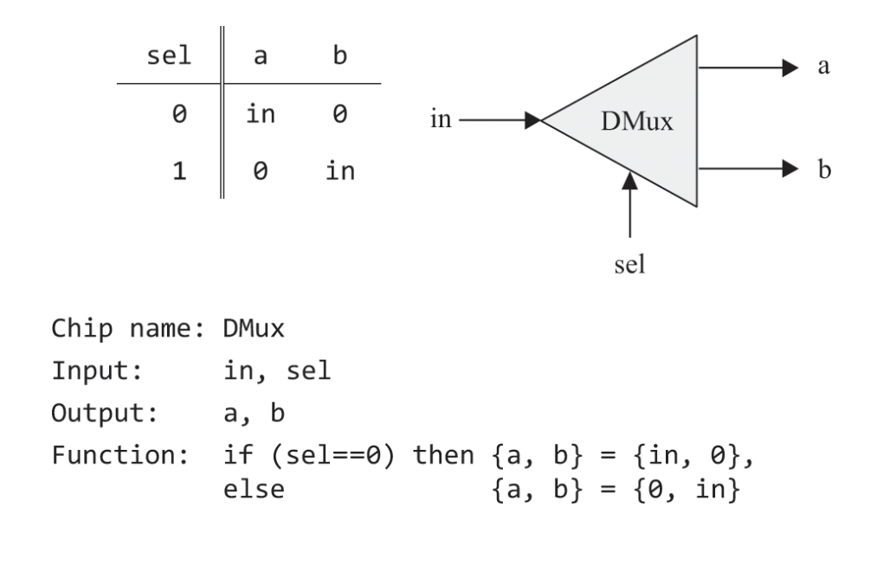

# Boolean Logic - 불 논리

## 주의점
- _Nand2Tetris_ 는 물리적인 구현에 대해서는 다루지 않는다.
- _Nand2Tetris_ 의 도서와 코세라 강의에서 나오는 내용을 포함한다.
- _Nand2Tetris_ 외에 _한 권으로 읽는 컴퓨터 구조와 프로그래밍_ 책을 참고하였다.

## 0과 1

컴퓨터는 binary(이진법)을 사용한다.
이진법은 0과 1을 사용하는 수 체계이다.

여러 이유가 있지만,   
두 가지(0과 1) 상태는 전기적 신호의 온/오프 상태로 쉽게 매핑되고 아날로그 신호를 쉽게 처리할 수 있다.   
비트를 사용하면 0과 1로만 나타내기 때문에 문턱값(threshold)을 설정하기가 간단하다.   
이는 하드웨어 설계의 복잡성을 줄어준다.

## Boolean Logic - 불 논리

### 불 대수 - Boolean Algebra
대수: 일련의 연산들이 주어진 집합  
2진 값을 다루는 대수.  

###  불 연산자 - Boolean Operator

기본적으로 And, Or, Not이 있다.  
이 세 연산자를 조합하여 모든 불 연산자를 만들 수 있다.   
(정확히는 And, Or 중 하나 + Not만 있어도 된다.)

또한 Nand만을 사용하여 모든 기본 연산자를 만들 수 있다. 이는 Nand만으로 모든 연산자를 만들 수 있음을 의미한다.
- Not(x): (x Nand x)
- (x And y): Not(x Nand y)
- (x Or y): (x Nand x) Nand (y Nand y)

나머지 불 연산자
- Nor: Not-Or
- Nand: Not-And
- Xor: Exclusive-Or
- Nor: Not-Or

###  불 함수 - Boolean Function

불 함수는 2가지 표현 방법을 가진다.
- 진리표 - Truth Table
    - 모든 입력 조합에 대한 함수의 output
- 표현식 - Boolean Expression
    - 불 함수를 나타내는 대수적 표현
    - AND, OR, NOT과 같은 논리 연산자를 사용하여 표현된다.

#### 불 항등식 - Boolean Identity

같은 진리표를 가지는 공식은 서로 대체할 수 있다.

대표적으로 드 모르건 법칙(De Morgan Law), Commutative Law, Associative Law, Distributive Law 등이 있다.

더 자세하게는 [이 사이트](https://www.allaboutcircuits.com/technical-articles/boolean-identities/) 참고

## Logic Gates - 논리 게이트

### Logic Gates - 논리 게이트

게이트(Gate): 불 함수를 하드웨어로 구현한 물리적 장치

오늘날 게이트는 칩(chip)에 패키징 되어 있으며, 게이트와 칩을 동일한 의미로 사용하기도 한다.

논리 게이트는 2가지 종류가 있다.
- Elementory: 기본적인 게이트, Nand, And, Or, Not ...
- Composite: 더 복잡한 게이트, Mux, Adder ...

### 논리 설계

게이트는 추상화와 구현 영역으로 나뉘어진다.

구현은 "어떤 방식이든 정해진 인터페이스를 따르는 게이트를 구현하는 것"을 목표로 한다.

효율성 관점에서는 게이트를 최소한으로 사용해서 비용과 에너지를 아끼는 것이 일반적이다.

즉, 논리 설계는 기존의 게이트를 사용해서 추상화(명세, 인터페이스)를 구현하는 효율적인 방법을 찾는 것이다.

### 하드웨어 설계

#### 하드웨어 기술 언어(HDL, Hardware Description Language)

요즘에는 하드웨어 설계자는 HDL이라 불리는 소프트웨어 도구를 사용해서 칩을 설계하고 테스트한다.  
(하드웨어 시뮬레이터를 사용해 테스트한다.)

HDL은 소프트웨어 적으로 논리 게이트를 구현하고, 여러 변수를 확인할 수 있게 제공한다.

HDL을 사용해 설계된 칩을 청사진으로 실제 칩을 만든다.

#### 실습 HDL

실습에 사용할 HDL과 명세를 설명하는데, 굳이 정리할 필요성을 느끼지 못했다.  
(자세한 내용은 책의 부록 A를 참고)

### 논리 게이트 명세

(Nand, Or 같은 기본적인건 생략)

- 멀티플렉서 (Multiplexer)
    - 셀렉터, 다중화기 등으로도 부른다.
    - 멀티플렉서는 여러 입력 신호 중에서 하나를 선택하여 출력한다.
    - 

- 디멀티플렉서 (Demultiplexer)
    - 입력 신호를 받아서 선택 비트에 따라 어느 하나의 출력을 1로, 나머지를 0으로 한다.
    - 

#### 멀티비트 버전

컴퓨터 하드웨어는 멀티비트 값들을 처리하도록 설계된다.

예를 들어 16비트 컴퓨터의 경우, 비트 단위(bitwise)로 계산하는 And 함수가 있다.

#### 다입력 버전

입력이 하나 혹은 둘인 게이트는, 입력이 두 개 이상인 다 입력(mulit-way) 게이트로 일반화할 수 있다.

- 멀티비트/다입력 멀티플렉서
    - 
    4입력 멀티플렉서의 API

- 멀티비트/다입력 디멀티플렉서
    - 
    4입력 디멀티플렉서의 API

## 과제

_Nand2Tetris_ 에서 제공하는 HDL 프로그램은 효과적인 실습(집중)을 위해 실제에 비해 물리적인 부분이 많이 생략되어 있다. 전력 량, 배선 교차 수 등