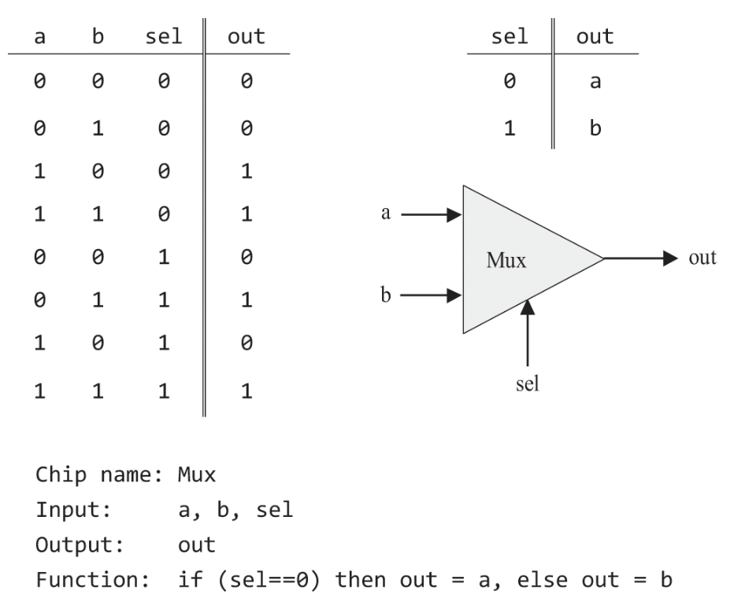
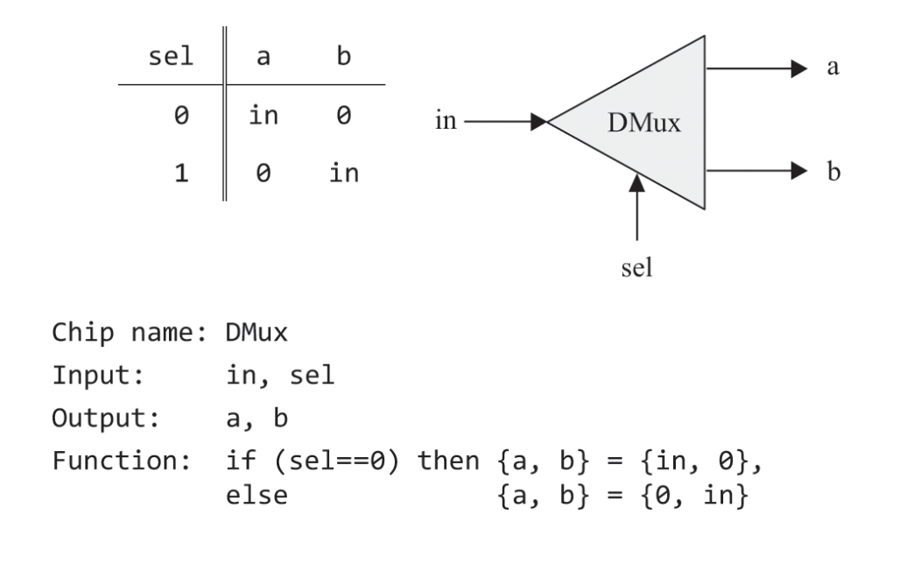

# Boolean Logic - 불 논리

## 주의점
- _Nand2Tetris_ 는 물리적인 구현에 대해서는 다루지 않는다.
- _Nand2Tetris_ 의 도서와 코세라 강의에서 나오는 내용을 포함한다.
- _Nand2Tetris_ 외에 _한 권으로 읽는 컴퓨터 구조와 프로그래밍_ 책을 참고하였다.

## 0과 1

컴퓨터는 binary(이진법)을 사용한다.
이진법은 0과 1을 사용하는 수 체계이다.

여러 이유가 있지만,   
두 가지(0과 1) 상태는 전기적 신호의 온/오프 상태로 쉽게 매핑되고 아날로그 신호를 쉽게 처리할 수 있다.   
비트를 사용하면 0과 1로만 나타내기 때문에 문턱값(threshold)을 설정하기가 간단하다.   
이는 하드웨어 설계의 복잡성을 줄어준다.

## Boolean Logic - 불 논리

### 불 대수 - Boolean Algebra
대수: 일련의 연산들이 주어진 집합  
2진 값을 다루는 대수.  

###  불 연산자 - Boolean Operator

기본적으로 And, Or, Not이 있다.  
이 세 연산자를 조합하여 모든 불 연산자를 만들 수 있다.   
(정확히는 And, Or 중 하나 + Not만 있어도 된다.)

또한 Nand만을 사용하여 모든 기본 연산자를 만들 수 있다. 이는 Nand만으로 모든 연산자를 만들 수 있음을 의미한다.
- Not(x): (x Nand x)
- (x And y): Not(x Nand y)
- (x Or y): Not(x) Nand Not(y)

나머지 불 연산자
- Nor: Not-Or
- Nand: Not-And
- Xor: Exclusive-Or
- Nor: Not-Or

###  불 함수 - Boolean Function

불 함수는 2가지 표현 방법을 가진다.
- 진리표 - Truth Table
    - 모든 입력 조합에 대한 함수의 output
- 표현식 - Boolean Expression
    - 불 함수를 나타내는 대수적 표현
    - AND, OR, NOT과 같은 논리 연산자를 사용하여 표현된다.

#### 불 항등식 - Boolean Identity

같은 진리표를 가지는 공식은 서로 대체할 수 있다.

대표적으로 드 모르건 법칙(De Morgan Law), Commutative Law, Associative Law, Distributive Law 등이 있다.

더 자세하게는 [이 사이트](https://www.allaboutcircuits.com/technical-articles/boolean-identities/) 참고

## Logic Gates - 논리 게이트

### Logic Gates - 논리 게이트

게이트(Gate): 불 함수를 하드웨어로 구현한 물리적 장치

오늘날 게이트는 칩(chip)에 패키징 되어 있으며, 게이트와 칩을 동일한 의미로 사용하기도 한다.

논리 게이트는 2가지 종류가 있다.
- Elementory: 기본적인 게이트, Nand, And, Or, Not ...
- Composite: 더 복잡한 게이트, Mux, Adder ...

### 논리 설계

게이트는 추상화와 구현 영역으로 나뉘어진다.

구현은 "어떤 방식이든 정해진 인터페이스를 따르는 게이트를 구현하는 것"을 목표로 한다.

효율성 관점에서는 게이트를 최소한으로 사용해서 비용과 에너지를 아끼는 것이 일반적이다.

즉, 논리 설계는 기존의 게이트를 사용해서 추상화(명세, 인터페이스)를 구현하는 효율적인 방법을 찾는 것이다.

### 하드웨어 설계

#### 하드웨어 기술 언어(HDL, Hardware Description Language)

요즘에는 하드웨어 설계자는 HDL이라 불리는 소프트웨어 도구를 사용해서 칩을 설계하고 테스트한다.  
(하드웨어 시뮬레이터를 사용해 테스트한다.)

HDL은 소프트웨어 적으로 논리 게이트를 구현하고, 여러 변수를 확인할 수 있게 제공한다.

HDL을 사용해 설계된 칩을 청사진으로 실제 칩을 만든다.

#### 실습 HDL

실습에 사용할 HDL과 명세를 설명하는데, 굳이 정리할 필요성을 느끼지 못했다.  
(자세한 내용은 책의 부록 A를 참고)

### 논리 게이트 명세

(Nand, Or 같은 기본적인건 생략)

- 멀티플렉서 (Multiplexer)
    - 셀렉터, 다중화기 등으로도 부른다.
    - 멀티플렉서는 여러 입력 신호 중에서 하나를 선택하여 출력한다.
    - 

- 디멀티플렉서 (Demultiplexer)
    - 입력 신호를 받아서 선택 비트에 따라 어느 하나의 출력을 1로, 나머지를 0으로 한다.
    - 

#### 멀티비트 버전

컴퓨터 하드웨어는 멀티비트 값들을 처리하도록 설계된다. = 여러 비트가 하나의 단위  
여러 비트가 동시에 전달되는 선을 버스(bus)라고 부르기도 한다.

예를 들어 16비트 컴퓨터의 경우, 비트 단위(bitwise)로 계산하는 And 함수가 있다.

#### 다입력 버전

입력이 하나 혹은 둘인 게이트는, 입력이 두 개 이상인 다 입력(mulit-way) 게이트로 일반화할 수 있다.

- 멀티비트/다입력 멀티플렉서
    - 
    4입력 멀티플렉서의 API

- 멀티비트/다입력 디멀티플렉서
    - 
    4입력 디멀티플렉서의 API

## 과제

_Nand2Tetris_ 에서 제공하는 HDL 프로그램은 효과적인 실습(집중)을 위해 실제에 비해 물리적인 부분이 많이 생략되어 있다. 전력 량, 배선 교차 수 등

#### 논리게이트 구현
(어떻게 구현했는지 간단히 메모, 설명 없는건 쉽게 풀었음)

총 15개 구현해야 함

1. Nand - 책에 구현 있었음
2. And - 책에 구현 있었음
3. Or
4. Not
5. Xor
6. Mux - 그림 그려서 품 1
7. DMux -  그림 그려서 품 2
8. Not16 - 노가다해서 풀었는데 구글링해보니 다 이렇게 푸는듯
9. And16
10. Or16
11. Mux4Way16 - 각자 Mux16 sel[0]으로 a,c or b,d 로 나누고 그 중에서도 sel[1]로 정함, 아래처럼 자리수 하나 늘었다고 생각해도 될 듯
12. Mux8Way16 - 직관으로 풀었음, 그냥 Mux4Way16이랑 비슷하게 하면 풀릴거 같았음, "한자리가 늘어났으니까 그냥 Mux16 추가하면 되지 않을까?" 라고 생각함. 왜 그 2진수에서도 한자리 늘면 2배 되는거처럼
13. DMux4Way - 그림 그려서 품, 이건 진짜 걍 해보다가 된거라 운으루 푼 것 같기도 하고, 느낌 가는대로 해서 해결
14. Or8Way - 계단 식으로 0,1,2… 이렇게 풀까 했는데, 그것보다 2개씩 묶어서 처리하는게 더 연산 횟수가 적어서 그렇게 품
15. DMux8Way - DMux4Way랑 거의 비슷한 방식으로 풀었음

## 과제

칩 추가 몇개 + 구현한 것들로 ALU 만드는게 과제

아래는 구현 중 메모한 내용

- HalfAdder
- FullAdder: 반가산기 + 논리게이트 구현 가능하다는 책 설명 보고 그림그려 만듬
- Add16: 책 설명 보고 만듬
- Inc16
- ALU
    - 그림 그려서 품
    - 논리게이트 사용 순서는 책 설명 보고 쉽게 이해함 (x,y따로)
    - 어떻게 각 기능을 수행하게 하는지가 좀 여려웠음, 각 기능을 적용하거나 적용하지 않은 상태를 확인하고 한 줄로 다시 보내줘야 하는데
        - And 2개, Not 1개, Or - Not + 각 And 써서 값 켜진 경우 or 값 꺼진 경우 해서 or로 결과 하나만 나오게 할 수 있는데, 음… 이걸 여러번 쓰는게 효율적이지 않은 것 같아서 구글링함
            - Mux를 쓰는 것만 확인하고 끔
    - Mux 사용하는걸로 
        - 근데 몇개는 미리 계산하고 결과중 하나를 선택하는건데, 효율이 별로지 않나?
            - 구글링함 -> 그냥 효율 별로더라도 개수 적게 하는듯?
            - zr,  ng 구현하는데 막힘
                - zr(0인지?) -  out and16 true 연산 결과가 false인지?
                    - 근데 조건문이 없음
                        - 이전 논리게이트들 확인
                        - Or8Way 찾음
                            - 2번 써서 마지막 or 이후 out이 zr
                - ng(음수인지?) - 음수 기준이?
                    - 16비트 컴퓨터니까 out 15 인덱스를 확인
                    - 문법 오류남
                        - out을 input 값으로 받으려고 해서 발생했음
                        - 부록 A 2.2 문법 보면 해결 가능
