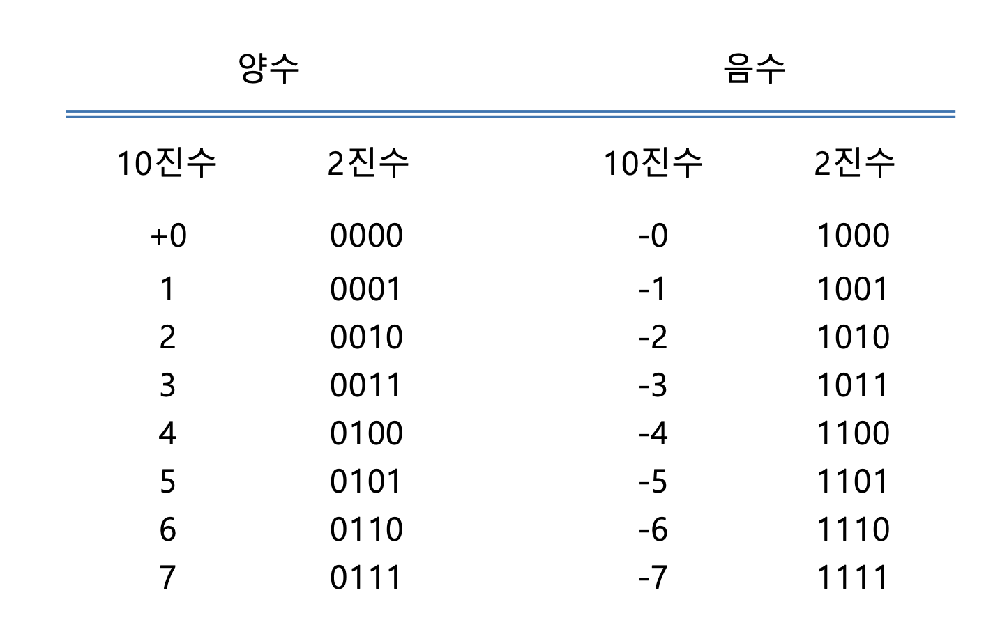
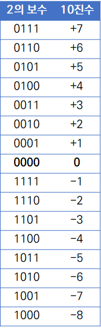

## boolean arithmetic
이번 챕터에서는 컴퓨터에서 연산을 하는 방법에 대해 알아 볼 것이다.  
그리고 배운 것을 기반으로 후에 CPU의 핵심 유닛이 될 ALU을 만들어볼 것이다.

## negative number
모두 알듯이 컴퓨터에서 모든 것은 2진수로 이루어져있다.  
또한 현실세계에서의 계산과 다르게 컴퓨터에서 수의 표현은 크기가 제한 돼있다.  
그렇기에 수를 표현하는게 자유롭지 못하다.  
무슨 말이냐하면 8비트가 있을때 이를 0과 자연수만 표현한다하면 0 ~ 255까지 표현할 수 있다.  
하지만 모두 알듯이 수에는 0과 자연수만이 아닌 음수, 실수 더 나아가 복소수 또한 존재한다 하지만 일단 음수에만 집중했을때 음수를 표현하려하면 어떻게 할까?  
가장 간단한 방법으로 맨 왼쪽 비트 MSB(most significant bit)라고 칭하는 녀석을 sing bit로 쓰는 것이다 msb가 0이면 양수 msb가 1이면 음수 이런식으로 말이다.  
4비트가 있다고 가정하면 아래와 같이 양수와 음수를 표현할 수 있다.

위 표현 방법도 사실 그냥 보면 크게 문제가 될게 없어보인다.  
오히려 인간이 보기에는 다음에 설명할 2의보수 방법보다 명확하다.  
하지만 이상한 부분이 있다.  
-0은 무엇이지? 또 뺄셈 즉, 음수와 음수의 덧셈 또는 음수와 양수의 덧셈은 어떻게 해야하지?

## complement of 2
2의 보수 표현식부터 빠르게 알아보 아래와 같다.

원래 수를 2의 보수로 표현하는 방법은 1의 보수에 1을 더하면 된다.  
그럼 1의 보수는 뭐냐? 2진수에서 모든 자리수가 1인 수를 만들기 위해 필요한 수이다.  
그러면 왜 굳이 2의 보수를 사용하냐?

먼저 뺄셈이란 연산이 필요없어진다.  
무슨 말이냐하면 덧셈만으로도 뺄셈을 할 수 있게 된다.  
위 표를 보고 직접 계산해보면 각각 3과 -4에 매핑된 2진수를 더하면 -1에 매핑된 2진수가 나오는 것을 확인 할 수 있다.  
놀랍지 않은가? 이는 2의 보수가 가지는 의미를 알아보면 이해할 수 있다.  
뺄셈을 할 때 예를 들어 244 - 355를 한다고할 때 355에서 244를 뺀 후 부호를 음수로 하는 방법도 있지만  
다른 방법으로는 수를 빌리는 것이 있다.  
1000 + 244에서 355를 빼고 다시 빌려온 100을 빼는 것이다.  
하지만 이 글을 잘 따라온 사람은 한가지 이상한점을 발견했을 것이다. 컴퓨터에서 수의 표현은 크기가 제한돼있다 그랬는데 기존에 세자릿수 연산하던 중에 네자릿수를 어떻게 가져오지?  
그럼 위 식을 살짝 바꿔보겠다.  
244 + (999 - 355) + 1 - 1000 이렇게 하면 빌림을 할 때 고정된 크기(세자릿 수)를 벗어날 일이 없다(1000을 빼는 것은 고정된 크기를 벗어난 수를 무시하는 것과 동일하다).  
무언가 보이지 않는가? 그렇다 위에선 정확히 표기하면 10의 보수지만 2의 보수와 비슷한 것이 보인다.  
바로 (999 - 355) + 1 부분이다. 2의 보수에서도 똑같다.  
예를 들어 0011 - 0100을 한다하면 다음과 같이 된다.  
0011 + (1111 - 0100) + 0001 - 10000  
(1111 - 0100) + 0001 부분은 0100의 보수인 1100이 되고 0011과 더하면 1111이 되고 이는 -1과 매핑된다.  
\- 10000의 경우는 이번엔 넘어간 자리 수가 없지만 있었다면 해당 수를 무시하는 것과 동일한 연산이다.

