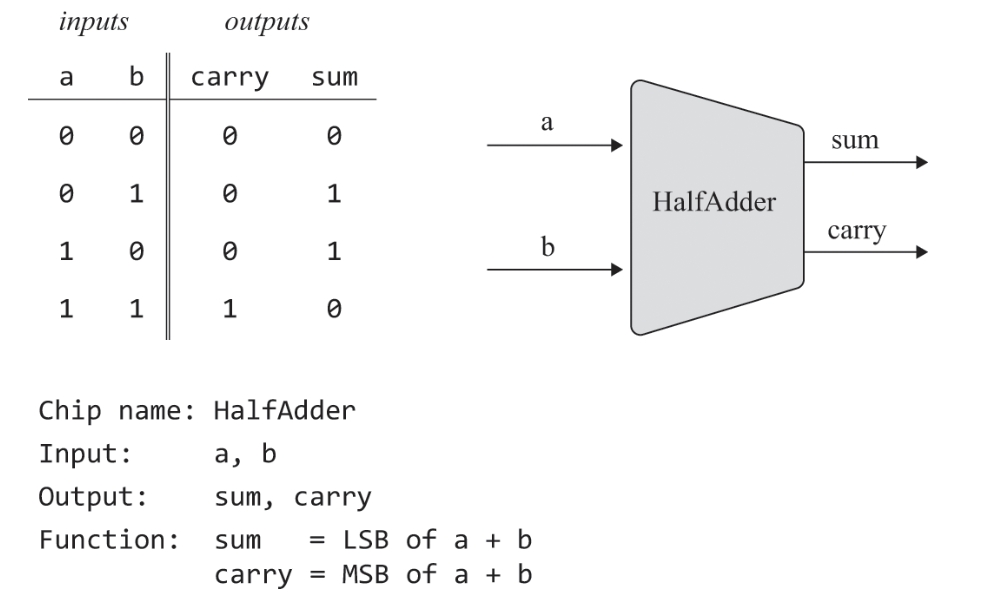
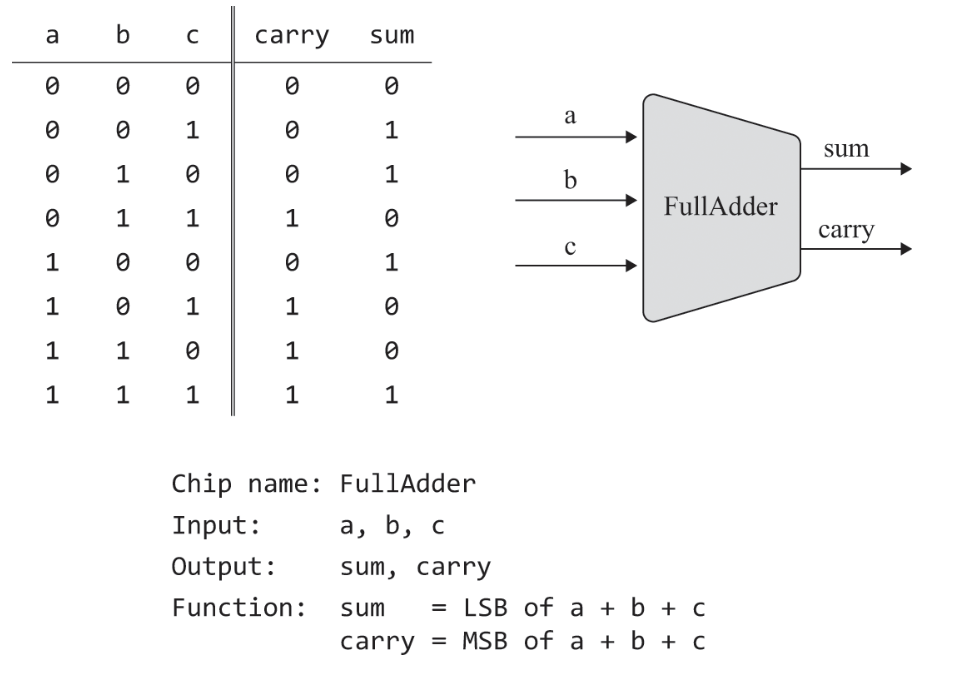
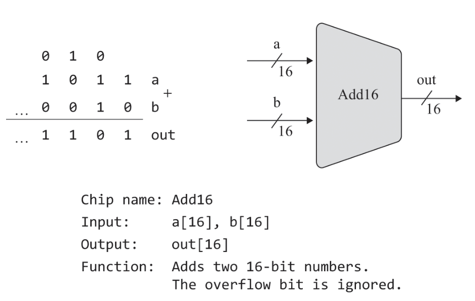
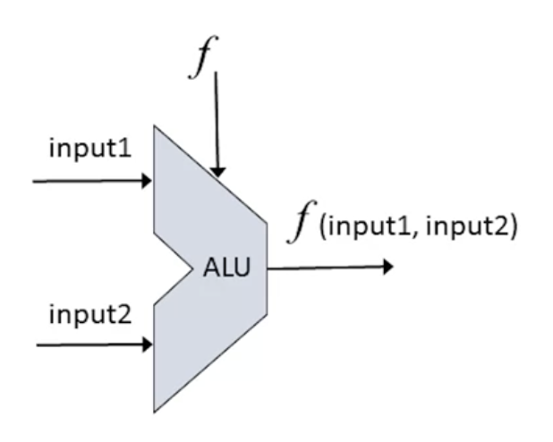
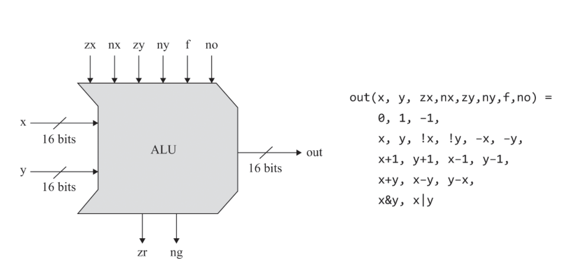

# Boolean Arithmetic - 불 연산

## 주의점
개인적인 정리과 코세라 Unit 2.6: Perspectives 참고

nand2tetris의 구현은 실습을 위해 실제에 비해 단순화, 생략 된 부분이 존재한다.

가산기에서 n이 증가할수록 계산에 시간이 증가한다. 올림 예측 가산기(carry look-ahead adder)를 사용하여 해결할 수 있지만, 프로젝트에서 다루지 않는다.

명세 자체는 대부분이 표준이나 실제 구현과 같다.

ALU의 경우에만 실습을 위해 간단한 구현을 제공한다.

Hack(nand2tetris에서 만드는 컴퓨터)에서는 곱셉과 나눗셈은 소프트웨어가 처리하도록 한다.  
덧셈을 반복해서 구현할 수 있고, 하드웨어로 구현하는 것보다 소프트웨어로 구현하는 것이 더 쉽기 때문이다.

이러한 계산은 클럭 단위로 처리되지만 지금 당장은 다루지 않는다. (3장에서 다룸)

## 산술 연산 - arithmetic operations
범용 컴퓨터 시스뎀은 부호있는 정수에 대해 최소한 아래 산술 연산을 수행 할 수 있어야 한다.
- 덧셈
- 부호 변환
- 뺄셈
- 비교
- 곱셉
- 나눗셈

### 고정 단어 크기

수학에서 숫자는 무한하지만 컴퓨터에서는 유한한 고정 단어 크기(word size)를 사용하므로 무한하지 않다.

고정 단어 크기: 컴퓨터가 기존 정보 단위를 표현하는데 사용하는 비트 수

보통 8-, 16-, 32-, 64비트 레지스터가 사용된다.

고정 단어 크기보다 더 큰 범위의 값을 사용하기 위해 고수준 언어는 추상화 기법을 지원한다.

여러 단어(mulit-word)로 구현된 숫자의 논리 연산은 느리다.

## 2진수

### 2진수와 10진수

n진수에서, 각 n 자리는 n의 거듭제곱을 의미한다.

10진수인 `789`는 $789 = 7 \times 10^2 + 8 \times 10^1 + 9 \times 10^0$ 이다.

2진수인 `101`(10진수로 3)은 $101 = 1 \times 2^2 + 0 \times 2^1 + 1 \times 2^0$ 이다.

사람은 (손가락이 10개라) 10진수를 사용하고, 컴퓨터는 (on-off) 2진수를 사용한다.

### 2진수의 범위

2^자리수 만큼의 값을 가질 수 있다.

예를 들어, 8비트는 $2^8 = 256$로, 총 0~255(자리수-1) 개의 범위를 가진다.

일반적으로 음수의 표현이 필요하므로 반반으로 나눈다.   
8비트에서는 -128~127(0+양수) 만큼의 숫자를 표현할 수 있다.   
(양수: $0~2^n-1-1$, 음수 )

### 음수 표현
음수와 양수의 덧셈을 위해 2의 보수를 사용한다.  
거의 모든 컴퓨터에서 2의 보수로 음수를 표현하고 있다.

보수: 보충을 해주는 수, 1에 대한 10의 보수는 9, 4에 대한 15의 보수는 11, N에 대한 M의 보수에서 M>N은 성립하지 않는데.  
1의 보수(를 사용한 음수 표현): 1010의 1의 보수는 0101, 자리수의 0과 1을 바꾸면 된다.  
2의 보수(를 사용한 음수 표현): 1의 보수에서 1을 더함, 1010의 2의 보수는 0110

## 2진수의 덧셈과 뺄셈

### 덧셈

10진수의 덧셈과 동일하다.   
첫 번째 자리부터 시작하여 숫자를 더하고(sum), 한 자리 수로 표현할 수 없을 경우에는 자리올림(carry)을 수행하는 과정을 반복한다.

덧셈의 결과가 word size가 표현할 수 있는 범위를 넘어간 경우를 **오버플로우**라고 하며, 넘어간 숫자는 무시된다.   
(word size 제한 때문; 구현에 따라 다르지만 일반적으로, 오버플로우가 발생한다.)
### 뺄셈

2의 보수를 사용하면 음수와 양수를 더하는 것으로 뺄샘이 가능하다. (ex: $0101 + 1101 = (1)0010$. 오버플로우는 제외된다. 10진수로 하면 $5 + -3 = 2$)    
이러한 특징 때문에 부호 전환에서 1의 보수보다 계산이 더 필요하더라도 사용한다.

## 칩(논리 게이트) 명세

산술 논리 장치(ALU)를 구현하기 위한 여러 칩의 명세를 설명한다.

- **반가산기** - half-adders
    - 두 비트를 더한다.
    - 
- **전가산기** - full-adders
    - 세 비트를 더한다.
    - 
- **가산기** - n-bit adders
    - 두개의 n 비트 숫자를 더한다.
- **증분기** - counters, incrementer
    - 주어진 숫자의 1을 더한다.
    - (다음 명령을 가져오는데 사용한다)
    - 

## 산술 논리 장치(ALU, Arithmetic Logic Unit)

컴퓨터의 모든 명령을 처리하는 중앙 처리 장치(CPU, Central Processing Unit)의 핵심적인 계산 부품이다.

어떤 산술 및 논리 연산 집합을 처리하도록 설계된 칩.

일반적인 형태의 산술 논리 장치

2개의 인풋을 입력받은 함수 f로 처리한 결과를 반환한다.

Nand to Tetris 프로젝트에서 구현하는 산술 논리 장치 다이어그램

