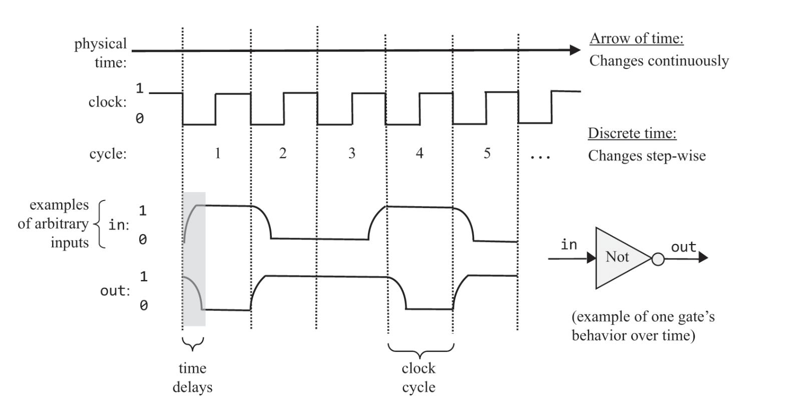
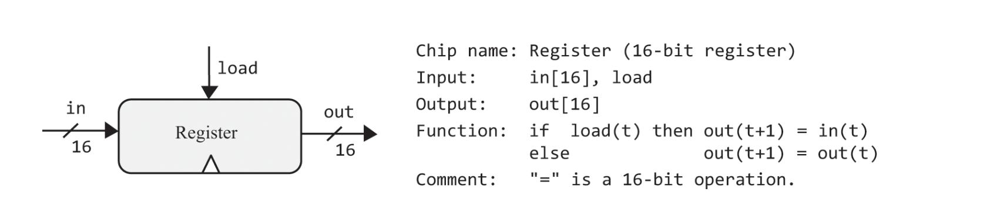
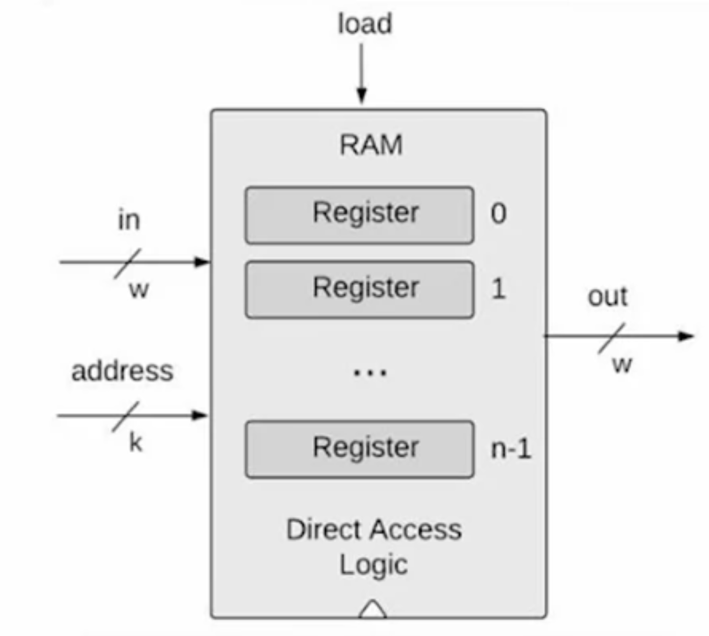
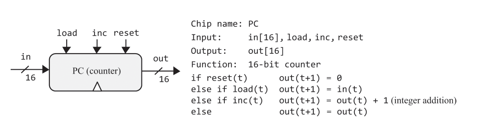

## time in computer
우리의 시간은 아날로그이다.  
즉 어떤 두 시점 사이의 한 시점이 항상 존재한다.  
하지만 모두 알 듯이 컴퓨터에서 시간은 디지털이다.  
왜 그럴까? 컴퓨터는 0과 1로만 이루어져있어서?  
어느정도 맞는 말이겠지만 정확한 정답이라 하기는 어렵다.  

지금까지 만들어온 칩들을 포함해 현존하는 컴퓨터에 들어가는 모든 로직게이트에는 인풋을 넣고 아웃풋이 나오는 그 사이에 지연시간이 존재한다.  
빛도 속도가 존재하는 마당에 전자가 이동하는데 시간이 걸리는 건 당연하다.  
물론 사람이 인지할 수 없을만큼 짧은 시간이다.  
하지만 무시할 수는 없다.  
a로직 게이트의 결과와 b의 로직 게이트 결과를 더하는 로직 게이트 c가있다고 할때, a의 결과가 나왔다고 바로 c의 아웃풋이 의도한 값이 라고 장담할 수는 없다.  
아직 b의 아웃풋은 안나왔을 수도 있기 때문이다.  

이러한 동기화 문제를 해결하기 위해 사람들은 임의의 time cycle을 만들었다.

사진을 보면 clock부분이 두 단계로 나눠져있다.  
책에서는 이 두 단계를 tick, tock으로 부른다.  
tock이 끝나고 tick시작하는, 즉 한 사이클이 끝난 후의 로직게이트가 가지고있는 어떤 binary값, 상태는 의도된 연산이 제대로 수행된 후의 값이라고 가정하는 것이다.  
그러므로 물론 이 한 time cycle은 로직게이트의 지연시간 중 가장 긴 시간보다 더 길어야한다.  
거기에 최대한 작아야한다. 그래야 컴퓨터의 속도가 가장 빠를테니까

## flip flop
소프트웨어 단계에서 모든건 변수, 리스트, 객체이다.  
하지만 이 값을 어떻게 저장해두는 걸까?  
우리가 지금까지 만든 칩은 모두 인풋을 넣으면 아웃풋이 나올뿐이다.  
그리고 이 아웃풋또한 전자이므로 어디론가 흘러가게 되있다.  
이 정보를 저장하기 위한 최소조건은 n+1번째 time cycle에서 n번째 time cycle에서의 state를 아는 것이다.  
flip flop은 그 최소조건을 만족하게 해주는 칩이다.

> The Nand- based DFF implementations are elegant, yet intricate and impossible to model in our hardware simulator since they require feedback loops among combinational gates. Wishing to abstract away this complexity, we will treat the DFF as a primitive building block

nand gate로 구현된 flip flop은 우아하지만 책에서 제공하는 하드웨어 시뮬레이터는 모든 combinational 칩들의 피드백 루프를 요구하기에 구현이 불가합니다.  
때문에 책에서는 flip flop을 원시 칩으로서 제공합니다.(피드백 루프를 요구한단게 필자도 정확히 무슨 말인지는 모르겠지만 또 어떤 complexity가 있단 것만 알고 넘어갑시다)

## register
register는 단순히 Bit 칩을 여러개 쌓은 칩입니다.(칩이름이 Bit입니다. 아마 1 bit짜리 메모리라 저렇게 작명된 것으로 추측해봅니다)  
Bit칩의 구조는 넘어가고 register의 인터페이스를 보면 아래와 같습니다.  

그리고 메모리는 이 레지스터를 또 여러개 쌓은 칩입니다.(정말 간단하죠?)  

다만 ram에는 address라는 입력이 추가로 생겼는데 이는 단순히 몇번째 register에 access할지 정하는 주소 값입니다.  

## counter

현 챕터는 카운터의 역할에 대해 깊게 설명하지 않으므로 인터페이스만 보고 넘어갑니다.  
다만 후에(챕터5) 다시 등장할 예정이란 것만 알고 넘어갑시다.  
